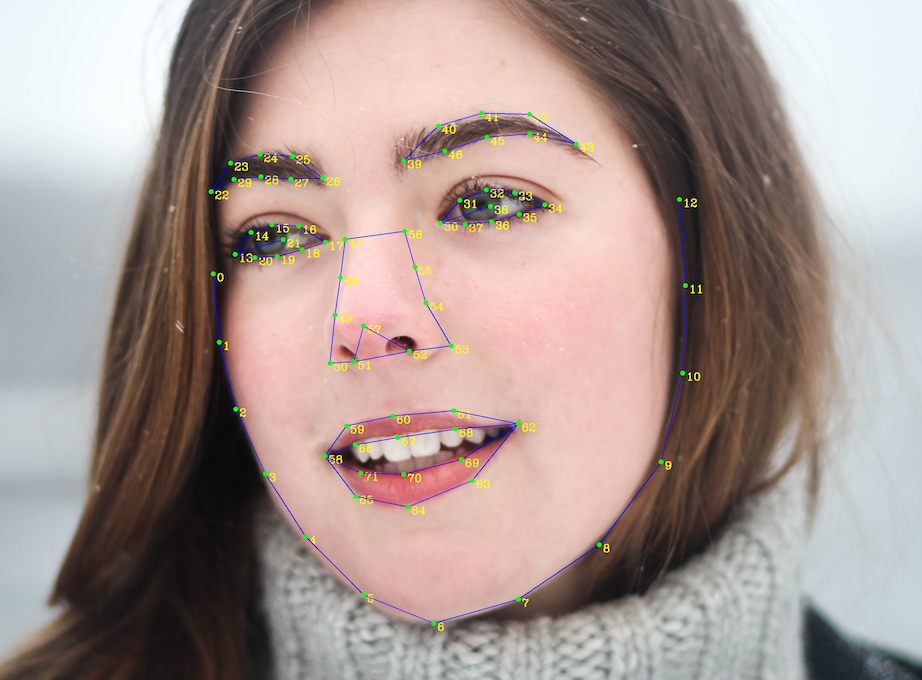

# 对标百度接口API-对外

## 总体说明

私有化部署包部署成功后，即可获得与公有云基本完全相同的接口，人脸识别的相关接口将会启动，即可开始调用。

在私有化部署包中会提供如下5类接口：

- **Appid管理**

**业务能力** **创建Appid**：用于创建一个Appid

**查询Appid**：用于查询此业务中已经创建哪个Appid

> 注：创建方式为：通过调用“创建用户组”接口来创建appid，即：在“创建用户组”接口中可以自定义一个Appid，当组创建成功后，此Appid即可生效。

- **人脸检测与属性分析**

**接口能力**

① **人脸检测**：检测图片中的人脸并标记出位置信息;
② **人脸关键点**：展示人脸的核心关键点信息，及72个关键点信息;
③ **人脸属性值**：展示人脸属性信息，如年龄、性别等;
④ **人脸质量信息**：返回人脸各部分的遮挡、光照、模糊、完整度、置信度等信息。

典型应用场景：如**人脸属性分析**，**基于人脸关键点的加工分析**，**人脸营销活动**等。

- **人脸比对**

**接口能力**

① **两张人脸图片相似度对比**：比对两张图片中人脸的相似度，并返回相似度分值；
② **多种图片类型**：支持**生活照**、**证件照**、**身份证芯片照**、**带网纹照**四种类型的人脸对比；
③ **活体检测控制**：基于图片中的破绽分析，判断其中的人脸是否为**二次翻拍**（举例：如用户A用手机拍摄了一张包含人脸的图片一，用户B翻拍了图片一得到了图片二，并用图片二伪造成用户A去进行识别操作，这种情况普遍发生在金融开户、实名认证等环节。）；
④ **质量检测控制**：分析图片的中人脸的模糊度、角度、光照强度等特征，判断图片质量；

**业务应用**

用于比对多张图片中的人脸相似度并返回两两比对的得分，可用于判断两张脸是否是同一人的可能性大小。

典型应用场景：如**人证合一验证**，**用户认证**等，可与您现有的人脸库进行比对验证。

- **人脸搜索**

**业务能力**

① **1：N人脸搜索**：也称为1：N识别，在指定人脸集合中，找到最相似的人脸；
② **1：N人脸认证**：基于uid维度的1：N识别，由于uid已经锁定固定数量的人脸，所以检索范围更聚焦；

> **1：N人脸识别**与**1：N人脸认证**的差别在于：人脸搜索是在指定人脸集合中进行直接地人脸检索操作，而人脸认证是基于uid，先调取这个uid对应的人脸，再在这个uid对应的人脸集合中进行检索（因为每个uid通常对应的只有一张人脸，所以通常也就变为了1：1对比）；实际应用中，人脸认证需要用户或系统先输入id，这增加了验证安全度，但也增加了复杂度，具体使用哪个接口需要视您的业务场景判断。

> 提示：进行人脸查找相关操作前，建议先阅读**人脸库管理**相关内容。

- **人脸库管理**

**业务能力**

要完成1：N或者M：N识别，首先需要构建一个人脸库，用于存放所有人脸特征，相关接口如下：

**人脸注册**：向人脸库中添加人脸
① **人脸更新**：更新人脸库中指定用户下的人脸信息
② **人脸删除**：删除指定用户的某张人脸
③ **用户信息查询**：查询人脸库中某个用户的详细信息
④ **获取用户人脸列表**：获取某个用户组中的全部人脸列表
⑤ **获取用户列表**：查询指定用户组中的用户列表
⑥ **复制用户**：将指定用户复制到另外的人脸组
⑦ **创建用户组**：创建一个新的用户组
⑧ **删除用户组**：删除指定用户组
⑨ **组列表查询**：查询人脸库中用户组的列表

**人脸库结构**

人脸库、用户组、用户、用户下的人脸**层级关系**如下所示：

```text
|- 人脸库(appid)
   |- 用户组一（group_id）
      |- 用户01（uid）
         |- 人脸（faceid）
      |- 用户02（uid）
         |- 人脸（faceid）
         |- 人脸（faceid）
         ....
       ....
   |- 用户组二（group_id）
   |- 用户组三（group_id）
   ....
```

**关于人脸库的设置限制**

① 每个私有化部署包对应1个appid，**每个appid对应一个人脸库**；
② 每个人脸库下，可以创建多个用户组，用户组（group）数量**没有限制**；
③ 每个用户组（group）下，可添加**无限**个user_id，**无限**张人脸（注：为了保证查询速度，单个group中的人脸容量上限建议为**80万**）；
④ 每个用户（user_id）所能注册的最大人脸数量**没有限制**；

> 提醒：每个人脸库对应一个appid，一定不要轻易删除appid，删除后则此人脸库将失效，无法进行查找！


## 接口格式说明

- **变量类型定义**

| 类型       | 定义                                                         |
| ---------- | ------------------------------------------------------------ |
| string     | 普通的字符串，可能会有长度要求，具体参见接口说明中的备注     |
| uint32     | 整形数字，最大取值为4字节int。自然数                         |
| int64      | 整形数字，最大取值为8字节int。允许负数                       |
| json       | 无论是request还是response中某个字段定义为json，那么它其实是一个json格式的字符串，需要二次解析 |
| array      | request的query中表示array请使用key[] 。response的json中的array即为jsonArray |
| double     | 双精度，小数点后最大8位四舍五入                              |
| encryption | 加密格式，一般用于人脸服务各模块间交互数据使用。             |

**注意事项**

① 所有ID定义必须为小于等于32字节的数字字母组合，尽量使用无意义的组合，并且不可以使用系统保留关键字：all、self、me、this、next。
② 所有接口POSTDATA 应当小于等于**8M**。
③ 单个group中的图片容量上限建议为**80万**
④ 人脸图片需要人脸像素在100x100以上，否则可能检测不出来人脸

- **请求方式**

请求方式统一使用`application/json`请求 **直接请求**
直接请求时需要将appid参数拼接在请求url中，不要放在json body中 注意：如果是直接对线上单台机器发起请求，需要在接口路径前加上`/api`的前缀

- **返回格式**
  ① **error_code**、**error_msg**即错误码和错误描述，详细含义请参考错误码表, **error_code为0代表请求成功**
  ② **result**是接口返回的详细信息, 格式为数组;
  ③ **log_id**是请求的日志id, **13位长(bigint)**, 用于定位请求。

```json
{
    "error_code" : 0,  //错误码 0代表成功
    "error_msg"  : "SUCCESS", //错误信息
    "result" : {...} //返回结果 具体内容详见相关接口
    "log_id" : 3535325235 //请求的日志id
    "timestamp" : 1512391548 //请求到达的时间戳 精确到秒级
    "cached" : 0 //未启用 无需处理
}
```

- **阈值说明**

遮挡情况的阈值

| 控制度 | left_eye | right_eye | nose | mouth | left_cheek | right_cheek | chin_contour |
| ------ | -------- | --------- | ---- | ----- | ---------- | ----------- | ------------ |
| LOW    | 0.8      | 0.8       | 0.8  | 0.8   | 0.8        | 0.8         | 0.8          |
| NORMAL | 0.6      | 0.6       | 0.6  | 0.6   | 0.6        | 0.6         | 0.6          |
| HIGH   | 0.2      | 0.2       | 0.2  | 0.2   | 0.2        | 0.2         | 0.2          |

模糊度、完整度的阈值

| 控制度 | illumination | blurdegree | completeness |
| ------ | ------------ | ---------- | ------------ |
| LOW    | 20           | 0.8        | 0            |
| NORMAL | 40           | 0.6        | 0            |
| HIGH   | 100          | 0.2        | 1            |

- **参数说明**

| 参数         | 说明                                                         |
| ------------ | ------------------------------------------------------------ |
| left_eye     | 左眼被遮挡的比例 [0-1] 1表示完全遮挡                         |
| right_eye    | 右眼被遮挡的比例 [0-1] 1表示完全遮挡                         |
| nose         | 鼻子被遮挡的比例 [0-1] 1表示完全遮挡                         |
| mouth        | 嘴巴被遮挡的比例 [0-1] 1表示完全遮挡                         |
| left_cheek   | 左脸颊被遮挡的比例 [0-1] 1表示完全遮挡                       |
| right_cheek  | 右脸颊被遮挡的比例 [0-1] 1表示完全遮挡                       |
| chin_contour | 下巴被遮挡比例 [0-1] 1表示完全遮挡                           |
| illumination | 光照 [0-255] 0表示光照不好                                   |
| blurdegree   | 图片模糊度 [0-1] 1表示完全模糊                               |
| completeness | 人脸完整度（0或1） 0为人脸溢出图像边界，1为人脸都在图像边界内 |

- **活体控制阈值**

> 不同的控制度下所对应的活体控制阈值 如果检测出来的活体分数小于控制阈值，则会返回错误。

| 控制度 | 阈值 | 说明                                                        |
| ------ | ---- | ----------------------------------------------------------- |
| LOW    | 0.05 | 0.01%活体误拒率 **对应的通过率为99.99% 攻击拒绝率为63.91%** |
| NORMAL | 0.3  | 0.1%活体误拒率 **对应的通过率为99.9% 攻击拒绝率为90.32%**   |
| HIGH   | 0.9  | 1%活体误拒率 **对应的通过率为99% 攻击拒绝率为97.56%**       |

> 误拒率（FRR）：如0.5%，指1000次真人请求，会有5次因为活体分数低于阈值被错误拒绝。 通过率（TAR）：如99%，指100次真人请求，会有99次因为活体分数高于阈值而通过。 攻击拒绝率（TRR）：如99%，代表100次作弊假体攻击，会有99次被拒绝。 误拒率越高， 其对攻击的防范能力也会越高


## 调用准备

1、调用接口的地址示例：[192.168.0.1]:8300/face-api/v3/face/detect，其中ip需要替换为用户自己服务器的ip，端口固定为：8300，接口地址需要替换为下述接口的地址。

2、调用接口时需要指定appid，此appid为用户自定的id，目前可以通过调用“创建用户组”接口来创建appid


## 接口文档


## 基础能力接口


### 人脸检测

> 检测图片中的人脸并获得位置信息, 属性信息, 质量信息等

- 请求路径

/face-api/v3/face/detect

- URL请求参数

| 参数  | 必选 | 类型   | 说明                                              |
| ----- | ---- | ------ | ------------------------------------------------- |
| appid | 是   | string | app标识 （由数字、字母、下划线组成），长度限制48B |

- Header：

| 参数         | 值               |
| ------------ | ---------------- |
| Content-Type | application/json |

- Body请求参数

| 参数             | 必选 | 类型   | 说明                                                         |
| ---------------- | ---- | ------ | ------------------------------------------------------------ |
| image            | 是   | string | 图片信息(**总数据大小应小于10M，分辨率应小于1920\*1080**)，图片上传方式根据image_type来判断 |
| image_type       | 是   | string | 图片类型 **BASE64**:图片的base64值，base64编码后的图片数据，编码后的图片大小不超过2M； **FACE_TOKEN**: 人脸图片的唯一标识，调用人脸检测接口时，会为每个人脸图片赋予一个唯一的FACE_TOKEN，同一张图片多次检测得到的FACE_TOKEN是同一个。 |
| face_field       | 否   | string | 包括**age,beauty,expression,face_shape,gender,glasses,landmark,race,quality,face_type,parsing,eye_status,emotion,feature,lip_language,spoofing信息** 逗号分隔. 默认只返回face_token、人脸框、概率和旋转角度 |
| get_feature      | 否   | string | 是否保存特征值， 只有保存了特征值之后才能使用FACE_TOKEN，默认为NO YES 保存特征值 NO 不保存特征值 2019.12.12以后部署的模型提供此接口请求参数，之前部署的模型若需要保存特征值，请在face_field字段中添加feature字段 或者更新模型，更新方式请参考[这里](https://ai.baidu.com/ai-doc/FACE/lk38rj7tq) |
| max_face_num     | 否   | uint32 | 最多处理人脸的数目，默认值为1，仅检测图片中面积最大的那个人脸；**最大值10**，检测图片中面积最大的几张人脸。若您想修改最大人脸检测数量数值，请参考[接口调用问题文档](https://ai.baidu.com/ai-doc/FACE/ck38rcx64#其他问题) |
| face_type        | 否   | string | 人脸的类型 **LIVE**表示生活照：通常为手机、相机拍摄的人像图片、或从网络获取的人像图片等 **IDCARD**表示身份证芯片照：二代身份证内置芯片中的人像照片 **WATERMARK**表示带水印证件照：一般为带水印的小图，如公安网小图 **CERT**表示证件照片：如拍摄的身份证、工卡、护照、学生证等证件图片 默认**LIVE** |
| liveness_control | 否   | string | **活体控制** 检测结果中不符合要求的人脸会被过滤 **NONE**: 不进行控制 **LOW**:较低的活体要求(高通过率 低攻击拒绝率) **NORMAL**: 一般的活体要求(平衡的攻击拒绝率, 通过率) **HIGH**: 较高的活体要求(高攻击拒绝率 低通过率) 默认**NONE** |

若为**视频监控模型**，请求参数可以增加下列字段：

> 若您的前端摄像头是抓拍机抓拍并处理过的单人脸小图模式，推荐您在人脸检测/人脸注册/人脸更新/人脸搜索接口中使用SNAP参数，若为普通摄像头及混合场景模式，使用COMMON参数即可

| 参数       | 必选 | 类型   | 说明                                                         |
| ---------- | ---- | ------ | ------------------------------------------------------------ |
| image_spec | 否   | string | 图片规格 服务会对不同规格的图片采用不同的图片处理方式 **COMMON**: 通用图片规格 默认的处理方式(如无适应的图片规格则使用此参数) **SNAP**: 从人脸抓拍机得到的抓拍图 适用于**小图片+单人脸**的情况 **默认COMMON** |

- 请求示例

```json
  {
      "image": "027d8308a2ec665acb1bdf63e513bcb9",
      "image_type": "FACE_TOKEN",
      "face_field": "faceshape,facetype"
  }
```

- 返回结果

| 字段              | 必选 | 类型   | 说明                                                         |
| ----------------- | ---- | ------ | ------------------------------------------------------------ |
| face_num          | 是   | int    | 检测到的图片中的人脸数量                                     |
| face_list         | 是   | array  | 人脸信息列表，具体包含的参数参考下面的列表。                 |
| +face_token       | 是   | string | 人脸图片的唯一标识                                           |
| +location         | 是   | array  | 人脸在图片中的位置                                           |
| ++left            | 是   | double | 人脸区域离左边界的距离                                       |
| ++top             | 是   | double | 人脸区域离上边界的距离                                       |
| ++width           | 是   | double | 人脸区域的宽度                                               |
| ++height          | 是   | double | 人脸区域的高度                                               |
| ++rotation        | 是   | int64  | 人脸框相对于竖直方向的顺时针旋转角，[-180,180]               |
| +face_probability | 是   | double | 人脸置信度，范围【0~1】，代表这是一张人脸的概率，0最小、1最大。 |
| +angel            | 是   | array  | 人脸旋转角度参数                                             |
| ++yaw             | 是   | double | 三维旋转之左右旋转角[-90(左), 90(右)]                        |
| ++pitch           | 是   | double | 三维旋转之俯仰角度[-90(上), 90(下)]                          |
| ++roll            | 是   | double | 平面内旋转角[-180(逆时针), 180(顺时针)]                      |
| +age              | 否   | double | 年龄 ，当**face_field包含age时返回**                         |
| +beauty           | 否   | int64  | 美丑打分，范围0-100，越大表示越美。当**face_fields包含beauty时返回** |
| +expression       | 否   | array  | 表情，当 **face_field包含expression时返回**                  |
| ++type            | 否   | string | **none**:不笑；**smile**:微笑；**laugh**:大笑                |
| ++probability     | 否   | double | 表情置信度，范围【0~1】，0最小、1最大。                      |
| +face_shape       | 否   | array  | 脸型，当**face_field包含face_shape时返回**                   |
| ++type            | 否   | double | **square**: 正方形 **triangle**:三角形 **oval**: 椭圆 **heart**: 心形 **round**: 圆形 |
| ++probability     | 否   | double | 置信度，范围【0~1】，代表这是人脸形状判断正确的概率，0最小、1最大。 |
| +gender           | 否   | array  | 性别，**face_field包含gender时返回**                         |
| ++type            | 否   | string | male:**男性** female:**女性**                                |
| ++probability     | 否   | double | 性别置信度，范围【0~1】，0代表概率最小、1代表最大。          |
| +glasses          | 否   | array  | 是否带眼镜，**face_field包含glasses时返回**                  |
| ++type            | 否   | string | **none**:无眼镜，**common**:普通眼镜，**sun**:墨镜           |
| ++probability     | 否   | double | 眼镜置信度，范围【0~1】，0代表概率最小、1代表最大。          |
| +eye_status       | 否   | array  | 双眼状态（睁开/闭合） **face_field包含eye_status时返回**     |
| ++left_eye        | 否   | double | 左眼状态 [0,1]取值，越接近0闭合的可能性越大                  |
| ++right_eye       | 否   | double | 右眼状态 [0,1]取值，越接近0闭合的可能性越大                  |
| +emotion          | 否   | array  | 情绪 **face_field包含emotion时返回**                         |
| ++type            | 否   | string | **angry**:愤怒 **disgust**:厌恶 **fear**:恐惧 **happy**:高兴 **sad**:伤心 **surprise**:惊讶 **neutral**:无情绪 |
| ++probability     | 否   | double | 情绪置信度，范围0~1                                          |
| +race             | 否   | array  | 人种 **face_field包含race时返回**                            |
| ++type            | 否   | string | **yellow**: 黄种人 **white**: 白种人 **black**:黑种人 **arabs**: **阿拉伯人** |
| ++probability     | 否   | double | 人种置信度，范围【0~1】，0代表概率最小、1代表最大。          |
| +face_type        | 否   | array  | 真实人脸/卡通人脸 **face_field包含face_type时返回**          |
| ++type            | 否   | string | **human**: 真实人脸 **cartoon**: 卡通人脸                    |
| ++probability     | 否   | double | 人脸类型判断正确的置信度，范围【0~1】，0代表概率最小、1代表最大。 |
| +landmark         | 否   | array  | 4个关键点位置，左眼中心、右眼中心、鼻尖、嘴中心。**face_field包含landmark时返回** |
| +landmark72       | 否   | array  | 72个特征点位置 **face_field包含landmark72时返回**            |
| +quality          | 否   | array  | 人脸质量信息。**face_field包含quality时返回**                |
| ++occlusion       | 否   | array  | 人脸各部分遮挡的概率，范围[0~1]，0表示完整，1表示不完整      |
| +++left_eye       | 否   | double | 左眼遮挡比例，[0-1] ，1表示完全遮挡                          |
| +++right_eye      | 否   | double | 右眼遮挡比例，[0-1] ， 1表示完全遮挡                         |
| +++nose           | 否   | double | 鼻子遮挡比例，[0-1] ， 1表示完全遮挡                         |
| +++mouth          | 否   | double | 嘴巴遮挡比例，[0-1] ， 1表示完全遮挡                         |
| +++left_cheek     | 否   | double | 左脸颊遮挡比例，[0-1] ， 1表示完全遮挡                       |
| +++right_cheek    | 否   | double | 右脸颊遮挡比例，[0-1] ， 1表示完全遮挡                       |
| +++chin           | 否   | double | 下巴遮挡比例，，[0-1] ， 1表示完全遮挡                       |
| ++blur            | 否   | double | 人脸模糊程度，范围[0~1]，0表示清晰，1表示模糊                |
| ++illumination    | 否   | double | 取值范围在[0~255], 表示脸部区域的光照程度 越大表示光照越好   |
| ++completeness    | 否   | int64  | 人脸完整度，0或1, 0为人脸溢出图像边界，1为人脸都在图像边界内 |
| +lip_language     | 否   | array  | 唇语识别 face_field包含lip_language时返回                    |
| +spoofing         | 否   | double | 判断图片是否合成图功能                                       |
| ++char            | 否   | string | 人脸当前正在读出的文字（当前只支持对数字进行识别，返回内容为单个数字，范围0~9） |
| ++probability     | 否   | double | 置信度，范围0~1                                              |
| +parsing_info     | 否   | string | 人脸分层结果 结果数据是使用gzip压缩后再base64编码 使用前需base64解码后再解压缩 原数据格式为string 形如0,0,0,0,0,1,1,1,1,1,1,2,2,2,2,2,2,2,2,2,… |

- 返回示例

```json
{
 "error_code": 0,
 "error_msg": "SUCCESS",
 "log_id": 1234567890123,
 "timestamp": 1533094400,
 "cached": 0,
 "result": {
     "face_num": 1,
     "face_list": [
         {
             "face_token": "35235asfas21421fakghktyfdgh68bio",
             "location": {
                 "left": 117,
                 "top": 131,
                 "width": 172,
                 "height": 170,
                 "rotation": 4
             },
             "face_probability": 1,
             "angle": {
                 "yaw": -0.34859421849251,
                 "pitch": 1.9135693311691,
                 "roll": 2.3033397197723
             },
             "landmark": [
               {
                   "x": 61.67,
                   "y": 133.44
               },
               {
                   "x": 99.73,
                   "y": 129.72
               },
               {
                   "x": 85.88,
                   "y": 155.07
               },
               {
                   "x": 85.82,
                   "y": 173.16
               }
             ],
             "age": 29.298097610474,
             "beauty": 55.128883361816,
             "expression": {
                 "type": "smile",
                 "probability": 0.5543018579483
             },
             "gender": {
                 "type": "male",
                 "probability": 0.99979132413864
             },
             "glasses": {
                 "type": "sun",
                 "probability": 0.99999964237213
             },
             "eye_status": {
                 "left_eye": 0.9999974966,
                 "right_eye": 0.9999724627
             },
             "race": {
                 "type": "yellow",
                 "probability": 0.99999976158142
             },
             "face_shape": {
                 "type": "triangle",
                 "probability": 0.5543018579483
             },
             "quality": {
                 "occlusion": {
                     "left_eye": 0,
                     "right_eye": 0.015625,
                     "nose": 0,
                     "mouth": 0,
                     "left_cheek": 0.03078358248,
                     "right_cheek": 0.03356481344,
                     "chin_contour": 0.006372549105
                 },
                 "blur": 5.188863383e-7,
                 "illumination": 131,
                 "completeness": 1
             },
             "lib_language": {
                   "char": "0",
                   "probability": 0.67
             }
         }
     ]
 }
}
```

**72个关键点分布图（对应landmark72个点的顺序，序号从0-71）**： 


### 人脸对比

> 两张人脸图片相似度对比：比对两张图片中人脸的相似度，并返回相似度分值

- 请求路径

/face-api/v3/face/match

- URL请求参数

| 参数  | 必选 | 类型   | 说明                                              |
| ----- | ---- | ------ | ------------------------------------------------- |
| appid | 是   | string | app标识 （由数字、字母、下划线组成），长度限制48B |

- Header：

| 参数         | 值               |
| ------------ | ---------------- |
| Content-Type | application/json |

- Body请求参数

| 参数             | 必选 | 类型   | 说明                                                         |
| ---------------- | ---- | ------ | ------------------------------------------------------------ |
| image            | 是   | string | 图片信息(**总数据大小应小于10M**)，图片上传方式根据image_type来判断。 **两张图片通过json格式上传，格式参考表格下方示例** |
| image_type       | 是   | string | 图片类型 **BASE64**:图片的base64值，base64编码后的图片数据，编码后的图片大小不超过2M； **FACE_TOKEN**: 人脸图片的唯一标识，调用人脸检测接口时，会为每个人脸图片赋予一个唯一的FACE_TOKEN，同一张图片多次检测得到的FACE_TOKEN是同一个。 |
| face_type        | 否   | string | 人脸的类型 **LIVE**：表示生活照：通常为手机、相机拍摄的人像图片、或从网络获取的人像图片等， **IDCARD**：表示身份证芯片照：二代身份证内置芯片中的人像照片， **WATERMARK**：表示带水印证件照：一般为带水印的小图，如公安网小图 **CERT**：表示证件照片：如拍摄的身份证、工卡、护照、学生证等证件图片 默认LIVE |
| quality_control  | 否   | string | 图片质量控制 **NONE**: 不进行控制 **LOW**:较低的质量要求 **NORMAL**: 一般的质量要求 **HIGH**: 较高的质量要求 **默认 NONE** 若图片质量不满足要求，则返回结果中会提示质量检测失败 |
| liveness_control | 否   | string | 活体检测控制 **NONE**: 不进行控制 **LOW**:较低的活体要求(高通过率 低攻击拒绝率) **NORMAL**: 一般的活体要求(平衡的攻击拒绝率, 通过率) **HIGH**: 较高的活体要求(高攻击拒绝率 低通过率) **默认 NONE** 若活体检测结果不满足要求，则返回结果中会提示活体检测失败 |

- 请求示例

```json
  [
        {
            "image": "sfasq35sadvsvqwr5q...",
            "image_type": "BASE64",
            "face_type": "LIVE",
            "quality_control": "LOW",
            "liveness_control": "HIGH"
        },
        {
            "image": "sfasq35sadvsvqwr5q...",
            "image_type": "BASE64",
            "face_type": "IDCARD",
            "quality_control": "LOW",
            "liveness_control": "HIGH"
        }
  ]
```

> 注意：请求体要求为json格式，可以参考请求示例。

- 请求示例

```json
[
    {
        "image": "sfasq35sadvsvqwr5q...",
        "image_type": "BASE64",
        "face_type": "LIVE",
        "quality_control": "LOW",
        "liveness_control": "HIGH"
    },
    {
        "image": "sfasq35sadvsvqwr5q...",
        "image_type": "BASE64",
        "face_type": "IDCARD",
        "quality_control": "LOW",
        "liveness_control": "HIGH"
    }
]
```

- 返回结果

| 参数名      | 必选 | 类型   | 说明                         |
| ----------- | ---- | ------ | ---------------------------- |
| score       | 是   | float  | 人脸相似度得分，推荐阈值80分 |
| face_list   | 是   | array  | 人脸信息列表                 |
| +face_token | 是   | string | 人脸的唯一标志               |

- 返回示例

```json
{
 "error_code": 0,
 "error_msg": "SUCCESS",
 "log_id": 1234567890123,
 "timestamp": 1533094576,
 "cached": 0,
 "result": {
     "score": 44.3,
     "face_list": [
         {
             "face_token": "fid1"
         },
         {
             "face_token": "fid2"
         }
     ]
 }
}
```


### 人脸搜索

> 在指定人脸集合中，找到最相似的人脸

- 请求路径

/face-api/v3/face/identify

- URL请求参数

| 参数  | 必选 | 类型   | 说明                                              |
| ----- | ---- | ------ | ------------------------------------------------- |
| appid | 是   | string | app标识 （由数字、字母、下划线组成），长度限制48B |

- Header：

| 参数         | 值               |
| ------------ | ---------------- |
| Content-Type | application/json |

- Body请求参数

| 参数             | 必选 | 类型   | 说明                                                         |
| ---------------- | ---- | ------ | ------------------------------------------------------------ |
| image            | 是   | string | 图片信息(**总数据大小应小于10M**)，图片上传方式根据image_type来判断 |
| image_type       | 是   | string | 图片类型 **BASE64**:图片的base64值，base64编码后的图片数据，编码后的图片大小不超过2M； **FACE_TOKEN**: 人脸图片的唯一标识，调用人脸检测接口时，会为每个人脸图片赋予一个唯一的FACE_TOKEN，同一张图片多次检测得到的FACE_TOKEN是同一个。 |
| group_id_list    | 是   | string | 从指定的group中进行查找 用逗号分隔，**上限10个**             |
| quality_control  | 否   | string | 图片质量控制 **NONE**: 不进行控制 **LOW**:较低的质量要求 **NORMAL**: 一般的质量要求 **HIGH**: 较高的质量要求 **默认 NONE** 若图片质量不满足要求，则返回结果中会提示质量检测失败 |
| liveness_control | 否   | string | 活体检测控制 **NONE**: 不进行控制 **LOW**:较低的活体要求(高通过率 低攻击拒绝率) **NORMAL**: 一般的活体要求(平衡的攻击拒绝率, 通过率) **HIGH**: 较高的活体要求(高攻击拒绝率 低通过率) **默认NONE** 若活体检测结果不满足要求，则返回结果中会提示活体检测失败 |
| user_id          | 否   | string | 当需要对特定用户进行比对时，指定user_id进行比对。即人脸认证功能。 |
| match_threshold  | 否   | int    | 匹配阈值（设置阈值后，score低于此阈值的用户信息将不会返回） 最大100 最小0 默认0 此阈值设置得越高，检索速度将会越快，推荐使用80的阈值 |
| max_user_num     | 否   | unit32 | 查找后返回的用户数量。返回相似度最高的几个用户，默认为1，最多返回50个,若您想要修改最大返回人脸数量，请参考[4.如何控制1：N返回的最大人脸数问题](https://ai.baidu.com/ai-doc/FACE/ck38rcx64#其他问题)文档 |

若为**视频监控模型**，请求参数可以增加下列字段：

> 若您的前端摄像头是抓拍机抓拍并处理过的单人脸小图模式，推荐您在人脸检测/人脸注册/人脸更新/人脸搜索接口中使用SNAP参数，若为普通摄像头及混合场景模式，使用COMMON参数即可

| 参数       | 必选 | 类型   | 说明                                                         |
| ---------- | ---- | ------ | ------------------------------------------------------------ |
| image_spec | 否   | string | 图片规格 服务会对不同规格的图片采用不同的图片处理方式 **COMMON**: 通用图片规格 默认的处理方式(如无适应的图片规格则使用此参数) **SNAP**: 从人脸抓拍机得到的抓拍图 适用于**小图片+单人脸**的情况 **默认COMMON** |

> 说明：如果使用base 64格式的图片，两张请求的图片请分别进行base64编码。

- 请求示例

```json
  {
      "image": "027d8308a2ec665acb1bdf63e513bcb9",
      "image_type": "FACE_TOKEN",
      "group_id_list": "group_repeat,group_233",
      "quality_control": "LOW",
      "liveness_control": "NORMAL"
  }
```

- 返回结果

| 字段       | 必选 | 类型   | 说明                         |
| ---------- | ---- | ------ | ---------------------------- |
| face_token | 是   | string | 人脸标志                     |
| user_list  | 是   | array  | 匹配的用户信息列表           |
| +group_id  | 是   | string | 用户所属的group_id           |
| +user_id   | 是   | string | 用户的user_id                |
| +user_info | 是   | string | 注册用户时携带的user_info    |
| +score     | 是   | float  | 用户的匹配得分，推荐阈值80分 |

```json
{
    "error_code": 0,
    "error_msg": "SUCCESS",
    "log_id": 1234567890123,
    "timestamp": 1533094591,
    "cached": 0,
    "result": {
        "face_token": "fid",
        "user_list": [
            {
                "group_id": "test1",
                "user_id": "u333333",
                "user_info": "Test User",
                "score": 99.3
            }
        ]
    }
}
```


### M:N 多人脸搜索

> 使用多人脸的图片, 在指定人脸集合中，查找最相似的人脸

- 请求路径 /face-api/v3/face/midentify
- URL请求参数

| 参数  | 必选 | 类型   | 说明                                              |
| ----- | ---- | ------ | ------------------------------------------------- |
| appid | 是   | string | app标识 （由数字、字母、下划线组成），长度限制48B |

- Header：

| 参数         | 值               |
| ------------ | ---------------- |
| Content-Type | application/json |

- Body请求参数

| 参数             | 必选 | 类型   | 说明                                                         |
| ---------------- | ---- | ------ | ------------------------------------------------------------ |
| image            | 是   | string | 图片信息(**数据大小应小于10M 分辨率应小于1920\*1080**)       |
| image_type       | 是   | string | 图片类型 **BASE64**:图片的base64值; **URL**:图片的 URL( 下载图片时可能由于网络原因导致下载图片时间过长) **FACE_TOKEN**: face_token 人脸标识 |
| group_id_list    | 是   | string | 从指定的group中进行查找 用逗号分隔，**上限10个**             |
| max_face_num     | 否   | int    | 最多处理人脸的数目 **默认值为1(仅检测图片中面积最大的那个人脸)** **最大值10** |
| match_threshold  | 否   | int    | 匹配阈值（设置阈值后，score低于此阈值的用户信息将不会返回） 最大100 最小0 默认80 **此阈值设置得越高，检索速度将会越快，推荐使用默认阈值`80`** |
| quality_control  | 否   | string | 质量控制(质量不符合要求的人脸不会出现在返回结果中) **NONE**: 不进行控制 **LOW**:较低的质量要求 **NORMAL**: 一般的质量要求 **HIGH**: 较高的质量要求 **默认NONE** |
| liveness_control | 否   | string | 活体控制(活体分数不符合要求的人脸不会出现在返回结果中) **NONE**: 不进行控制 **LOW**:较低的活体要求(高通过率 低攻击拒绝率) **NORMAL**: 一般的活体要求(平衡的攻击拒绝率, 通过率) **HIGH**: 较高的活体要求(高攻击拒绝率 低通过率) **默认NONE** |
| max_user_num     | 否   | unit32 | 识别返回的最大用户数，默认为1，最大值20                      |

> 多人脸的情况下 如果设置了质量控制、活体控制参数，不合格的人脸将被过滤，不会出现在结果中。

- 请求示例

  ```text
  {  "image": "/9j/4AAQSkZJRgABAQAAAQABAAD/2wBDAAgGBgcGBQgHBwcJCQgKD...",  "image_type": "BASE64",  "group_id_list": "group1",  "max_face_num" : 5,  "quality_control": "LOW",  "liveness_control": "NORMAL"}
  ```

- 返回结果

| 字段        | 必选 | 类型   | 说明                                                         |
| ----------- | ---- | ------ | ------------------------------------------------------------ |
| face_num    | 是   | int    | 图片中的人脸数量                                             |
| face_list   | 是   | array  | 人脸信息列表                                                 |
| +face_token | 是   | string | 人脸标志                                                     |
| +location   | 是   | array  | 人脸在图片中的位置                                           |
| ++left      | 是   | double | 人脸区域离左边界的距离                                       |
| ++top       | 是   | double | 人脸区域离上边界的距离                                       |
| ++width     | 是   | double | 人脸区域的宽度                                               |
| ++height    | 是   | double | 人脸区域的高度                                               |
| ++rotation  | 是   | int64  | 人脸框相对于竖直方向的顺时针旋转角，[-180,180]               |
| +user_list  | 是   | array  | 匹配的用户信息列表                                           |
| ++group_id  | 是   | string | 用户所属的group_id                                           |
| ++user_id   | 是   | string | 用户的user_id                                                |
| ++user_info | 是   | string | 注册用户时携带的user_info                                    |
| ++score     | 是   | float  | 用户的匹配得分 **80分以上可以判断为同一人，此分值对应万分之一误识率** |

- 返回示例

  ```text
  {
    "error_code": 0,
    "error_msg": "SUCCESS",
    "log_id": 240483475,
    "timestamp": 1535533440,
    "cached": 0,
    "result": {
        "face_num": 2,
        "face_list": [
            {
                "face_token": "6fe19a6ee0c4233db9b5bba4dc2b9233",
                "location": {
                    "left": 31.95568085,
                    "top": 120.3764267,
                    "width": 87,
                    "height": 85,
                    "rotation": -5
                },
                "user_list": [
                    {
                        "group_id": "group1",
                        "user_id": "5abd24fd062e49bfa906b257ec40d284",
                        "user_info": "userinfo1",
                        "score": 69.85684967041
                    },
                    {
                        "group_id": "group1",
                        "user_id": "2abf89cffb31473a9948268fde9e1c3f",
                        "user_info": "userinfo2",
                        "score": 66.586112976074
                    }
                ]
            },
            {
                "face_token": "fde61e9c074f48cf2bbb319e42634f41",
                "location": {
                    "left": 219.4467773,
                    "top": 104.7486954,
                    "width": 81,
                    "height": 77,
                    "rotation": 3
                },
                "user_list": [
                    {
                        "group_id": "group1",
                        "user_id": "088717532b094c3990755e91250adf7d",
                        "user_info": "userinfo",
                        "score": 65.154159545898
                    }
                ]
            }
        ]
    }
  }
  ```


### 活体检测

> 多图活体检测接口，支持送入1/3/8张图片进行活体检测(如果传入一个人的多张图片，活体判断会更准确)

- 请求路径

/face-api/v3/face/liveness

- URL请求参数

| 参数  | 必选 | 类型   | 说明                                              |
| ----- | ---- | ------ | ------------------------------------------------- |
| appid | 是   | string | app标识 （由数字、字母、下划线组成），长度限制48B |

- Header：

| 参数         | 值               |
| ------------ | ---------------- |
| Content-Type | application/json |

- Body请求参数

| 参数名     | 必选 | 类型   | 说明                                                         |
| ---------- | ---- | ------ | ------------------------------------------------------------ |
| image      | 是   | string | 图片信息(总数据大小应小于10M)，图片上传方式根据image_type来判断； **可以上传同一个用户的1张、3张或8张图片来进行活体判断，注：后端会选择每组照片中的最高分数作为整体分数。** |
| image_type | 是   | string | 图片类型 **BASE64**:图片的base64值，base64编码后的图片数据，需urlencode，编码后的图片大小不超过2M； **FACE_TOKEN**: 人脸图片的唯一标识，调用人脸检测接口时，会为每个人脸图片赋予一个唯一的FACE_TOKEN，同一张图片多次检测得到的FACE_TOKEN是同一个。 |
| face_field | 否   | string | 包括**age,beauty,expression,face_shape,gender,glasses,landmark,race,quality,face_type,parsing,eye_status,emotion,lip_language,feature信息**，逗号分隔，默认只返回face_token、活体数、人脸框、概率和旋转角度 |
| option     | 否   | string | 场景信息，程序会视不同的场景选用相对应的模型。当前支持的场景有COMMON(通用场景)，GATE(闸机场景)，默认使用COMMON |

- 请求示例

```json
[
    {
        "image": "sfasq35sadvsvqwr5q...",
        "image_type": "BASE64",
        "face_field": "age,beauty",
        "option": "COMMON"
    },
    {
        "image": "http://xxx.baidu.com/image1.png",
        "image_type": "URL",
        "face_field": "age,beauty",
        "option": "COMMON"
    },
    {
        "image": "9f30d19f86f89f2f07ce88b69557061a",
        "image_type": "FACE_TOKEN",
        "face_field": "age,beauty",
        "option": "COMMON"
    }
]
```

- 返回结果

| 参数              | 类型 | 是否必须 | 说明                                                         |
| ----------------- | ---- | -------- | ------------------------------------------------------------ |
| face_liveness     | 是   | float    | 活体分数值                                                   |
| thresholds        | 是   | array    | 由服务端返回最新的阈值数据（随着模型的优化，阈值可能会变化），将此参数与返回的face_liveness进行比较，可以作为活体判断的依据。 frr_1e-4：万分之一误识率的阈值；frr_1e-3：千分之一误识率的阈值；frr_1e-2：百分之一误识率的阈值。误识率越低，准确率越高，相应的拒绝率也越高 |
| face_list         | 是   | array    | 每张图片的详细信息描述，如果只上传一张图片，则只返回一个结果。 |
| +face_token       | 是   | string   | 人脸图片的唯一标识                                           |
| +location         | 是   | array    | 人脸在图片中的位置                                           |
| ++left            | 是   | double   | 人脸区域离左边界的距离                                       |
| ++top             | 是   | double   | 人脸区域离上边界的距离                                       |
| ++width           | 是   | double   | 人脸区域的宽度                                               |
| ++height          | 是   | double   | 人脸区域的高度                                               |
| ++rotation        | 是   | int64    | 人脸框相对于竖直方向的顺时针旋转角，[-180,180]               |
| +face_probability | 是   | double   | 人脸置信度，范围【0~1】，代表这是一张人脸的概率，0最小、1最大。 |
| +angel            | 是   | array    | 人脸旋转角度参数                                             |
| ++yaw             | 是   | double   | 三维旋转之左右旋转角[-90(左), 90(右)]                        |
| ++pitch           | 是   | double   | 三维旋转之俯仰角度[-90(上), 90(下)]                          |
| ++roll            | 是   | double   | 平面内旋转角[-180(逆时针), 180(顺时针)]                      |
| +age              | 否   | double   | 年龄 ，当**face_field包含age时返回**                         |
| +beauty           | 否   | int64    | 美丑打分，范围0-100，越大表示越美。当**face_fields包含beauty时返回** |
| +expression       | 否   | array    | 表情，当 **face_field包含expression时返回**                  |
| ++type            | 否   | string   | **none**:不笑；**smile**:微笑；**laugh**:大笑                |
| ++probability     | 否   | double   | 表情置信度，范围【0~1】，0最小、1最大。                      |
| +face_shape       | 否   | array    | 脸型，当**face_field包含face_shape时返回**                   |
| ++type            | 否   | double   | **square**: 正方形 **triangle**:三角形 **oval**: 椭圆 **heart**: 心形 **round**: 圆形 |
| ++probability     | 否   | double   | 置信度，范围【0~1】，代表这是人脸形状判断正确的概率，0最小、1最大。 |
| +gender           | 否   | array    | 性别，**face_field包含gender时返回**                         |
| ++type            | 否   | string   | male:**男性** female:**女性**                                |
| ++probability     | 否   | double   | 性别置信度，范围【0~1】，0代表概率最小、1代表最大。          |
| +glasses          | 否   | array    | 是否带眼镜，**face_field包含glasses时返回**                  |
| ++type            | 否   | string   | **none**:无眼镜，**common**:普通眼镜，**sun**:墨镜           |
| ++probability     | 否   | double   | 眼镜置信度，范围【0~1】，0代表概率最小、1代表最大。          |
| +race             | 否   | array    | 人种 **face_field包含race时返回**                            |
| ++type            | 否   | string   | **yellow**: 黄种人 **white**: 白种人 **black**:黑种人 **arabs**: **阿拉伯人** |
| ++probability     | 否   | double   | 人种置信度，范围【0~1】，0代表概率最小、1代表最大。          |
| +face_type        | 否   | array    | 真实人脸/卡通人脸 **face_field包含face_type时返回**          |
| ++type            | 否   | string   | **human**: 真实人脸 **cartoon**: 卡通人脸                    |
| ++probability     | 否   | double   | 人脸类型判断正确的置信度，范围【0~1】，0代表概率最小、1代表最大。 |
| +landmark         | 否   | array    | 4个关键点位置，左眼中心、右眼中心、鼻尖、嘴中心。**face_field包含landmark时返回** |
| +landmark72       | 否   | array    | 72个特征点位置 **face_field包含landmark时返回**              |
| +quality          | 否   | array    | 人脸质量信息。**face_field包含quality时返回**                |
| ++occlusion       | 否   | array    | 人脸各部分遮挡的概率，范围[0~1]，0表示完整，1表示不完整      |
| +++left_eye       | 否   | double   | 左眼遮挡比例，[0-1] ， 1表示完全遮挡                         |
| +++right_eye      | 否   | double   | 右眼遮挡比例，[0-1] ， 1表示完全遮挡                         |
| +++nose           | 否   | double   | 鼻子遮挡比例，[0-1] ， 1表示完全遮挡                         |
| +++mouth          | 否   | double   | 嘴巴遮挡比例，[0-1] ， 1表示完全遮挡                         |
| +++left_cheek     | 否   | double   | 左脸颊遮挡比例，[0-1] ， 1表示完全遮挡                       |
| +++right_cheek    | 否   | double   | 右脸颊遮挡比例，[0-1] ， 1表示完全遮挡                       |
| +++chin           | 否   | double   | 下巴遮挡比例，，[0-1] ， 1表示完全遮挡                       |
| ++blur            | 否   | double   | 人脸模糊程度，范围[0~1]，0表示清晰，1表示模糊                |
| ++illumination    | 否   | double   | 取值范围在[0~255], 表示脸部区域的光照程度 越大表示光照越好   |
| ++completeness    | 否   | int64    | 人脸完整度，0或1, 0为人脸溢出图像边界，1为人脸都在图像边界内 |
| +liveness         | 否   | array    | 单张图片活体检测结果                                         |
| ++livemapscore    | 否   | double   | 单张图片的活体打分 范围[0~1]                                 |
| +parsing_info     | 否   | string   | 人脸分层结果 结果数据是使用gzip压缩后再base64编码 使用前需base64解码后再解压缩 原数据格式为string 形如0,0,0,0,0,1,1,1,1,1,1,2,2,2,2,2,2,2,2,2,… |
| +lip_language     | 否   | array    | 唇语识别 face_field包含lip_language时返回                    |
| ++char            | 否   | string   | 人脸当前正在读出的文字（当前只支持对数字进行识别，返回内容为单个数字，范围0~9） |
| ++probability     | 否   | double   | 置信度，范围0~1                                              |

- 返回示例

```text
{
"error_code": 0,
"error_msg": "SUCCESS",
"log_id": 1234567890123,
"timestamp": 1533094517,
"cached": 0,
"result": {
    "thresholds": {
        "frr_1e-4": 0.05,
        "frr_1e-3": 0.3,
        "frr_1e-2": 0.9
    },
    "face_liveness": 0.05532243927,
    "face_list": [
        {
            "face_token": "df46f7c7db4aa09a093c26fb8d1a8d44",
            "location": {
                "left": 328.9026489,
                "top": 97.16340637,
                "width": 162,
                "height": 154,
                "rotation": 32
            },
            "face_probability": 1,
            "angle": {
                "yaw": 10.16196251,
                "pitch": 2.244354248,
                "roll": 33.82199097
            },
            "liveness": {
                "livemapscore": 0.04492170034
            },
            "age": 23,
            "beauty": 20.23693275
        },
        {
            "face_token": "901d2c64274fccd687d311a6e6110a01",
            "location": {
                "left": 411.4876404,
                "top": 166.3593445,
                "width": 329,
                "height": 308,
                "rotation": 45
            },
            "face_probability": 0.9194830656,
            "angle": {
                "yaw": -1.716423035,
                "pitch": 7.344647408,
                "roll": 45.79914856
            },
            "liveness": {
                "livemapscore": 0.001787073661
            },
            "age": 23,
            "beauty": 12.6438179
        },
        {
            "face_token": "7d57e36981c48b4946eb97c8d838b02a",
            "location": {
                "left": 161.4559937,
                "top": 199.8726501,
                "width": 218,
                "height": 201,
                "rotation": -1
            },
            "face_probability": 1,
            "angle": {
                "yaw": -8.187754631,
                "pitch": 6.973727226,
                "roll": -1.25429821
            },
            "liveness": {
                "livemapscore": 0.05532243927
            },
            "age": 23,
            "beauty": 8.20657444
        }
    ]
}
}
```

- 活体阈值说明

| 阈值 | 误拒率 | 通过率 | 攻击拒绝率 |
| ---- | ------ | ------ | ---------- |
| 0.05 | 0.01%  | 99.99% | 63.91%     |
| 0.3  | 0.1%   | 99.9%  | 90.33%     |
| 0.9  | 1%     | 99%    | 97.56%     |

- 阈值（Threshold）：高于此数值，则可判断为活体。（视用户的业务场景需求，选用合适的阈值）
- 误拒率（FRR）：如0.5%，指1000次真人请求，会有5次因为活体分数低于阈值被错误拒绝。
- 通过率（TAR）：如99%，指100次真人请求，会有99次因为活体分数高于阈值而通过。
- 攻击拒绝率（TRR）：如99%，代表100次作弊假体攻击，会有99次被拒绝。


### H5活体检测

> 对输入的视频进行活体检测, 返回活体分数和解析出来的图片信息

- 请求路径

/face-api/face/liveness

- Header：

| 参数         | 值               |
| ------------ | ---------------- |
| Content-Type | application/json |

- Body请求参数

| 参数         | 必选 | 类型   | 说明                                                         |
| ------------ | ---- | ------ | ------------------------------------------------------------ |
| video_base64 | 否   | string | base64编码后的视频数据 （视频限制：最佳为上传5-15s的mp4文件。 视频编码方式：h264编码； 音频编码格式：aac，pcm均可。） |
| video        | 否   | file   | 视频文件 需要用post multipart/form-data的方式上传            |

> video/video_base64必需选一个传入, 如同时传入时video字段优先

**返回参数**

| 字段                | 必选 | 类型              | 说明                                                         |
| ------------------- | ---- | ----------------- | ------------------------------------------------------------ |
| score               | 是   | float             | 活体检测分数。此分数为视频分析结果， 不包含语音验证结果，语音验证 需开发基于自己的业务需求做判断。 |
| thresholds          | 是   | array             | 阈值参考，实际业务应用中， 请以score>阈值判定通过， 可直接选择不同误识别率的阈值， 无需对应具体的分值， 选择阈值参数即可。 |
| code                | 是   | array             | 语音校验码信息                                               |
| create              | 是   | string            | 生成的校验码                                                 |
| identify            | 是   | string            | 语音识别出来的校验码, 通过`create`和`identify`两个字段的对比， 可以判断上传的视频是否为现成录制。 `create`和`identify`两个字段的对比 逻辑需要开发者基于自身业务逻辑进行判断和开发。 |
| pic_list            | 是   | array             | 抽取图片信息列表                                             |
| pic_list[i].face_id | 是   | string            | face唯一ID                                                   |
| pic_list[i].pic     | 是   | string/encryption | base64编码后的图片信息                                       |

**返回示例**

```text
{
	err_no:0,
	err_msg: 'success',
	result: {
		score: 0.984654366,
		thresholds: {
			"frr_1e-4": 0.05, //万分之一误识别率的阈值
			"frr_1e-3": 0.3,  //千分之一误识别率的阈值
			"frr_1e-2": 0.9   //百分之一误识别率的阈值
   		},
   		code: {
     		"create": "5789",
     		"identify": "5789"
   		},
   		pic_list: [
   			{
     			"face_id": 5745745747,
     			"pic": "gsagaheryzxv..."
   			},
   			{
     			"face_id": 5745745747,
     			"pic": "gsagaheryzxv..."
   			}
   		]
 	},
 	"timestamp": 1509611848,
 	"cached": 0,
 	"serverlogid": "2248375729"
}
```

**关于活体检测faceliveness的判断阈值选择，可参考以下数值信息**：

| 拒绝率（TRR） | 误拒率（FRR） | 通过率（TAR） | 阈值（Threshold）    |
| ------------- | ------------- | ------------- | -------------------- |
| 0.90325733    | 0.1%          | 99.9%         | 0.022403             |
| 0.96254072    | 0.5%          | 99.5%         | 0.393241（**推荐**） |
| 0.97557003    | 1%            | 99%           | 0.649192             |
| 0.98990228    | 2%            | 98%           | 0.933801             |
| 0.99446254    | 3%            | 97%           | 0.973637             |
| 0.99641694    | 4%            | 96%           | 0.988479             |
| 0.99739414    | 5%            | 95%           | 0.994058             |

**关于以上数值的概念介绍**：

- **拒绝率（TRR）**：如99%，代表100次作弊假体攻击，会有99次被拒绝。
- **误拒率（FRR）**：如0.5%，指1000次真人请求，会有5次因为活体分数低于阈值被错误拒绝。
- **通过率（TAR）**：如99%，指100次真人请求，会有99次因为活体分数高于阈值而通过。
- **阈值（Threshold）**：高于此数值，则可判断为活体。


## 人脸管理接口


### 人脸注册

> 向人脸库中添加人脸(如果group,uid不存在, 则会自动创建用户组和注册用户) 组下单个用户的人脸数目限制为20张（如果不同组下有同一个user_id， 每个组的user_id下的人脸数目都是限制20，不会合并计算） **一个用户组中只能有一个唯一的face_token**

- 请求路径:

/face-api/v3/face/add

- URL请求参数

| 参数  | 必选 | 类型   | 说明                                              |
| ----- | ---- | ------ | ------------------------------------------------- |
| appid | 是   | string | app标识 （由数字、字母、下划线组成），长度限制48B |

- Header：

| 参数         | 值               |
| ------------ | ---------------- |
| Content-Type | application/json |

- Body请求参数

| 参数             | 必选 | 类型   | 说明                                                         |
| ---------------- | ---- | ------ | ------------------------------------------------------------ |
| image            | 是   | string | 图片信息(**总数据大小应小于10M**)，图片上传方式根据image_type来判断。 注：组内每个uid下的人脸图片数目上限为20张 |
| image_type       | 是   | string | 图片类型 **BASE64**:图片的base64值，base64编码后的图片数据，编码后的图片大小不超过2M； **FACE_TOKEN**：人脸图片的唯一标识，调用人脸检测接口时，会为每个人脸图片赋予一个唯一的FACE_TOKEN，同一张图片多次检测得到的FACE_TOKEN是同一个。 |
| group_id         | 是   | string | 用户组id，标识一组用户（由数字、字母、下划线组成），长度限制48B。 **产品建议**：根据您的业务需求，可以将需要注册的用户，按照业务划分，分配到不同的group下，例如按照会员手机尾号作为groupid，用于刷脸支付、会员计费消费等，这样可以尽可能控制每个group下的用户数与人脸数，提升检索的准确率 单个group建议80W人脸上限 |
| user_id          | 是   | string | 用户id（由数字、字母、下划线组成），长度限制48B              |
| user_info        | 否   | string | 用户资料，长度限制256B 默认空                                |
| quality_control  | 否   | string | 图片质量控制 **NONE**: 不进行控制 **LOW**:较低的质量要求 **NORMAL**: 一般的质量要求 **HIGH**: 较高的质量要求 **默认 NONE** 若图片质量不满足要求，则返回结果中会提示质量检测失败 |
| liveness_control | 否   | string | 活体检测控制 **NONE**: 不进行控制 **LOW**:较低的活体要求(高通过率 低攻击拒绝率) **NORMAL**: 一般的活体要求(平衡的攻击拒绝率, 通过率) **HIGH**: 较高的活体要求(高攻击拒绝率 低通过率) **默认NONE** 若活体检测结果不满足要求，则返回结果中会提示活体检测失败 |
| action_type      | 否   | string | **操作方式** APPEND: 当user_id在库中已经存在时，对此user_id重复注册时，新注册的图片默认会追加到该user_id下 REPLACE : 当对此user_id重复注册时,则会用新图替换库中该user_id下所有图片 默认使用APPEND |

若为**视频监控模型**，请求参数可以增加下列字段：

> 若您的前端摄像头是抓拍机抓拍并处理过的单人脸小图模式，推荐您在人脸检测/人脸注册/人脸更新/人脸搜索接口中使用SNAP参数，若为普通摄像头及混合场景模式，使用COMMON参数即可

| 参数       | 必选 | 类型   | 说明                                                         |
| ---------- | ---- | ------ | ------------------------------------------------------------ |
| image_spec | 否   | string | 图片规格 服务会对不同规格的图片采用不同的图片处理方式 **COMMON**: 通用图片规格 默认的处理方式(如无适应的图片规格则使用此参数) **SNAP**: 从人脸抓拍机得到的抓拍图 适用于**小图片+单人脸**的情况 **默认COMMON** |

> **说明**：人脸注册完毕后，生效时间**一般为5s以内**，之后便可以进行人脸搜索或认证操作。

- 请求示例

```json
  {
      "image": "027d8308a2ec665acb1bdf63e513bcb9",
      "image_type": "FACE_TOKEN",
      "group_id": "group_repeat",
      "user_id" : "user1",
      "user_info" : "abc"
      "quality_control": "LOW",
      "liveness_control": "NORMAL"
  }
```

- 返回结果

| 字段       | 必选 | 类型   | 说明                                           |
| ---------- | ---- | ------ | ---------------------------------------------- |
| face_token | 是   | string | 人脸图片的唯一标识                             |
| location   | 是   | array  | 人脸在图片中的位置                             |
| +left      | 是   | double | 人脸区域离左边界的距离                         |
| +top       | 是   | double | 人脸区域离上边界的距离                         |
| +width     | 是   | double | 人脸区域的宽度                                 |
| +height    | 是   | double | 人脸区域的高度                                 |
| +rotation  | 是   | int64  | 人脸框相对于竖直方向的顺时针旋转角，[-180,180] |

> **每个face_token在用户组下都是唯一的，即同一张人脸无法在同一个用户组下注册多次**

- 返回示例

```json
{
  "error_code": 0,
  "error_msg": "SUCCESS",
  "log_id": 1234567890123,
  "timestamp": 1533094602,
  "cached": 0,
  "result": {
      "face_token": "2fa64a88a9d5118916f9a303782a97d3",
      "location": {
          "left": 117,
          "top": 131,
          "width": 172,
          "height": 170,
          "rotation": 4
      }
  }
}
```


### 人脸更新

> 用于对人脸库中指定用户，更新其下的人脸图像。
> **说明**：针对一个user_id执行更新操作，新上传的人脸图像将覆盖该group_id中user_id的原有所有图像。

- 请求路径:

/face-api/v3/face/update

- URL请求参数

| 参数  | 必选 | 类型   | 说明                                              |
| ----- | ---- | ------ | ------------------------------------------------- |
| appid | 是   | string | app标识 （由数字、字母、下划线组成），长度限制48B |

- Header：

| 参数         | 值               |
| ------------ | ---------------- |
| Content-Type | application/json |

- Body请求参数

| 参数             | 必选 | 类型   | 说明                                                         |
| ---------------- | ---- | ------ | ------------------------------------------------------------ |
| image            | 是   | string | 图片信息(**总数据大小应小于10M**)，图片上传方式根据image_type来判断 |
| image_type       | 是   | string | 图片类型 **BASE64**:图片的base64值，base64编码后的图片数据，编码后的图片大小不超过2M； **FACE_TOKEN**: 人脸图片的唯一标识 |
| group_id         | 是   | string | 用户组id，标识一组用户（由数字、字母、下划线组成），长度限制128B |
| user_id          | 是   | string | 用户id（由数字、字母、下划线组成），长度限制48B              |
| user_info        | 否   | string | 用户资料，长度限制48B 默认空                                 |
| quality_control  | 否   | string | 图片质量控制 **NONE**: 不进行控制 **LOW**:较低的质量要求 **NORMAL**: 一般的质量要求 **HIGH**: 较高的质量要求 **默认 NONE** 若图片质量不满足要求，则返回结果中会提示质量检测失败 |
| liveness_control | 否   | string | 活体检测控制 **NONE**: 不进行控制 **LOW**:较低的活体要求(高通过率 低攻击拒绝率) **NORMAL**: 一般的活体要求(平衡的攻击拒绝率, 通过率) **HIGH**: 较高的活体要求(高攻击拒绝率 低通过率) **默认NONE** 若活体检测结果不满足要求，则返回结果中会提示活体检测失败 |
| action_type      | 否   | string | **操作方式** UPDATE: 会使用新图替换库中该user_id下所有图片, 若user_id不存在则会报错 REPLACE : 当user_id不存在时, 则会注册这个user_id的用户 默认使用UPDATE |

若为**视频监控模型**，请求参数可以增加下列字段：

> 若您的前端摄像头是抓拍机抓拍并处理过的单人脸小图模式，推荐您在人脸检测/人脸注册/人脸更新/人脸搜索接口中使用SNAP参数，若为普通摄像头及混合场景模式，使用COMMON参数即可

| 参数       | 必选 | 类型   | 说明                                                         |
| ---------- | ---- | ------ | ------------------------------------------------------------ |
| image_spec | 否   | string | 图片规格 服务会对不同规格的图片采用不同的图片处理方式 **COMMON**: 通用图片规格 默认的处理方式(如无适应的图片规格则使用此参数) **SNAP**: 从人脸抓拍机得到的抓拍图 适用于**小图片+单人脸**的情况 **默认COMMON** |

- 请求示例

```json
  {
      "image": "027d8308a2ec665acb1bdf63e513bcb9",
      "image_type": "FACE_TOKEN",
      "group_id": "group_repeat",
      "user_id" : "user1",
      "user_info" : "cba"
      "quality_control": "LOW",
      "liveness_control": "NORMAL"
  }
```

- 返回结果

| 字段       | 必选 | 类型   | 说明                                           |
| ---------- | ---- | ------ | ---------------------------------------------- |
| log_id     | 是   | uint64 | 请求标识码，随机数，唯一                       |
| face_token | 是   | string | 人脸图片的唯一标识                             |
| location   | 是   | array  | 人脸在图片中的位置                             |
| +left      | 是   | double | 人脸区域离左边界的距离                         |
| +top       | 是   | double | 人脸区域离上边界的距离                         |
| +width     | 是   | double | 人脸区域的宽度                                 |
| +height    | 是   | double | 人脸区域的高度                                 |
| +rotation  | 是   | int64  | 人脸框相对于竖直方向的顺时针旋转角，[-180,180] |

- 返回示例

```json
{
  "error_code": 0,
  "error_msg": "SUCCESS",
  "log_id": 1234567890123,
  "timestamp": 1533094612,
  "cached": 0,
  "result": {
      "face_token": "2fa64a88a9d5118916f9a303782a97d3",
      "location": {
          "left": 117,
          "top": 131,
          "width": 172,
          "height": 170,
          "rotation": 4
      }
  }
}
```


### 人脸列表

> 获取一个用户下的人脸列表

- 请求路径

/face-api/v3/face/list

- URL请求参数

| 参数  | 必选 | 类型   | 说明                                              |
| ----- | ---- | ------ | ------------------------------------------------- |
| appid | 是   | string | app标识 （由数字、字母、下划线组成），长度限制48B |

- Header：

| 参数         | 值               |
| ------------ | ---------------- |
| Content-Type | application/json |

- Body请求参数

| 参数     | 必选 | 类型   | 说明                                             |
| -------- | ---- | ------ | ------------------------------------------------ |
| user_id  | 是   | string | 用户id（由数字、字母、下划线组成），长度限制4B   |
| group_id | 是   | string | 用户组id（由数字、字母、下划线组成） 长度限制48B |

- 请求示例

```json
  {
      "user_id": "user1",
      "group_id": "group1"
  }
```

- 返回结果

| 字段        | 必选 | 类型   | 说明         |
| ----------- | ---- | ------ | ------------ |
| face_list   | 是   | array  | 人脸信息列表 |
| +face_token | 是   | string | 人脸标志     |
| +ctime      | 是   | string | 人脸创建时间 |

- 返回示例

```json
  {
      "error_code": 0,
      "error_msg": "SUCCESS",
      "log_id": 1234567890123,
      "timestamp": 1533094619,
      "cached": 0,
      "result": {
          "face_list": [
              {
                  "face_token": "fid1",
                  "ctime": "2018-01-01 00:00:00"
              },
              {
                  "face_token": "fid2",
                  "ctime": "2018-01-01 10:00:00"
              }
          ]
      }
  }
```


### 删除人脸

> 删除用户下的某一张人脸 如果该用户下没有其他人脸了则同时删除用户

- 请求路径

/face-api/v3/face/delete

- URL请求参数

| 参数  | 必选 | 类型   | 说明                                              |
| ----- | ---- | ------ | ------------------------------------------------- |
| appid | 是   | string | app标识 （由数字、字母、下划线组成），长度限制48B |

- Header：

| 参数         | 值               |
| ------------ | ---------------- |
| Content-Type | application/json |

- Body请求参数

| 参数       | 必选 | 类型   | 说明                                             |
| ---------- | ---- | ------ | ------------------------------------------------ |
| user_id    | 是   | string | 用户id（由数字、字母、下划线组成），长度限制48B  |
| group_id   | 是   | string | 用户组id（由数字、字母、下划线组成） 长度限制48B |
| face_token | 是   | string | 人脸id（由数字、字母、下划线组成）长度限制64B    |

- 请求示例

```json
  {
      "user_id": "user1",
      "group_id": "group1",
      "face_token": "2fa64a88a9d5118916f9a303782a97d3"
  }
```

- 返回结果 通过返回的error_code判断是否成功 如失败则查看error_msg获得具体错误信息
- 通过返回的error_code判断是否成功 如失败则查看error_msg获得具体错误信息

```json
  {
      "error_code": 0,
      "error_msg": "SUCCESS",
      "log_id": 1234567890123,
      "timestamp": 1533094650,
      "cached": 0,
      "result": null
  }
```


## 用户管理接口


### 复制用户

> 将已经存在于人脸库中的用户复制到一个新的组

- 请求路径

/face-api/v3/user/copy

- URL请求参数

| 参数  | 必选 | 类型   | 说明                                              |
| ----- | ---- | ------ | ------------------------------------------------- |
| appid | 是   | string | app标识 （由数字、字母、下划线组成），长度限制48B |

- Header：

| 参数         | 值               |
| ------------ | ---------------- |
| Content-Type | application/json |

- Body请求参数

| 参数         | 必选 | 类型   | 说明                           |
| ------------ | ---- | ------ | ------------------------------ |
| user_id      | 是   | string | 用户id                         |
| src_group_id | 是   | string | 从指定group里复制 长度限制48B  |
| dst_group_id | 是   | string | 需要添加用户的组id 长度限制48B |

- 请求示例

```json
  {
      "user_id": "user1",
      "src_group_id": "group1",
      "dst_group_id": "group2"
  }
```

- 返回结果 通过返回的error_code判断是否成功 如失败则查看error_msg获得具体错误信息

```json
  {
      "error_code": 0,
      "error_msg": "SUCCESS",
      "log_id": 1234567890123,
      "timestamp": 1533094714,
      "cached": 0,
      "result": null
  }
```


### 获取用户信息

> 获取人脸库中某个用户的信息(user_info信息和用户所属的组)

- 请求路径

/face-api/v3/user/get

- URL请求参数

| 参数  | 必选 | 类型   | 说明                                              |
| ----- | ---- | ------ | ------------------------------------------------- |
| appid | 是   | string | app标识 （由数字、字母、下划线组成），长度限制48B |

- Header：

| 参数         | 值               |
| ------------ | ---------------- |
| Content-Type | application/json |

- Body请求参数

| 参数     | 必选 | 类型   | 说明                                                         |
| -------- | ---- | ------ | ------------------------------------------------------------ |
| user_id  | 是   | string | 用户id（由数字、字母、下划线组成），长度限制48B              |
| group_id | 是   | string | 用户组id(由数字、字母、下划线组成，长度限制48B) 如传入**@ALL**则从所有组中查询用户信息 |

- 请求示例

```json
  {
      "user_id": "user1",
      "group_id": "group1"
  }
```

- 返回结果

| 字段       | 必选 | 类型   | 说明                     |
| ---------- | ---- | ------ | ------------------------ |
| user_list  | 是   | array  | 用户信息列表             |
| +user_info | 是   | string | 用户注册时携带的用户信息 |
| +group_id  | 是   | string | 用户所属的group_id       |

- 返回示例

```json
  {
      "error_code": 0,
      "error_msg": "SUCCESS",
      "log_id": 1234567890123,
      "timestamp": 1533094729,
      "cached": 0,
      "result": {
          "user_list": [
              {
                  "user_info": "user info ...",
                  "group_id": "gid1"
              },
              {
                  "user_info": "user info2 ...",
                  "group_id": "gid2"
              }
          ]
      }
  }
```


### 用户列表

> 获取用户组中的用户列表

- 请求路径

/face-api/v3/user/list

- URL请求参数

| 参数  | 必选 | 类型   | 说明                                              |
| ----- | ---- | ------ | ------------------------------------------------- |
| appid | 是   | string | app标识 （由数字、字母、下划线组成），长度限制48B |

- Header：

| 参数         | 值               |
| ------------ | ---------------- |
| Content-Type | application/json |

- Body请求参数

| 参数     | 必选 | 类型   | 说明                            |
| -------- | ---- | ------ | ------------------------------- |
| group_id | 是   | string | 用户组id                        |
| start    | 否   | uint32 | 默认值0，起始序号               |
| length   | 否   | uint32 | 返回数量，默认值100，最大值1000 |

- 请求示例

```json
  {
   	"group_id": "group1"   
  }
```

- 返回结果

| 字段         | 必选 | 类型  | 说明       |
| ------------ | ---- | ----- | ---------- |
| user_id_list | 是   | array | 用户ID列表 |

- 返回示例

```json
  {
      "error_code": 0,
      "error_msg": "SUCCESS",
      "log_id": 1234567890123,
      "timestamp": 1533094739,
      "cached": 0,
      "result": {
          "user_id_list": [
              "uid1",
              "uid2"
          ]
      }
  }
```


### 删除用户

> 将用户从某个组中删除

- 请求路径

/face-api/v3/user/delete

- URL请求参数

| 参数  | 必选 | 类型   | 说明                                              |
| ----- | ---- | ------ | ------------------------------------------------- |
| appid | 是   | string | app标识 （由数字、字母、下划线组成），长度限制48B |

- Header：

| 参数         | 值               |
| ------------ | ---------------- |
| Content-Type | application/json |

- Body请求参数

| 参数     | 必选 | 类型   | 说明                                                         |
| -------- | ---- | ------ | ------------------------------------------------------------ |
| group_id | 是   | string | 用户组id(由数字、字母、下划线组成，长度限制48B) 如传入**@ALL**则从所有组中删除用户 |
| user_id  | 是   | string | 用户id(由数字、字母、下划线组成，长度限制48B)                |

- 请求示例

```json
  {
      "user_id": "user1",
      "group_id": "group1"
  }
```

- 返回结果 通过返回的error_code判断是否成功 如失败则查看error_msg获得具体错误信息

```json
  {
      "error_code": 0,
      "error_msg": "SUCCESS",
      "log_id": 1234567890123,
      "timestamp": 1533094766,
      "cached": 0,
      "result": null
  }
```


## 用户组管理接口


### 创建用户组

> 创建一个空的用户组
> **如果用户组已存在 则返回错误**

- 请求路径

/face-api/v3/group/add

- URL请求参数

| 参数  | 必选 | 类型   | 说明                                              |
| ----- | ---- | ------ | ------------------------------------------------- |
| appid | 是   | string | app标识 （由数字、字母、下划线组成），长度限制48B |

- Header：

| 参数         | 值               |
| ------------ | ---------------- |
| Content-Type | application/json |

- Body请求参数

| 参数     | 必选 | 类型   | 说明                                                |
| -------- | ---- | ------ | --------------------------------------------------- |
| group_id | 是   | string | group标识 （由数字、字母、下划线组成），长度限制48B |

- 请求示例

  ```json
  {
      "group_id": "group1"
  }
  ```

- 返回结果 通过返回的error_code判断是否成功 如失败则查看error_msg获得具体错误信息

```json
{
    "error_code": 0,
    "error_msg": "SUCCESS",
    "log_id": 1234567890123,
    "timestamp": 1533094781,
    "cached": 0,
    "result": null
}
```


### 删除用户组

> 删除用户组下所有的用户信息及人脸信息 **如果组不存在 则返回错误** 注：使用**删除组接口**前需要先绑定定时脚本

```shell
#组删除脚本(部署目录如果不是`/home/work`, 记得修改到部署目录下)
*/10 * * * * cd /home/work/odp && ./hhvm/bin/hhvm app/face-api/script/DeleteGroup.php 
```

- 路径

/face-api/v3/group/delete

- URL请求参数

| 参数  | 必选 | 类型   | 说明                                              |
| ----- | ---- | ------ | ------------------------------------------------- |
| appid | 是   | string | app标识 （由数字、字母、下划线组成），长度限制48B |

- Header：

| 参数         | 值               |
| ------------ | ---------------- |
| Content-Type | application/json |

- Body请求参数

| 请求参数 | 必选 | 类型   | 说明                                                |
| -------- | ---- | ------ | --------------------------------------------------- |
| group_id | 是   | string | group标识 （由数字、字母、下划线组成），长度限制48B |

- 返回结果 通过返回的error_code判断是否成功 如失败则查看error_msg获得具体错误信息

> 注：
> 用户组删除为异步操作，通过定时任务每5min执行一次
> 1、删除1W人脸库大约需要70s；
> 2、删除5W人脸库大约需要3min；
> 3、删除10W人脸库大约需要4min；

```json
{
    "error_code": 0,
    "error_msg": "SUCCESS",
    "log_id": 1234567890123,
    "timestamp": 1533094791,
    "cached": 0,
    "result": null
}
```


### 组列表

> 获取人脸库中用户组的列表

- 请求路径

/face-api/v3/group/list

- URL请求参数

| 参数  | 必选 | 类型   | 说明                                              |
| ----- | ---- | ------ | ------------------------------------------------- |
| appid | 是   | string | app标识 （由数字、字母、下划线组成），长度限制48B |

- Header：

| 参数         | 值               |
| ------------ | ---------------- |
| Content-Type | application/json |

- Body请求参数

| 参数   | 必选 | 类型   | 说明                            |
| ------ | ---- | ------ | ------------------------------- |
| start  | 否   | uint32 | 默认值0，起始序号               |
| length | 否   | uint32 | 返回数量，默认值100，最大值1000 |

- 请求示例

```json
  {
      "start": 0,
      "length": 100
  }
```

- 返回结果

| 字段          | 必选 | 类型  | 说明  |
| ------------- | ---- | ----- | ----- |
| group_id_list | 是   | array | group |

- 返回示例

```json
{
  "error_code": 0,
  "error_msg": "SUCCESS",
  "log_id": 1234567890123,
  "timestamp": 1533094800,
  "cached": 0,
  "result": {
      "group_id_list": [
          "gid1",
          "gid2"
      ]
  }
}
```


### 查询人脸组数量

- 请求路径:

  /face-api/facehub/statapp

- Header：

| 参数         | 值               |
| ------------ | ---------------- |
| Content-Type | application/json |

- Body请求参数

| 请求参数       | 类型   | 说明  |
| -------------- | ------ | ----- |
| op_app_id_list | string | appid |

- 返回结果

  ```json
  {
      "appid1": {
          "group_num": 1
  }
  ```


### 批量获取组统计信息

- 请求路径

  /face-api/facehub/statgroup

- Header：

| 参数         | 值               |
| ------------ | ---------------- |
| Content-Type | application/json |

- Body请求参数

| 请求参数      | 类型   | 说明                                   |
| ------------- | ------ | -------------------------------------- |
| op_app_id     | string | appid标识                              |
| group_id_list | string | groupid列表 多个按`,`分隔 **限制20个** |

- 返回结果

  ```json
  {
      "gid1": {
          "user_num": 3,
          "face_num": 5,
          "ctime": "2017-11-30 00:00:00",
          "utime": "2017-11-30 12:00:00" 
      },
      "gid2": {
          "user_num": 3,
          "face_num": 5,
          "ctime": "2017-11-30 00:00:00",
          "utime": "2017-11-30 12:00:00"
      }
  }
  ```


## 人脸库管理接口


### 创建人脸库（APPID）

> 人脸识别私有化服务中没有单独创建人脸库（Appid）的接口，如果需要创建人脸库，可以直接调用创建人脸组接口实现。
> 创建方式为：在“创建用户组”接口中可以自定义一个Appid，当组创建成功后，此Appid即可生效。请参考「创建用户组」接口文档。

系统会默认生成一个default的人脸库Appid。


### 查询appid列表

> 列出所有的appid

- 请求路径 /face-api/v3/app/list
- 请求参数：无
- 返回结果

| 字段        | 必选 | 类型  | 说明  |
| ----------- | ---- | ----- | ----- |
| app_id_list | 是   | array | appid |

- 返回示例

  ```json
  {
      "error_code": 0,
      "error_msg": "SUCCESS",
      "log_id": 774558169,
      "timestamp": 1559027574,
      "cached": 0,
      "result": {
          "app_id_list": [
              "516978270",
              "516978277",
              "516978100"
          ]
      }
  }
  ```