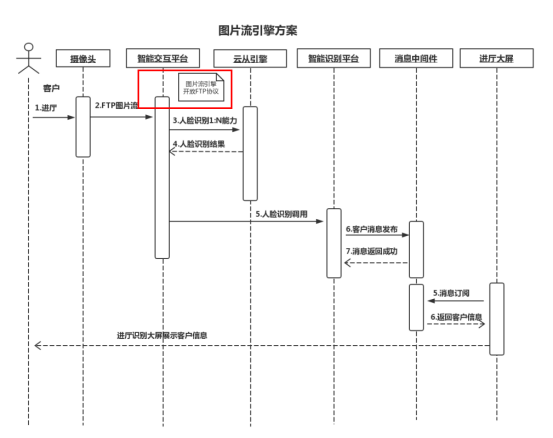

# 智能交互平台使用手册-对外

## 1.公用信

| 信息名称         | 地址              |
| ---------------- | ----------------- |
| 后端能力域名地址 | aicp.teamshub.com |
| 前端交互域名地址 | aift.teamshub.com |

## 2.人脸识别


### 2.1 人证比对

**接口描述:**  

`用于比对多张图片中的人脸相似度并返回两两比对的相似度，可用于判断两张脸是否是同一人的可能性大小。`

`使用场景:人证识别,用户认证`  

**调用URL:** 

`http://aicp.teamshub.com/aicp/face/couple `

**调用方法:**  

`post`

**请求参数:数组参数**  

| 参数名 | 类型   | 是否必选 | 参数说明         |
| ------ | ------ | -------- | ---------------- |
| imageA | String | 是       | 图片A Base64编码 |
| imageB | String | 是       | 图片B Base64编码 |

**请求报文示例:**

``` json
{
				"imageA": "图片A Base64编码",
                "imageB": "图片B Base64编码"
}

```

**调用示例:**

``` json
curl -X "POST" "http://aicp.teamshub.com/InteractiveAbility/face/personwitnessratio" \
     -H "Content-Type: application/json; charset=utf-8" \
     -d $'{
				"imageA": "图片A Base64编码",
                "imageB": "图片B Base64编码"
}'

```

**返回值描述:**

| 参数名     | 类型       | 参数说明                            |
| ---------- | ---------- | ----------------------------------- |
| flag       | boolean    | 成功失败标识                        |
| message    | String     | 成功或异常描述信息                  |
| data       | json对象   | 人脸返回结果描述                    |
| onePerson  | String     | 识别结果: "true"是一个人"flase"不是 |
| similarity | BigDecimal | 相似度                              |

**成功返回示例:**

```json
{
    "flag": true,
    "message": "系统处理正常",
    "data": {
        "onePerson": "true",
        "similarity": "0.9444"
    }
}
```

**失败返回示例:**

```json
{
    "flag": false,
    "message": "Base64编码错误或图片原始数据错误或特征图片都为空",
    "data": null
}

```

### 2.2 人脸录入

**接口描述:**  

`在使用智能交互平台，人脸识别能力时前提条件要有人脸识别底库，人脸录入功能用于向人脸库中新增用户`

`应用场景：构建您的人脸库，如会员人脸注册，已有用户补全人脸信息等。`

**调用URL:** 

`http://aicp.teamshub.com/aicp/face/add`

**调用方法:**  

`post`

**请求参数:**  

| 参数名   | 类型    | 是否必选 | 参数说明                                             |
| -------- | ------- | -------- | ---------------------------------------------------- |
| groupId  | String  | 是       | 人员分组id                                           |
| image    | String  | 是       | 图片Base64编码,编码后的图片大小不超过2M              |
| name     | String  | 否       | 姓名                                                 |
| sex      | integer | 否       | 性别，1：男，2：女                                   |
| birthday | integer | 否       | 生日20190601                                         |
| province | String  | 否       | 省份                                                 |
| duty     | String  | 否       | 职务                                                 |
| type     | String  | 否       | 人员类别，1：运营商，2：客户，3：内部人员，4：陌生人 |
| idIccid  | String  | 否       | 证件号码                                             |
| custId   | String  | 否       | 客户号码                                             |
| remark   | String  | 否       | 备注信息                                             |

**请求报文示例:**

``` json
{ 
    "groupId":"分组id",
	"image": "base64", 
	"name": "客户姓名",
	"idIccid": "220112****0551",
	"sex":1,
	"idIccid":"119020199000",
	"company":"思特奇",
	"duty":"高工",
	"province":"吉林",
	"type":1,
	"remark": "备注"
}
```

**调用示例:**

``` json
curl -X "POST" "http://aicp.teamshub.com/InteractiveAbility/face/FaceEntry" \
     -H "Content-Type: application/json; charset=utf-8" \
     -d $'{ "groupId":"分组id",
			"image": "base64", 
			"cust_name": "客户姓名",
			"id_iccid": "220112****0551",
			"sex":1,
			"birthday":20190607,
			"cust_id":"119020199000",
			"company":"思特奇",
			"duty":"高工",
			"province":"吉林",
			"type":1,
			"remark": "备注"
		}'
```

**返回值描述:**

| 参数名   | 类型    | 参数说明           |
| -------- | ------- | ------------------ |
| flag     | boolean | 成功失败标识       |
| message  | String  | 成功或异常描述信息 |
| data     | json    | 人脸返回结果描述   |
| personID | String  | 人脸id             |

**成功返回示例:**

``` json
{
    "flag": true,
    "message": "人脸录入成功",
    "data": {
        "personID": "7825208425084637184"
    }
}
```

**失败返回示例:**

```
{
    "flag": false,
    "message": "80018,extract feature decode pictrue! get feature failed",
    "data": null
}
```

### 3.3 人脸识别

**接口描述:**  

`也称为1:N人脸识别,以图搜人接口,在指定人脸底库中，找到相似度最高的人。且相似度大于指定阈值。作为人脸识别信息返回`  

`应用场景：排队机,大屏识别,云货架等。`

 **调用URL:** 

`http://aicp.teamshub.com/aicp/face/recognition `

**调用方法:**  

`post`

**请求参数:**  

| 参数名  | 类型   | 是否必选 | 参数说明                                |
| ------- | ------ | -------- | --------------------------------------- |
| groupId | String | 是       | 分组id                                  |
| image   | String | 是       | 图片Base64编码,编码后的图片大小不超过2M |

**请求报文示例:**

``` json
{ 
    "groupId":"分组id",
	"image": "图片Base64编码"
}
```

**调用示例:**

``` json
curl -X "POST" "http://aicp.teamshub.com/InteractiveAbility/face/FaceRecognition" \
     -H "Content-Type: application/json; charset=utf-8" \
     -d $'{ "image": "图片Base64编码",
			"groupId":"分组id"
		}'
```

**返回值描述:**

| 参数名     | 类型       | 参数说明                                         |
| ---------- | ---------- | ------------------------------------------------ |
| flag       | boolean    | 成功失败标识                                     |
| message    | String     | 成功或异常描述信息                               |
| data       | json对象   | 人脸返回结果描述                                 |
| similarity | BigDecimal | 相似度                                           |
| personID   | String     | 识别出人员id                                     |
| name       | String     | 姓名                                             |
| sex        | integer    | 性别 1：男，2：女                                |
| sexCN      | String     | 性别 男，女                                      |
| birthday   | integer    | 生日20190601                                     |
| province   | String     | 省份                                             |
| duty       | String     | 职务                                             |
| type       | integer    | 人员类别     1:运营商 2:客户 3:内部人员 4:陌生人 |
| typeCN     | String     | 人员类别中文 1:运营商 2:客户 3:内部人员 4:陌生人 |
| imageUrl   | String     | 图片路径                                         |
| idIccid    | String     | 证件号码                                         |
| custId     | String     | 客户号码                                         |
| remark     | String     | 备注信息                                         |

**成功返回示例:**

```json
{
    "flag": true,
    "message": "系统处理正常",
    "data": {
        "personID": "7885694657450508288",
        "faceFlag": "Y",
        "similarity": "0.99933773",
        "personinfo": {
            "id": 4993,
            "personId": "7885694657450508288",
            "name": "客户姓名",
            "sex": 1,
            "sexCN": "男",
            "birthday": 20190601,
            "idIccid": "220112****0551",
            "custId": "119020199000",
            "company": "思特奇",
            "duty": "高工",
            "province": "吉林",
            "imageUrl": "http://172.18.199.35:10100/person/20191118/7884681432723365888.png",
            "type": 1,
            "typeCN": "运营商",
            "remark": "备注"
        }
    }
}
```

**失败返回示例:**

```
{
    "flag": false,
    "message": "Base64编码错误或图片原始数据错误或特征图片都为空",
    "data": null
}
```


### 2.3 人脸删除

**接口描述:**  

`根据人员分组和人员id删除人脸底库中的人脸信息`  

**调用URL:** 
`http://aicp.teamshub.com/aicp/face/remove`

**调用方法:**  

`post`

**请求参数:**  

| 参数名  | 类型   | 是否必选 | 参数说明     |
| ------- | ------ | -------- | ------------ |
| groupId | String | 是       | 分组id       |
| userId  | String | 是       | 待删除人员id |

**请求报文示例:**

``` json
{
	"groupId":"分组id",
	"userId":"用户id"
}
```

**调用示例:**

``` json
curl -X POST \
  http://aicp.teamshub.com/aicp/face/remove \
  -H 'Content-Type: application/json' \
  -d '{
	"groupId":"分组id",
	"userId":"用户id"
}'
```

**返回值描述:**

| 参数名   | 类型     | 参数说明                           |
| -------- | -------- | ---------------------------------- |
| flag     | boolean  | 成功失败标识                       |
| message  | String   | 成功或异常描述信息                 |
| data     | json对象 | 接口返回数据                       |
| personID | String   | 删除成功用户id，即请求参数中userId |

**成功返回示例:**

```json
{
    "flag": true,
    "message": "系统处理正常",
    "data": {
        "personID": "7887150487247790080"
    }
}
```

**失败返回示例:**

```json
{
    "flag": false,
    "message": "人脸库[200000]删除人脸[7885743058546360320]错误,错误信息[人脸不存在]",
    "data": null
}
```

### 2.4 人脸查询

**接口描述:**  

`根据人员分组和人员id信息查询对应的人员图片信息`  

**调用URL:** 
`http://aicp.teamshub.com/aicp/face/query`

**调用方法:**  

`post`

**请求参数:**  

| 参数名  | 类型   | 是否必选 | 参数说明   |
| ------- | ------ | -------- | ---------- |
| groupId | String | 是       | 用户分组id |
| userId  | String | 是       | 用户id     |

**请求报文示例:**

``` json
{
	"groupId":"填写分组id",
	"userId":"填写用户id"
}
```

**调用示例:**

``` json
curl -X POST \
  http://aicp.teamshub.com/aicp/face/query \
  -H 'Content-Type: application/json' \
  -d '{
	"groupId":"分组id",
	"userId":"用户id"
}'
```

**返回值描述:**

| 参数名    | 类型     | 参数说明           |
| --------- | -------- | ------------------ |
| flag      | boolean  | 成功失败标识       |
| message   | String   | 成功或异常描述信息 |
| data      | json对象 | 接口响应数据       |
| faceDBURL | String   | 人脸图片url地址    |
| personID  | String   | 用户id             |

**成功返回示例:**

```json
{
    "flag": true,
    "message": "系统处理正常",
    "data": {
        "faceDBURL": "http://172.18.199.35:7100/face/getimage?app_id=system&app_secret=12345&groupId=200000&faceId=55",
        "personID": "7885746467177529344",
        "faceId": "55"
    }
}
```

**失败返回示例:**

```json
{
    "flag": false,
    "message": "查询人脸错误,错误信息[record not found]",
    "data": null
}
```

### 2.5 图片质量检测

**接口描述:**  

`对图片中人脸的质量进行检测，返回质量评分`  

**调用URL:** 
`http://aicp.teamshub.com/aicp/face/quality`

**调用方法:**  

`post`

**请求参数:**  

| 参数名 | 类型   | 是否必选 | 参数说明                                |
| ------ | ------ | -------- | --------------------------------------- |
| image  | String | 是       | 图片Base64编码,编码后的图片大小不超过2M |

**请求报文示例:**

``` json
{ 
	"image": "图片Base64编码"
}
```

**调用示例:**

``` shell
curl -X "POST" "http://aicp.teamshub.com/aicp/face/quality" \
     -H "Content-Type: application/json; charset=utf-8" \
     -d $'{ "image": "图片Base64编码" 
		}'
```

**返回值描述:**

| 参数名        | 类型       | 参数说明                        |
| ------------- | ---------- | ------------------------------- |
| flag          | boolean    | 成功失败标识                    |
| message       | String     | 成功或异常描述信息              |
| data          | json对象   | 接口返回数据                    |
| qualityFlag   | String     | 图片质量是否合格：Y合格 N不合格 |
| feature       | String     | 图片特征                        |
| qualityScores | BigDecimal | 图片质量得分                    |

**成功返回示例:**

```json
{
    "flag": true,
    "message": "系统处理正常",
    "data": {
        "qualityFlag": "Y",
        "feature": "goWpvcJK1DzuW....CAACAPw==",
        "qualityScores": "0.7373"
    }
}
```

**失败返回示例:**

```json
{
    "flag": false,
    "message": "80018,extract feature decode pictrue! get feature failed",
    "data": null
}
```

## 3.场景支撑

### 3.1进厅识别场景



### 3.2底库运营场景


## 4.授权能力

### 4.1 能力授权

**接口描述:**  

`对用户授权对应的能力，返回拥有用户信息的token`  

**调用URL:** 
`http://aicp.teamshub.com/authorize/grantAuthorize`

**调用方法:**  

`post`

**请求Header:**

| 参数名 | 类型   | 是否必选 | 参数说明 |
| ------ | ------ | -------- | -------- |
| token  | String | 是       | token    |

**请求参数:**  

| 参数名            | 类型   | 是否必选 | 参数说明       |
| ----------------- | ------ | -------- | -------------- |
| appId             | String | 是       | 用户id         |
| dueTime           | String | 是       | 授权到期时间   |
| capabilityIdArray | Array  | 是       | 授权能力ID数组 |

**请求报文示例:**

``` json
{
	"appId":"testan",
    "dueTime":"2020-11-11 00:00:00",
    "capabilityIdArray":["C10000000001,C10000000002"]
}
```

**调用示例:**

``` shell
curl -X "POST" "http://aicp.teamshub.com/authorize/grantAuthorize" \
     -H "Content-Type: application/json; charset=utf-8" \
     -d $'{ 
	"appId":"testan",
    "dueTime":"2020-11-11 00:00:00",
    "capabilityIdArray":["C10000000001,C10000000002"]
		}'
```

**返回值描述:**

| 参数名     | 类型     | 参数说明                |
| ---------- | -------- | ----------------------- |
| flag       | boolean  | 成功失败标识            |
| resultCode | int      | 成功失败状态码          |
| message    | String   | 成功或异常描述信息      |
| data       | json对象 | 接口返回数据            |
| appId      | String   | 用户ID                  |
| dueTime    | String   | 授权到期时间            |
| token      | String   | 包含用户授权能力的token |

**成功返回示例:**

```json
{
    "flag": true,
    "resultCode": 0,
    "message": "系统处理正常",
    "data": {
        "appId": "testan",
        "dueTime": "2020-11-11 00:00:00",
        "token": "DU/mHOzoR4it4ljQFugDcA=="
    }
}
```

**失败返回示例:**

```json
{
    "timestamp": "2020-04-04T08:22:51.121+0000",
    "status": 500,
    "error": "Internal Server Error",
    "message": "当前授权用户已存在",
    "path": "/authorize/grantAuthorize"
}
```


### 4.2 授权更新

**接口描述:**  

`对用户授权对应的能力进行更新`  

**调用URL:** 
`http://aicp.teamshub.com/authorize/updateAuthorize`

**调用方法:**  

`post`

**请求Header:**

| 参数名 | 类型   | 是否必选 | 参数说明 |
| ------ | ------ | -------- | -------- |
| token  | String | 是       | token    |

**请求参数:**  

| 参数名            | 类型   | 是否必选 | 参数说明       |
| ----------------- | ------ | -------- | -------------- |
| appId             | String | 是       | 用户id         |
| dueTime           | String | 是       | 授权到期时间   |
| capabilityIdArray | Array  | 是       | 授权能力ID数组 |

**请求报文示例:**

``` json
{
	"appId":"testan",
	"dueTime":"2099-10-28 00:00:00",
	"capabilityIdArray":["C10000000001,C10000000002,C10000000003"]
}
```

**调用示例:**

``` shell
curl -X "POST" "http://aicp.teamshub.com/authorize/updateAuthorize" \
     -H "Content-Type: application/json; charset=utf-8" \
     -d $'{
	"appId":"testan",
	"dueTime":"2099-10-28 00:00:00",
	"capabilityIdArray":["C10000000001,C10000000002,C10000000003"]
}'
```

**返回值描述:**

| 参数名         | 类型     | 参数说明                |
| -------------- | -------- | ----------------------- |
| flag           | boolean  | 成功失败标识            |
| resultCode     | int      | 成功失败状态码          |
| message        | String   | 成功或异常描述信息      |
| data           | json对象 | 接口返回数据            |
| existAuthorize | String   | 已存在的能力            |
| addAuthorize   | String   | 新增的能力              |
| appId          | String   | 用户id                  |
| token          | String   | 包含用户授权能力的token |

**成功返回示例:**

```json
{
    "flag": true,
    "resultCode": 0,
    "message": "系统处理正常",
    "data": {
        "existAuthorize": "[C10000000001, C10000000002]",
        "addAuthorize": "[C10000000003]",
        "appId": "testan",
        "token": "DU/mHOzoR4it4ljQFugDcA=="
    }
}
```

**失败返回示例:**

```json
{
    "flag": false,
    "message": "运行时出错!",
    "data": null
}
```


### 4.3 授权用户删除

**接口描述:**  

`对授权用户删除`  

**调用URL:** 
`http://aicp.teamshub.com/authorize/deleteAuthorizedUser`

**调用方法:**  

`post`

**请求Header:**

| 参数名 | 类型   | 是否必选 | 参数说明 |
| ------ | ------ | -------- | -------- |
| token  | String | 是       | token    |

**请求参数:**  

| 参数名 | 类型   | 是否必选 | 参数说明 |
| ------ | ------ | -------- | -------- |
| appId  | String | 是       | 用户Id   |

**请求报文示例:**

``` json
{
	"appId":"testan"
}
```

**调用示例:**

``` shell
curl -X "POST" "http://aicp.teamshub.com/authorize/saveOrUpdateAuthorize" \
     -H "Content-Type: application/json; charset=utf-8" \
     -d $'{ "appId":"testan
		}'
```

**返回值描述:**

| 参数名     | 类型     | 参数说明           |
| ---------- | -------- | ------------------ |
| flag       | boolean  | 成功失败标识       |
| resultCode | int      | 成功失败状态码     |
| message    | String   | 成功或异常描述信息 |
| data       | json对象 | 接口返回数据       |
| appId      | String   | 用户id             |

**成功返回示例:**

```json
{
    "flag": true,
    "resultCode": 0,
    "message": "系统处理正常",
    "data": {
        "appId": "testan"
    }
}
```

**失败返回示例:**

```json
{
    "flag": false,
    "resultCode": 1,
    "message": "该用户不存在",
    "data": null
}
```


## 5.微服务API

### 5.1.人脸底库添加

**接口描述:**  

`在使用智能交互平台，人脸底库是对人脸进行管理`

**调用URL:** 

`http://aicp.teamshub.com/aicp/face/addBase`

**调用方法:**  

`post`

**请求Header:**

| 参数名 | 类型   | 是否必选 | 参数说明 |
| ------ | ------ | -------- | -------- |
| token  | String | 是       | token    |

**请求参数:**  

| 参数名  | 类型   | 是否必选 | 参数说明     |
| ------- | ------ | -------- | ------------ |
| groupId | String | 是       | 人员分组id   |
| dbName  | String | 是       | 人脸底库名称 |
| dbDesc  | String | 否       | 人脸底库描述 |

**请求报文示例:**

``` json
{ 
    "groupId":"200000",
	"dbName":"sitechTest2",
	"dbDesc":"This is sitechTest"
}
```

**调用示例:**

``` json
curl -X "POST" "http://aicp.teamshub.com/aicp/face/addBase" \
     -H "Content-Type: application/json; charset=utf-8" \
     -d $'{ 
	"groupId":"200000",
	"dbName":"sitechTest2",
	"dbDesc":"This is sitechTest"
}'
```

**返回值描述:**

| 参数名      | 类型    | 参数说明           |
| ----------- | ------- | ------------------ |
| flag        | boolean | 成功失败标识       |
| message     | String  | 成功或异常描述信息 |
| data        | json    | 人脸返回结果描述   |
| dbDesc      | String  | 人脸底库描述       |
| dbName      | String  | 人脸底库名称       |
| personDbLib | String  | 人脸底库id         |

**成功返回示例:**

``` json
{
    "flag": true,
    "resultCode": 0,
    "message": "系统处理正常",
    "data": {
        "dbDesc": "This is sitechTest",
        "dbName": "sitechTest2",
        "personDbLib": "567a4e9469c147c896c478f891bff72d"
    }
}
```

**失败返回示例:**

```
{
    "flag": false,
    "resultCode": 1,
    "message": "服务端报错",
    "data": null
}
```

### 5.2.人脸底库查询

**接口描述:**  

`查询人脸底库`

**调用URL:** 

`http://aicp.teamshub.com/aicp/face/queryBase`

**调用方法:**  

`post`

**请求Header:**

| 参数名 | 类型   | 是否必选 | 参数说明 |
| ------ | ------ | -------- | -------- |
| token  | String | 是       | token    |

**请求参数:**  

| 参数名  | 类型   | 是否必选 | 参数说明   |
| ------- | ------ | -------- | ---------- |
| groupId | String | 是       | 人员分组id |

**请求报文示例:**

``` json
{
    "groupId":"200000"
}
```

**调用示例:**

``` json
curl -X "POST" "http://aicp.teamshub.com/aicp/face/queryBase" \
     -H "Content-Type: application/json; charset=utf-8" \
     -d $'{
    "groupId":"200000"
}'
```

**返回值描述:**

| 参数名      | 类型    | 参数说明           |
| ----------- | ------- | ------------------ |
| flag        | boolean | 成功失败标识       |
| message     | String  | 成功或异常描述信息 |
| data        | json    | 人脸返回结果描述   |
| dbDesc      | String  | 人脸底库描述       |
| dbName      | String  | 人脸底库名称       |
| personDbLib | String  | 人脸底库id         |

**成功返回示例:**

``` json
{
    "flag": true,
    "resultCode": 0,
    "message": "系统处理正常",
    "data": {
        "dbDesc": "This is sitechTest",
        "dbName": "sitechTest2",
        "personDbLib": "567a4e9469c147c896c478f891bff72d"
    }
}
```

**失败返回示例:**

```
{
    "flag": false,
    "resultCode": 1,
    "message": "服务端报错",
    "data": null
}
```

### 5.3.人脸底库删除

**接口描述:**  

`删除人脸底库`

**调用URL:** 

`http://aicp.teamshub.com/aicp/face/remove`

**调用方法:**  

`post`

**请求Header:**

| 参数名 | 类型   | 是否必选 | 参数说明 |
| ------ | ------ | -------- | -------- |
| token  | String | 是       | token    |

**请求参数:**  

| 参数名  | 类型   | 是否必选 | 参数说明   |
| ------- | ------ | -------- | ---------- |
| groupId | String | 是       | 人员分组id |

**请求报文示例:**

``` json
{
    "groupId":"200000"
}
```

**调用示例:**

``` json
curl -X "POST" "http://aicp.teamshub.com/aicp/face/remove" \
     -H "Content-Type: application/json; charset=utf-8" \
     -d $'{
    "groupId":"200000"
}'
```

**返回值描述:**

| 参数名  | 类型    | 参数说明           |
| ------- | ------- | ------------------ |
| flag    | boolean | 成功失败标识       |
| message | String  | 成功或异常描述信息 |
| data    | json    | 人脸返回结果描述   |
| message | String  | 返回成功信息       |

**成功返回示例:**

``` json
{
    "flag": true,
    "resultCode": 0,
    "message": "系统处理正常",
    "data": {
        "message": "ok"
    }
}
```

**失败返回示例:**

```
{
    "flag": false,
    "resultCode": 1,
    "message": "服务端报错",
    "data": null
}
```


### 5.4.人脸底库查询所有

**接口描述:**  

`查询所有的底库`

**调用URL:** 

`http://aicp.teamshub.com/aicp/face/queryBaseAll`

**调用方法:**  

post

**请求Header:**

| 参数名 | 类型   | 是否必选 | 参数说明 |
| ------ | ------ | -------- | -------- |
| token  | String | 是       | token    |

**请求参数:**  

| 参数名   | 类型   | 是否必选 | 参数说明 |
| -------- | ------ | -------- | -------- |
| pageNo   | String | 是       | 分页页数 |
| pageSize | String | 是       | 分页个数 |

**请求报文示例:**

``` json
{
	"pageNo":"1",
	"pageSize":"20"
}
```

**调用示例:**

``` json
curl -X "POST" "http://aicp.teamshub.com/aicp/face/queryBaseAll" \
     -H "Content-Type: application/json; charset=utf-8" \
     -d $'{
    "groupId":"200000"
}'
```

**返回值描述:**

| 参数名      | 类型     | 参数说明         |
| ----------- | -------- | ---------------- |
| flag        | boolean  | 成功失败标识     |
| resultCode  | Integer  | 结果代码         |
| data        | json     | 人脸返回结果描述 |
| records     | objcet[] | 人像库数组对象   |
| dbDesc      | String   | 人脸库描述       |
| dbName      | String   | 人脸库名称       |
| personDbLib | String   | 人脸库ID         |
| id          | String   | 人脸库编号       |

**成功返回示例:**

``` json
{
    "flag": true,
    "resultCode": 0,
    "message": "系统处理正常",
    "data": {
        "records": [
            {
                "dbDesc": "This is sitechTest",
                "dbName": "sitechTest1",
                "id": 63,
                "personDbLib": "c4ae5e7845e742b484d39a39e58be85a"
            }
        ]
    }
}
```

**失败返回示例:**

```
{
    "flag": false,
    "resultCode": 1,
    "message": "服务端报错",
    "data": null
}
```

### 5.5.人脸录入

**接口描述:**  

`在使用智能交互平台，人脸识别能力时前提条件要有人脸识别底库，人脸录入功能用于向人脸库中新增用户`

`应用场景：构建您的人脸库，如会员人脸注册，已有用户补全人脸信息等。`

**调用URL:** 

`http://aicp.teamshub.com/aicp/face/add`

**调用方法:**  

`post`

**请求Header:**

| 参数名 | 类型   | 是否必选 | 参数说明 |
| ------ | ------ | -------- | -------- |
| token  | String | 是       | token    |

**请求参数:**  

| 参数名   | 类型    | 是否必选 | 参数说明                                             |
| -------- | ------- | -------- | ---------------------------------------------------- |
| groupId  | String  | 是       | 人员分组id                                           |
| image    | String  | 是       | 图片Base64编码,编码后的图片大小不超过2M              |
| name     | String  | 否       | 姓名                                                 |
| sex      | integer | 否       | 性别，1：男，2：女                                   |
| birthday | integer | 否       | 生日20190601                                         |
| province | String  | 否       | 省份                                                 |
| duty     | String  | 否       | 职务                                                 |
| type     | String  | 否       | 人员类别，1：运营商，2：客户，3：内部人员，4：陌生人 |
| idIccid  | String  | 否       | 证件号码                                             |
| custId   | String  | 否       | 客户号码                                             |
| remark   | String  | 否       | 备注信息                                             |

**请求报文示例:**

``` json
{ 
    "groupId":"分组id",
	"image": "base64", 
	"name": "客户姓名",
	"idIccid": "220112****0551",
	"sex":1,
	"idIccid":"119020199000",
	"company":"思特奇",
	"duty":"高工",
	"province":"吉林",
	"type":1,
	"remark": "备注"
}
```

**调用示例:**

``` json
curl -X "POST" "http://aicp.teamshub.com/InteractiveAbility/face/FaceEntry" \
     -H "Content-Type: application/json; charset=utf-8" \
     -d $'{ "groupId":"分组id",
			"image": "base64", 
			"cust_name": "客户姓名",
			"id_iccid": "220112****0551",
			"sex":1,
			"birthday":20190607,
			"cust_id":"119020199000",
			"company":"思特奇",
			"duty":"高工",
			"province":"吉林",
			"type":1,
			"remark": "备注"
		}'
```

**返回值描述:**

| 参数名     | 类型    | 参数说明           |
| ---------- | ------- | ------------------ |
| flag       | boolean | 成功失败标识       |
| resultCode | Integer | 结果代码           |
| message    | String  | 成功或异常描述信息 |
| data       | json    | 人脸返回结果描述   |
| personID   | String  | 人脸id             |
| url        | String  | 人脸图片url地址    |

**成功返回示例:**

``` json
{
    "flag": true,
    "resultCode": 0,
    "message": "系统处理正常",
    "data": {
        "personNo": "1b350b97cc944a169426f1b81540c993",
        "url": "http://172.18.199.16:38095/group1/default/20200325/13/40/1/1585114811949?download=0"
    }
}
```

**失败返回示例:**

```
{
    "flag": false,
    "message": "80018,extract feature decode pictrue! get feature failed",
    "data": null
}
```

### 5.6.人脸识别

**接口描述:**  

`也称为1:N人脸识别,以图搜人接口,在指定人脸底库中，找到相似度最高的人。且相似度大于指定阈值。作为人脸识别信息返回`  

`应用场景：排队机,大屏识别,云货架等。`

 **调用URL:** 

`http://aicp.teamshub.com/aicp/face/recognition `

**调用方法:**  

`post`

**请求Header:**

| 参数名 | 类型   | 是否必选 | 参数说明 |
| ------ | ------ | -------- | -------- |
| token  | String | 是       | token    |

**请求参数:**  

| 参数名  | 类型   | 是否必选 | 参数说明                                |
| ------- | ------ | -------- | --------------------------------------- |
| groupId | String | 是       | 分组id                                  |
| image   | String | 是       | 图片Base64编码,编码后的图片大小不超过2M |

**请求报文示例:**

``` json
{ 
    "groupId":"分组id",
	"image": "图片Base64编码"
}
```

**调用示例:**

``` json
curl -X "POST" "http://aicp.teamshub.com/InteractiveAbility/face/FaceRecognition" \
     -H "Content-Type: application/json; charset=utf-8" \
     -d $'{ "image": "图片Base64编码",
			"groupId":"分组id"
		}'
```

**返回值描述:**

| 参数名       | 类型     | 参数说明           |
| ------------ | -------- | ------------------ |
| flag         | boolean  | 成功失败标识       |
| resultCode   | Integer  | 返回结果代码       |
| message      | String   | 成功或异常描述信息 |
| data         | json对象 | 人脸返回结果描述   |
| score        | Float    | 相似程度           |
| id           | String   | id                 |
| faceId       | String   | 人脸ID             |
| personNo     | String   | 人员编号           |
| url          | String   | 人像Url地址        |
| personinfo   | json对象 | 人像信息           |
| id           | Integer  | id                 |
| personId     | String   | 人像Id             |
| personUrl    | String   | 人像url            |
| groupId      | String   | 组织机构号         |
| reginCode    | String   | 地区代码           |
| facedbId     | String   | 人脸底库Id         |
| faceId       | String   | 人脸Id             |
| name         | String   | 人脸名称           |
| createTime   | String   | 插入时间           |
| lastSnapTime | String   | 最后修改时间       |
| type         | String   | 类型               |

**成功返回示例:**

```json
{
    "flag": true,
    "resultCode": 0,
    "message": "系统处理正常",
    "data": {
        "score": 100.0,
        "id": "1588742058590195000",
        "faceId": "koala-7903489270803603457-058527",
        "personNo": "7903489270803603457",
        "url": "http://172.18.199.16:38095/group1/default/20200430/10/27/1/1588213632269?download=0",
        "personinfo": {
            "id": 5130,
            "personId": "7903489270803603457",
            "personUrl": null,
            "groupId": null,
            "regionCode": null,
            "facedbId": null,
            "faceId": null,
            "name": "客户姓名",
            "createTime": null,
            "lastSnapTime": null,
            "type": 3
        }
    }
}
```

**失败返回示例:**

```
{
    "flag": false,
    "message": "Base64编码错误或图片原始数据错误或特征图片都为空",
    "data": null
}
```

### 5.7.人证比对

**接口描述:**  

`用于比对多张图片中的人脸相似度并返回两两比对的相似度，可用于判断两张脸是否是同一人的可能性大小。`

`使用场景:人证识别,用户认证`  

**调用URL:** 

`http://aicp.teamshub.com/aicp/face/couple `

**调用方法:**  

`post`

**请求Header:**

| 参数名 | 类型   | 是否必选 | 参数说明 |
| ------ | ------ | -------- | -------- |
| token  | String | 是       | token    |

**请求参数:数组参数**  

| 参数名 | 类型   | 是否必选 | 参数说明         |
| ------ | ------ | -------- | ---------------- |
| imageA | String | 是       | 图片A Base64编码 |
| imageB | String | 是       | 图片B Base64编码 |

**请求报文示例:**

``` json
{
				"imageA": "图片A Base64编码",
                "imageB": "图片B Base64编码"
}

```

**调用示例:**

``` json
curl -X "POST" "http://aicp.teamshub.com/InteractiveAbility/face/personwitnessratio" \
     -H "Content-Type: application/json; charset=utf-8" \
     -d $'{
				"imageA": "图片A Base64编码",
                "imageB": "图片B Base64编码"
}'

```

**返回值描述:**

| 参数名  | 类型       | 参数说明             |
| ------- | ---------- | -------------------- |
| flag    | boolean    | 成功失败标识         |
| message | String     | 成功或异常描述信息   |
| data    | json对象   | 人脸返回结果描述     |
| msg     | String     | 识别结果: ok是一个人 |
| score   | BigDecimal | 相似度               |

**成功返回示例:**

```json
{
    "flag": true,
    "resultCode": 0,
    "message": "系统处理正常",
    "data": {
        "msg": "ok",
        "score": "89.74037"
    }
}
```

**失败返回示例:**

```json
{
    "flag": false,
    "message": "Base64编码错误或图片原始数据错误或特征图片都为空",
    "data": null
}

```

### 5.8.人脸删除

**接口描述:**  

`根据人员分组和人员id删除人脸底库中的人脸信息`  

**调用URL:** 
`http://aicp.teamshub.com/aicp/face/remove`

**调用方法:**  

`post`

**请求Header:**

| 参数名 | 类型   | 是否必选 | 参数说明 |
| ------ | ------ | -------- | -------- |
| token  | String | 是       | token    |

**请求参数:**  

| 参数名  | 类型   | 是否必选 | 参数说明     |
| ------- | ------ | -------- | ------------ |
| groupId | String | 是       | 分组id       |
| userId  | String | 是       | 待删除人员id |

**请求报文示例:**

``` json
{
	"groupId":"分组id",
	"userId":"用户id"
}
```

**调用示例:**

``` json
curl -X POST \
  http://aicp.teamshub.com/aicp/face/remove \
  -H 'Content-Type: application/json' \
  -d '{
	"groupId":"分组id",
	"userId":"用户id"
}'
```

**返回值描述:**

| 参数名     | 类型     | 参数说明           |
| ---------- | -------- | ------------------ |
| flag       | boolean  | 成功失败标识       |
| resultCode | Integer  | 返回结果代码       |
| message    | String   | 成功或异常描述信息 |
| data       | json对象 | 接口返回数据       |
| request    | String   | 成功标识           |

**成功返回示例:**

```json
{
    "flag": true,
    "resultCode": 0,
    "message": "系统处理正常",
    "data": {
        "request": "Request successful"
    }
}
```

**失败返回示例:**

```json
{
    "flag": false,
    "message": "人脸库[200000]删除人脸[7885743058546360320]错误,错误信息[人脸不存在]",
    "data": null
}
```


### 5.9.人脸查询

**接口描述:**  

`根据人员分组和人员id信息查询对应的人员图片信息`  

**调用URL:** 
`http://aicp.teamshub.com/aicp/face/query`

**调用方法:**  

`post`

**请求Header:**

| 参数名 | 类型   | 是否必选 | 参数说明 |
| ------ | ------ | -------- | -------- |
| token  | String | 是       | token    |

**请求参数:**  

| 参数名  | 类型   | 是否必选 | 参数说明   |
| ------- | ------ | -------- | ---------- |
| groupId | String | 是       | 用户分组id |
| userId  | String | 是       | 用户id     |

**请求报文示例:**

``` json
{
	"groupId":"填写分组id",
	"userId":"填写用户id"
}
```

**调用示例:**

``` json
curl -X POST \
  http://aicp.teamshub.com/aicp/face/query \
  -H 'Content-Type: application/json' \
  -d '{
	"groupId":"分组id",
	"userId":"用户id"
}'
```

**返回值描述:**

| 参数名    | 类型     | 参数说明           |
| --------- | -------- | ------------------ |
| flag      | boolean  | 成功失败标识       |
| message   | String   | 成功或异常描述信息 |
| data      | json对象 | 接口响应数据       |
| faceDBURL | String   | 人脸图片url地址    |
| personID  | String   | 用户id             |

**成功返回示例:**

```json
{
    "flag": true,
    "message": "系统处理正常",
    "data": {
        "faceDBURL": "http://172.18.233.118:9012/face/getimage?app_id=system&app_secret=12345&groupId=200000&faceId=55",
        "personID": "7885746467177529344",
        "faceId": "55"
    }
}
```

**失败返回示例:**

```json
{
    "flag": false,
    "message": "查询人脸错误,错误信息[record not found]",
    "data": null
}
```


### 5.10.图片质量检测

**接口描述:**  

`对图片中人脸的质量进行检测，返回质量评分`  

**调用URL:** 
`http://aicp.teamshub.com/aicp/face/quality`

**调用方法:**  

`post`

**请求Header:**

| 参数名 | 类型   | 是否必选 | 参数说明 |
| ------ | ------ | -------- | -------- |
| token  | String | 是       | token    |

**请求参数:**  

| 参数名 | 类型   | 是否必选 | 参数说明                                |
| ------ | ------ | -------- | --------------------------------------- |
| image  | String | 是       | 图片Base64编码,编码后的图片大小不超过2M |

**请求报文示例:**

``` json
{ 
	"image": "图片Base64编码"
}
```

**调用示例:**

``` shell
curl -X "POST" "aicp.teamshub.com/aicp/face/quality" \
     -H "Content-Type: application/json; charset=utf-8" \
     -d $'{ "image": "图片Base64编码" 
		}'
```

**返回值描述:**

| 参数名      | 类型       | 参数说明                        |
| ----------- | ---------- | ------------------------------- |
| flag        | boolean    | 成功失败标识                    |
| resultCode  | Integer    | 结果返回代码                    |
| message     | String     | 成功或异常描述信息              |
| data        | json对象   | 接口返回数据                    |
| qualityFlag | String     | 图片质量是否合格：Y合格 N不合格 |
| qualities   | BigDecimal | 图片质量得分                    |

**成功返回示例:**

```json
{
    "flag": true,
    "resultCode": 0,
    "message": "系统处理正常",
    "data": {
        "qualityFlag": "Y",
        "qualities": [
            1,
            1,
            0,
            0,
            0
        ]
    }
}
```

**失败返回示例:**

```json
{
    "flag": false,
    "message": "80018,extract feature decode pictrue! get feature failed",
    "data": null
}
```


### 5.11.人脸检测

**接口描述:**  

`检测人脸信息`  

**调用URL:** 
`http://aicp.teamshub.com/aicp/face/detect`

**调用方法:**  

`post`

**请求Header:**

| 参数名 | 类型   | 是否必选 | 参数说明 |
| ------ | ------ | -------- | -------- |
| token  | String | 是       | token    |

**请求参数:**  

| 参数名 | 类型   | 是否必选 | 参数说明                                |
| ------ | ------ | -------- | --------------------------------------- |
| image  | String | 是       | 图片Base64编码,编码后的图片大小不超过2M |

**请求报文示例:**

``` json
{ 
	"image": "图片Base64编码"
}
```

**调用示例:**

``` shell
curl -X "POST" "aicp.teamshub.com/aicp/face/detect" \
     -H "Content-Type: application/json; charset=utf-8" \
     -d $'{ "image": "图片Base64编码" 
		}'
```

**返回值描述:**

| 参数名     | 类型         | 参数说明           |
| ---------- | ------------ | ------------------ |
| flag       | boolean      | 成功失败标识       |
| resultCode | Integer      | 结果返回代码       |
| message    | String       | 成功或异常描述信息 |
| data       | json对象     | 接口返回数据       |
| records    | Object[]数组 | 返回结果数组       |
| width      | Integer      | 头像框宽           |
| x          | Integer      | 头像x轴起点        |
| y          | Integer      | 头像y轴起点        |
| height     | Integer      | 头像框高           |

**成功返回示例:**

```json
{
    "flag": true,
    "resultCode": 0,
    "message": "系统处理正常",
    "data": {
        "records": [
            [
                {
                    "width": 166,
                    "x": 87,
                    "y": 49,
                    "height": 216
                }
            ]
        ]
    }
}
```

**失败返回示例:**

```json
{
    "flag": false,
    "message": "80018,extract feature decode pictrue! get feature failed",
    "data": null
}
```


### 5.12.人脸M:N

**接口描述:**  

`检测人脸信息`  

**调用URL:** 
`http://aicp.teamshub.com/aicp/face/recognitionmn`

**调用方法:**  

`post`

**请求Header:**

| 参数名 | 类型   | 是否必选 | 参数说明 |
| ------ | ------ | -------- | -------- |
| token  | String | 是       | token    |

**请求参数:**  

| 参数名  | 类型   | 是否必选 | 参数说明                                |
| ------- | ------ | -------- | --------------------------------------- |
| image   | String | 是       | 图片Base64编码,编码后的图片大小不超过2M |
| groupId | String | 否       | 人员分组id                              |

**请求报文示例:**

``` json
{ 
	"image": "图片Base64编码",
    "groupId":"20000"
}
```

**调用示例:**

``` shell
curl -X "POST" "aicp.teamshub.com/aicp/face/recognitionmn" \
     -H "Content-Type: application/json; charset=utf-8" \
     -d $'{ "image": "图片Base64编码"
     		"groupId":"20000"
		}'
```

**返回值描述:**

| 参数名     | 类型         | 参数说明           |
| ---------- | ------------ | ------------------ |
| flag       | boolean      | 成功失败标识       |
| resultCode | Integer      | 结果返回代码       |
| message    | String       | 成功或异常描述信息 |
| data       | json对象     | 接口返回数据       |
| records    | Object[]数组 | 返回结果数组       |
| score      | Float        | 相似度             |
| id         | String       | 编号               |
| faceId     | String       | 人脸图片ID         |
| personNo   | String       | 人员编号           |
| url        | String       | 图片url地址        |

**成功返回示例:**

```json
{
    "flag": true,
    "resultCode": 0,
    "message": "系统处理正常",
    "data": {
        "records": [
            [
                {
                    "score": 100.0,
                    "id": "1586394103831187000",
                    "faceId": "koala-deba4899ff644fa9b7ee3589372ffe45-",
                    "personNo": "deba4899ff644fa9b7ee3589372ffe45",
                    "url": "http://172.18.199.16:38095/group1/default/20200325/13/40/1/1585114811949?download=0"
                }
            ]
        ]
    }
}
```

**失败返回示例:**

```json
{
    "flag": false,
    "message": "80018,extract feature decode pictrue! get feature failed",
    "data": null
}
```

