# 移动门户演示环境搭建

## 0.基本信息

### 开放地址信息

| 服务名称              | 访问地址                    |
| --------------------- | --------------------------- |
| 移动门户web端访问地址 | http://172.18.199.34:10120/ |

### 研发资源地址信息

| 资源信息              | 资源地址                                                     |
| --------------------- | ------------------------------------------------------------ |
| 移动开发平台-API地址  | http://172.18.193.120:9999/app/item/page/main.html?lc=operation&id=d00001 |
| 移动开发平台-打包地址 | http://172.18.193.120:9999/app/item/page/mainView.html       |
| 能力接口地址          | http://eip.teamshub.com/t/4552845                            |
| 开发计划              | http://eip.teamshub.com/t/4564549                            |
| 交互流程              | http://eip.teamshub.com/t/4568739                            |

### 应用部署

| 部署应用           | 部署地址                                    |
| ------------------ | ------------------------------------------- |
| Jenkins环境地址    | http://172.18.234.180:20000/                |
| nginx部署主机信息  | 172.18.199.34:10120                         |
| zookeeper地址      | 172.18.199.34:2181                          |
| kafka地址          | 172.18.199.34:9092                          |
| msyql地址          | 172.18.199.34:3306                          |
| 文件上传微服务     | http://172.18.199.34:8092/image/upload      |
| 统一kafka服务接口  | http://172.18.199.34:8093/kafka/messagesend |
| 移动端能力开放后台 | http://172.18.199.34:9012                   |

备注：应用部署接口详情，请查看第七章访问接口部分

### 源码地址

| 代码模块             | 代码地址                                                     |
| -------------------- | ------------------------------------------------------------ |
| H5移动端能力开放前端 | http://172.18.234.180/aicp/aimobile                          |
| 图片上传微服务工程   | http://172.18.234.180/aicp/intelligentplatform/tree/dev/aicp-tools/aicp-fileuploader |
| 统一kafka接口工程    | http://172.18.234.180/aicp/intelligentplatform/tree/dev/aicp-tools/mickafka |
| H5移动端能力开放后台 | http://172.18.234.180/aicp/intelligentplatform/tree/dev/aimobile |

## 1.本地开发环境运行

### 第一步:下载工程

```
git clone git@172.18.234.180:aicp/aimobile.git
```

### 第二步:依赖安装

npm install 报错信息，不影响使用

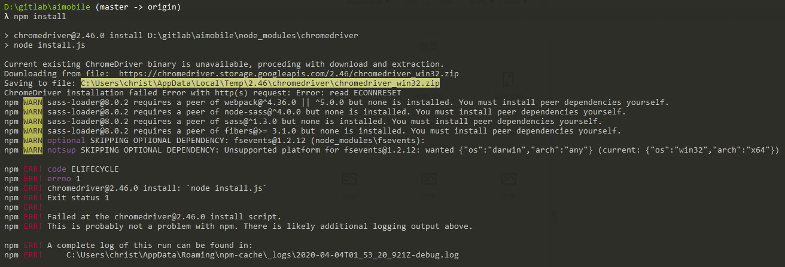

@lingqn 解释一下

chromedriver@2.46.0 依赖有什么用，什么情况可以安装成功

```bash
#快速执行
npm config ls
npm config set registry http://registry.npm.taobao.org
npm install
```

### 第三步:项目启动

```
npm run dev
```

## 2.持续集成环境安装

### 丢弃旧的构建

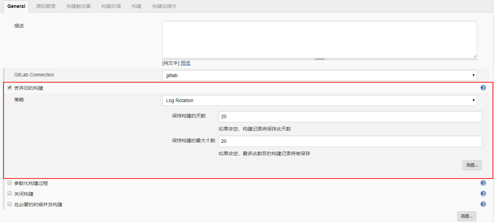

### 源码管理

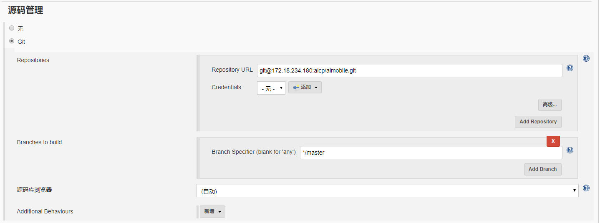

### 构建触发器

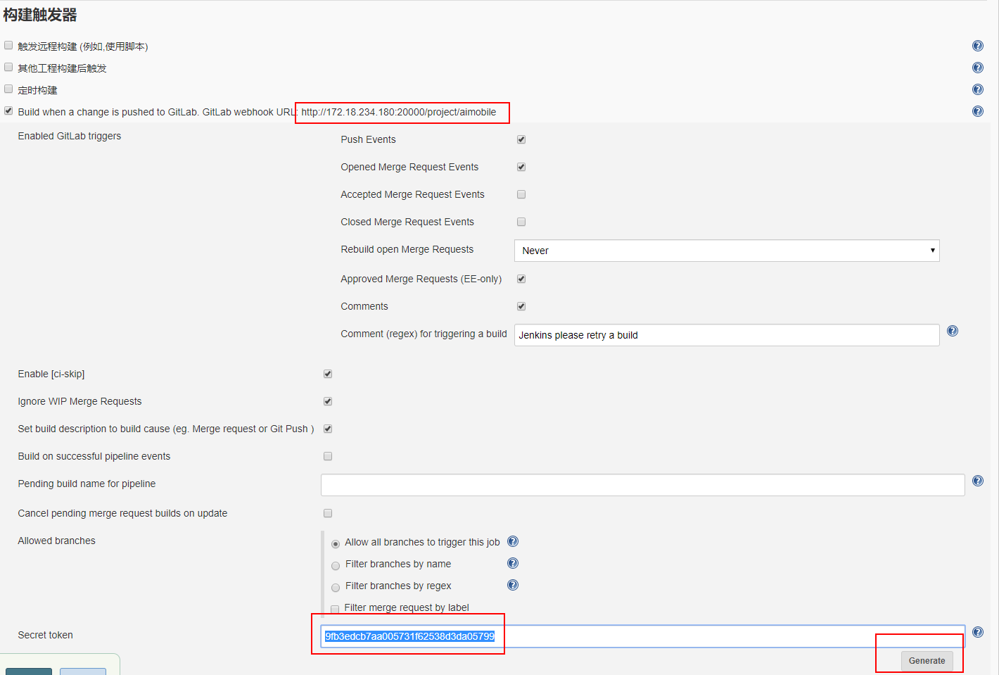

### gitlab上边设置：

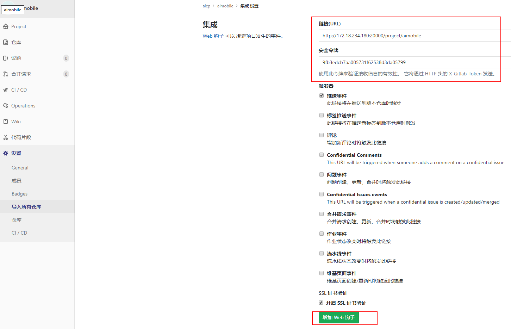

### 脚本方式进行构建

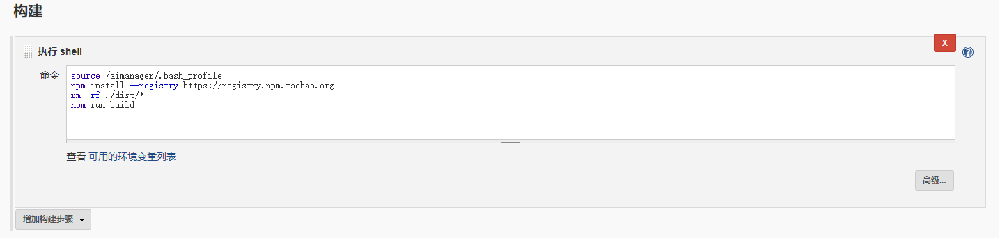

```bash
#脚本内容
source /aimanager/.bash_profile
npm install --registry=https://registry.npm.taobao.org
rm -rf ./dist/*
npm run build
```

### 构建后操作配置-远程部署：

前置条件：配置主机：**系统设置-->publish over ssh设置**

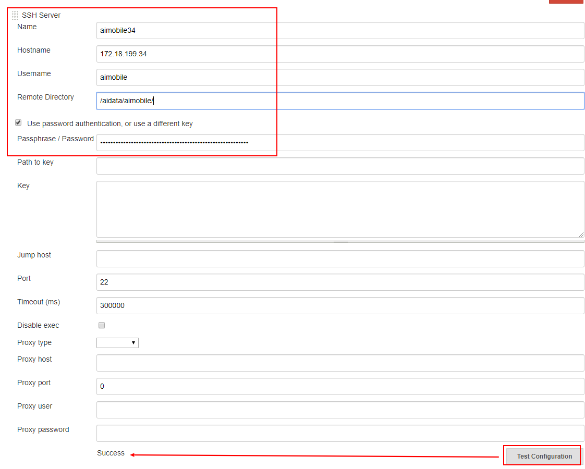

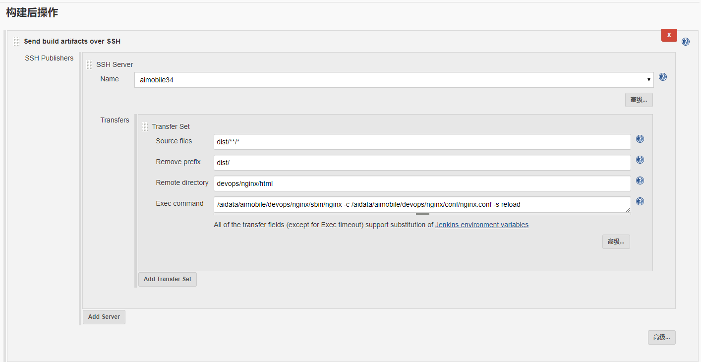

### 构建后操作配置-发送邮件：

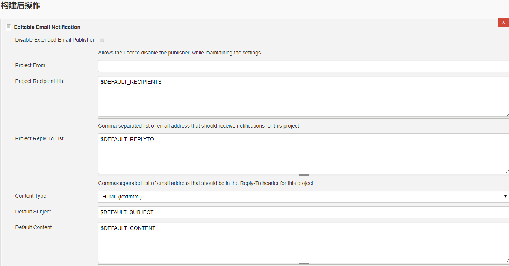

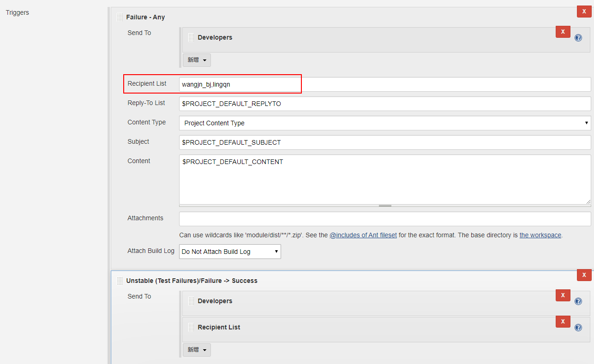

## 3.图片服务器fastdfs部署

参考fastdfs部署文档

java操作fastdfs使用工具：https://github.com/MarsNumberOne/FastDFS-Demo

### 图片上传接口

地址：http://172.18.199.34:8092/image/upload

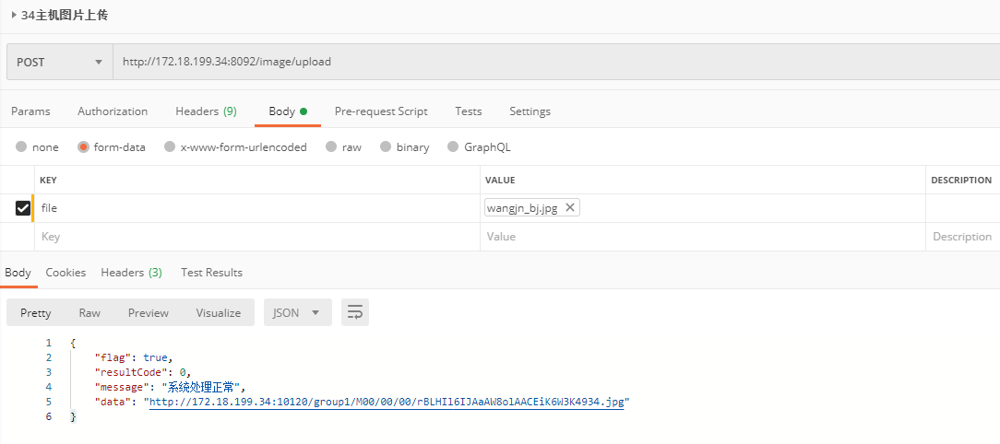

图片删除接口


## 4.依赖nginx安装

```
./configure \
--prefix=/aidata/aimobile/devops/nginx \
--sbin-path=/aidata/aimobile/devops/nginx/sbin/nginx \
--add-module=/aidata/aimobile/fastdfs/fastdfs-nginx-module/src

make
make install
```

2. 2依赖nginx安装

.依赖nginx安装

## 5.kafka安装

### 普通用户授权操作容器

```
groupadd docker 
gpasswd -a ${USER} docker 
newgrp docker
```

### 安装zookeeper

```
docker pull wurstmeister/zookeeper:3.4.6

docker run -d --restart=always \
-p 2181:2181 \
--name zookeeper \
wurstmeister/zookeeper:3.4.6
```

### 安装kafka

```bash
docker pull wurstmeister/kafka:2.12-2.4.1

docker run -d --name kafka_01 \
-p 9092:9092 \
-e KAFKA_BROKER_ID=0 \
-e KAFKA_ZOOKEEPER_CONNECT=172.18.199.34:2181 \
-e KAFKA_ADVERTISED_LISTENERS=PLAINTEXT://172.18.199.34:9092 \
-e KAFKA_LISTENERS=PLAINTEXT://0.0.0.0:9092 \
wurstmeister/kafka:2.12-2.4.1

#参数说明
KAFKA_BROKER_ID:集群的时候，broker的编号，唯一
KAFKA_ZOOKEEPER_CONNECT：zookeeper的ip：端口
KAFKA_ADVERTISED_LISTENERS：kafka的监听的地址，注册入zookeeper的地址，也要写物理机映射的ip和端口
KAFKA_LISTENERS：0.0.0.0表示对所有的网络接口有效，如果hostname为空表示只对默认的网络接口有效,也就是说如果你没有配置advertised.listeners


```

### kafka管理控制台使用(无用未使用)

```bash
docker pull sheepkiller/kafka-manager:stable

docker run -d \
--restart=always \
--name kafka-manager \
-p 9003:9000 \
-e ZK_HOSTS=172.18.199.34:2181 \
sheepkiller/kafka-manager:stable

http://172.18.199.34:9003/
```

### kafka使用验证

```
docker exec -it kafka容器ID bash

创建一个topic
/opt/kafka/bin/kafka-topics.sh --create --zookeeper 172.18.199.34:2181 --replication-factor 1 --partitions 1 --topic my-test

查看topic列表
/opt/kafka/bin/kafka-topics.sh --list --zookeeper 172.18.199.34:2181

发送消息
/opt/kafka/bin/kafka-console-producer.sh --broker-list 172.18.199.34:9092 --topic ocr

接收消息
/opt/kafka/bin/kafka-console-consumer.sh --bootstrap-server 172.18.199.34:9092 --topic ocr --from-beginning
```

### kafka验证出现问题

1.消息重发问题：

## 6.MYSQL安装使用

```
docker pull mysql:5.7

docker run -di --name=aimobile-mysql --restart=always \
	-p 3306:3306 \
	-e MYSQL_ROOT_PASSWORD=123456 \
	-v /aidata/aimobile/devops/aimobile_mysql:/var/lib/mysql \
	mysql:5.7  --lower_case_table_names=1

create database aimobile default character set utf8;
GRANT ALL PRIVILEGES ON aimobile.* TO aimobile IDENTIFIED BY 'aimobile';

```

## 7.访问接口

### 7.1 生成工单号

访问URL：http://172.18.199.34:9016/generate/orderid

访问方式：POST

请求头：

​	Content-Type:application/json

请求参数：

```
无
```

返回参数：

```json
{
    "flag": true,
    "resultCode": 0,
    "message": "系统处理正常",
    "data": "order7936504800033906688"
}
```

返回参数说明：

|  参数名称  | 参数类型 | 是否必须 |    参数说明    |
| :--------: | :------: | :------: | :------------: |
|    flag    |   file   |   true   |  请求返回状态  |
| resultCode |   Int    |   true   | 请求返回Code码 |
|  message   |  String  |   true   |  请求返回提示  |
|    data    |  Object  |   true   |  请求返回数据  |

### 7.2 生成流水号

访问URL：http://172.18.199.34:9016/generate/traceid

访问方式：POST

请求头：

​	Content-Type:application/json

请求参数：

```
无
```

返回参数：

```json
{
    "flag": true,
    "resultCode": 0,
    "message": "系统处理正常",
    "data": "traceid7936507232344350720"
}
```

返回参数说明：

|  参数名称  | 参数类型 | 是否必须 |    参数说明    |
| :--------: | :------: | :------: | :------------: |
|    flag    |   file   |   true   |  请求返回状态  |
| resultCode |   Int    |   true   | 请求返回Code码 |
|  message   |  String  |   true   |  请求返回提示  |
|    data    |  Object  |   true   |  请求返回数据  |

### 7.3 图片上传

访问URL：http://172.18.199.34:8092/image/upload

访问方式：POST

请求头：

​	Content-Type:application/json

请求参数：

| 参数名称 | 参数类型 | 是否必须 | 参数说明 |
| -------- | -------- | -------- | -------- |
| file     | file     | true     | 上传图片 |
|          |          |          |          |

返回参数：

```json
{
    "flag": true,
    "resultCode": 0,
    "message": "系统处理正常",
    "data": "http://172.18.199.34:10120/group1/M00/00/00/rBLHIl6O3USAUi9DAAYLKZzjX7w489.jpg"
}
```

返回参数说明：

|  参数名称  | 参数类型 | 是否必须 |    参数说明    |
| :--------: | :------: | :------: | :------------: |
|    flag    |   file   |   true   |  请求返回状态  |
| resultCode |   Int    |   true   | 请求返回Code码 |
|  message   |  String  |   true   |  请求返回提示  |
|    data    |  Object  |   true   |  请求返回数据  |

### 7.4 kafka统一服务

访问URL：http://172.18.199.34:8093/kafka/messagesend

访问方式：POST

请求头：

​	Content-Type:application/json

请求参数：

|    参数名称     | 参数类型 | 是否必须 |                    参数说明                    |
| :-------------: | :------: | :------: | :--------------------------------------------: |
|      topic      |  String  |   true   |                    主题信息                    |
|     orderId     |  String  |   true   |                     工单号                     |
|     traceId     |  String  |   true   |                   业务流水号                   |
|      image      |  String  |   true   |                base64格式的图片                |
|   modify_flag   | Boolean  |  false   | 类别（0 为识别信息为准，1 为用户修正信息为准） |
| 其他OCR识别信息 |          |          |                                                |

返回参数：

```json
{
    "flag": true,
    "resultCode": 0,
    "message": "系统处理正常",
    "data": {
        "topic": "ocr",
        "orderId": "orderId2",
        "modify_flag": true,
        "traceId": "traceId12",
        "姓名": "廷赫斯",
        "性别": "男",
        "image": "base64格式图片"
    }
}
```

返回参数说明：

|    参数名称     | 参数类型 | 是否必须 |                    参数说明                    |
| :-------------: | :------: | :------: | :--------------------------------------------: |
|      flag       |   file   |   true   |                  请求返回状态                  |
|   resultCode    |   Int    |   true   |                 请求返回Code码                 |
|     message     |  String  |   true   |                  请求返回提示                  |
|      data       |  Object  |   true   |                  请求返回数据                  |
|      topic      |  String  |   true   |                    主题信息                    |
|     orderId     |  String  |   true   |                     工单号                     |
|     traceId     |  String  |   true   |                   业务流水号                   |
|      image      |  String  |   true   |                base64格式的图片                |
|   modify_flag   | Boolean  |  false   | 类别（0 为识别信息为准，1 为用户修正信息为准） |
| 其他OCR识别信息 |          |          |                                                |

### 7.5 用户反馈入库

访问URL：http://172.18.199.34:9016/sitech/feedbackInformation

访问方式：POST

请求头：

​	Content-Type:application/json

请求参数：

```json
{
	"serialNumber":"traceId1000",
	"modifyFlag":true,
	"information":"{\"orderId\":\"orderId1000\",\"traceId\":\"traceId1000\",\"姓名\":\"廷赫斯修正\",\"性别\":\"男\"}"
}
```

请求参数说明：

|   参数名称   | 参数类型 | 是否必须 |                参数说明                 |
| :----------: | :------: | :------: | :-------------------------------------: |
| serialNumber |  String  |   true   |               业务流水号                |
| information  |  String  |   true   |              用户修正信息               |
|  modifyFlag  | Boolean  |   true   | 修改标记（true 未修改，false 已修改）） |

返回参数：

```json
{
    "flag": true,
    "resultCode": 0,
    "message": "系统处理正常",
    "data": "反馈成功"
}
```

返回参数说明：

|  参数名称  | 参数类型 | 是否必须 |    参数说明    |
| :--------: | :------: | :------: | :------------: |
|    flag    |   file   |   true   |  请求返回状态  |
| resultCode |   Int    |   true   | 请求返回Code码 |
|  message   |  String  |   true   |  请求返回提示  |
|    data    |  Object  |   true   |  请求返回数据  |

### 7.6 调用识别能力

访问URL：http://172.18.199.34:9018/sitech/ocrAbility

访问方式：POST

请求头：

​	Content-Type:application/json

​	token:"TIngHS6BqSbNOoQorJtc1s=="

请求参数：

```json
{
	"type":"IDCardOCR",
	"jobNumber":"orderId1kkkkfreoe311",
	"serialNumber":"treeeeacretrtwkuvvnvmrit111222eeeee2",
	"jsonPackage":"{\"image\": \"base64码\"}"
}
```

请求参数说明：

|   参数名称   | 参数类型 | 是否必须 |     参数说明     |
| :----------: | :------: | :------: | :--------------: |
|     type     |  String  |   true   |      工单号      |
|  jobNumber   |  String  |   true   |    业务工单号    |
| serialNumber |  String  |   true   |    业务流水号    |
| jsonPackage  |  String  |   true   | 需要识别的json包 |

返回参数：

```json
{
    "flag": true,
    "resultCode": 0,
    "message": "系统处理正常",
    "data": {
        "serialNumber": "7952084011240136704",
        "type": "SIMOCR",
        "results": {
            "status": "",
            "num": [
                "8986032004571080038B"
            ]
        },
        "jobNumber": "gong_dan_hao001"
    }
}
```

返回参数说明：

|   参数名称   | 参数类型 | 是否必须 |      参数说明      |
| :----------: | :------: | :------: | :----------------: |
|     flag     |   file   |   true   |    请求返回状态    |
|  resultCode  |   Int    |   true   |   请求返回Code码   |
|   message    |  String  |   true   |    请求返回提示    |
|     data     |  Object  |   true   |    请求返回数据    |
| serialNumber |  String  |   true   | 流水号（唯一标识） |
|     type     |  String  |   true   |    识别能力类型    |
|   results    |  Object  |   true   |      识别结果      |
|    status    |  String  |   true   |      识别状态      |
|     num      | [String] |   true   |    识别号码数组    |
|  jobNumber   |  String  |   true   |       工单号       |

### 7.7 身份证OCR服务接口

访问URL：http://172.18.238.17:30000/ocr/v1/idcard

访问方式：POST

Content-Type:application/json

接口说明：实现二代居民身份证图片文字提取，形成结构化信息。包括姓名、性别、民族、出生日期、住址、身份证号、签发机关、有效期限。

请求参数：

| 参数名称 | 参数类型 | 是否必须 |     参数说明     |
| :------: | :------: | :------: | :--------------: |
|  image   |  String  |   true   | base64格式的图片 |

返回参数：

```json
{
    "status": "0001:正常识别.",
    "face_size": [
        {
            "姓名": "逼逼菌",
            "性别": "女",
            "民族": "汉",
            "出生": "2684年41月28日",
            "住址": "中国非正常人类研究所第八号病床",
            "公民身份号码": "352116268441288652"
        }
    ],
    "emblem_size": []
}
```

返回参数说明：

|  参数名称   | 参数类型 | 是否必须 |    参数说明    |
| :---------: | :------: | :------: | :------------: |
|   status    |  String  |   true   |  请求返回状态  |
|  face_size  |  [json]  |   true   | 识别出的参数值 |
| emblem_size |    []    |   true   |                |

### 7.8 水牌OCR服务接口

访问URL：http://172.18.238.17:30060/ocr/house_num

访问方式：POST

Content-Type:application/json

接口说明：水牌OCR接口支持一次传一张图的请求，目前只实现楼宇门牌号OCR功能。

注释：4点位置为下图红框四边形的位置坐标


请求参数：

| 参数名称 | 参数类型 | 是否必须 |     参数说明     |
| :------: | :------: | :------: | :--------------: |
|  image   |  String  |   true   | base64格式的图片 |

返回参数：

```json
{
       "results": [{
                     "box": ['964.737','332.8','2666.71', '332.8','2666.71','428.133','964.737','428.133'],
                     "text": "北京思特奇信息技术股份有限公司"
                      },{
                     "box":['964.737', '707.2', '2680.39', '707.2', '2680.39', '809.467','964.737', '809.467'],
                     "text": "北京峰创润通科技有限公司"
                      }],
       "status": "Succeed"
}
```

返回参数说明：

```json
{
       "results": [{
                     "box": ["4点位置"],
                     "text": "文本信息"
                     },
                   {
                     "box": ["4点位置"],
                     "text": "文本信息"
                 }],
       "status": "状态说明"
}
```

返回参数说明：

| 参数名称 | 参数类型 | 是否必须 | 参数说明 |
| :------: | :------: | :------: | :------: |
|   box    | [String] |   true   | 4点位置  |
|   text   |  String  |   true   | 文本信息 |
|  status  |  String  |   true   | 状态说明 |

状态说明：

Succeed：正常识别（不代表正确识别）

[500] An exception occurred at server!: 调用服务发生异常**

### 7.9 增值税发票OCR服务接口

访问URL：http://172.18.238.17:30030/invoice_ocr

修改：http://172.18.199.28:5050/invoice_ocr

访问方式：POST

Content-Type:application/json

接口说明：实现增值税发票图片文字提取及识别，形成结构化信息。包括发票代码、发票号、发票日期、金额、税率、税额、大写总计、小写总计。

请求参数：

| 参数名称 | 参数类型 | 是否必须 |     参数说明     |
| :------: | :------: | :------: | :--------------: |
|  image   |  String  |   true   | base64格式的图片 |

返回参数：

```json
{
	"word_dict": {
		"发票代码": [
			"1100182130"
		],
		"发票号": [
			"08207025"
		],
		"发票日期": [
			"2018年05月30日"
		],
		"大写合计": [
			"壹万零捌佰圆整"
		],
		"小写合计": [
			"￥10800.00"
		],
		"税率": [
			"5%"
		],
		"税额": [
			"514.29",
			"￥514.29"
		],
		"金额": [
			"10285.71",
			"￥10285.71"
		]
	}
}
```

返回参数说明：

| 参数名称  | 参数类型 | 是否必须 |    参数说明    |
| :-------: | :------: | :------: | :------------: |
| word_dict |  String  |   true   | 识别出的参数值 |

### 7.10 企业证件号码识别服务接口定义

访问URL：http://172.18.238.17:30010/ocr/bl/num 

修改地址：http://172.18.238.17:30010/ocr/v1/com

访问方式：POST

Content-Type:application/json

接口说明：企业证件号码识别功能目前覆盖了竖版‘营业执照’、‘企业法人营业执照’、‘个体工商户营业执照’三种证件，识别的字段有‘注册号’和‘统一社会信用代码’，一种证件内只会出现其中一个字段。

请求参数：

| 参数名称 | 参数类型 | 是否必须 |     参数说明     |
| :------: | :------: | :------: | :--------------: |
|  image   |  String  |   true   | base64格式的图片 |

返回参数：

```json
{
	"status": "0001:正常识别.",
	"统一社会信用代码": "9142060OMA493F181D"
}
```

返回参数说明：

返回参数说明：

```json
{
	"status": "状态码:状态说明。",
	"字段名": "字段内容"
}
```

返回参数说明：

| 参数名称 | 参数类型 | 是否必须 |    参数说明     |
| :------: | :------: | :------: | :-------------: |
|  status  |  String  |   true   | 状态码:状态说明 |
|  字段名  |  String  |   true   |    字段内容     |

状态码及状态说明：

​	0000：未知错误（一些现在未预料到的错误）

​	0001：正常识别（不代表正确识别）

​	0002：base64解析错误

​	0003：图像识别异常

​	0004：参数格式错误

​	0005：文字检测失败

### 7.11 重庆移动业务表单OCR服务接口

访问URL：http://172.18.238.17:30050/ocr/business_form

访问方式：POST

Content-Type:application/json

接口说明：重庆移动业务表单OCR接口开始支持一次传多张图的请求，目前只实现统一付费业务登记表OCR功能。

注：其中，业务代码目前没定义，目前只有统一付费表的OCR，业务代码是为了适应以后新增的业务表单。

请求参数：

```json
{
	"images": {
		"图片名1": "base64码1",
		"图片名2": "base64码2"
	},
	"business_code": "业务代码，哪种业务单？"
}
```

请求参数：

|   参数名称    | 参数类型 | 是否必须 |       参数说明       |
| :-----------: | :------: | :------: | :------------------: |
|    images     |   json   |   true   | base64格式的图片列表 |
| business_code |  String  |   true   |       业务代码       |

返回参数：

```json
{
	"status": "0001:正常识别.",
	"results": {
		"bill.jpg": {
			"details": ["13908327566", "13618214275"],
			"seals": "1",
			"status": "0001:正常识别."
		},
		"bill2.jpg": {
			"details": ["13748284920", "13638482959", "18823847538", "13738428573"],
			"seals": "0",
			"status": "0001:正常识别."
		}
	}
}
```

返回参数说明：

```json
{
	"status": "状态码:状态说明。",
	"results": {
		"图片名称1": {
			"details": ["手机号码", "手机号码"],
			"seals": "公章数量",
			"status": "状态码:状态说明。"
		},
		"图片名称2": {
			"details": ["手机号码", "手机号码", "手机号码"],
			"seals": "公章数量",
			"status": "状态码:状态说明。"
		}
	}
}
```

返回参数说明：

| 参数名称 | 参数类型 | 是否必须 |    参数说明     |
| :------: | :------: | :------: | :-------------: |
|  status  |  String  |   true   | 状态码:状态说明 |
| results  |   Json   |   true   | 识别出的参数值  |

状态码及状态说明：

​	0000：未知错误（一些现在未预料到的错误）

​	0001：正常识别（不代表正确识别）

​	0002：base64解析错误

​	0003：图像识别异常

​	0004：JSON格式错误

​	0005：未上传图像

### 