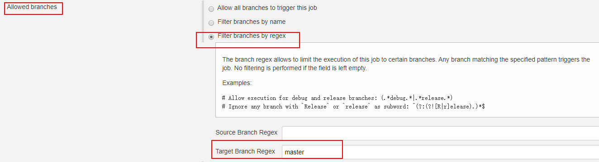
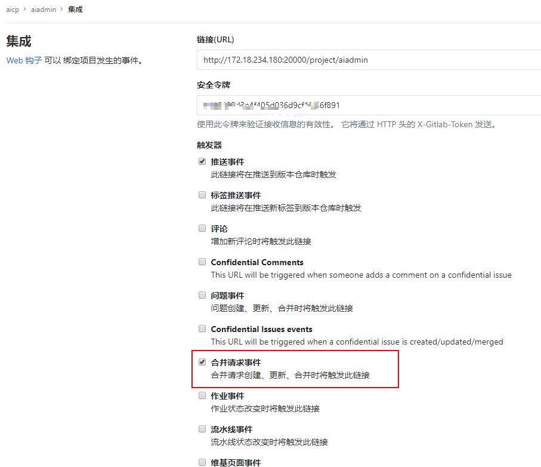
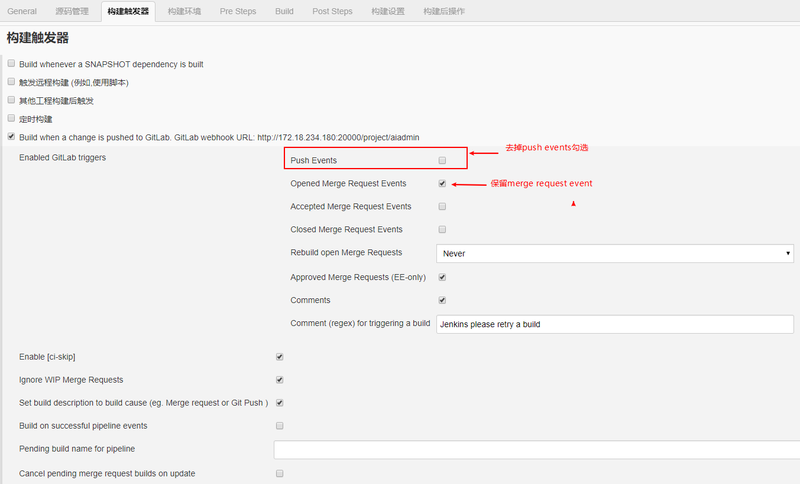
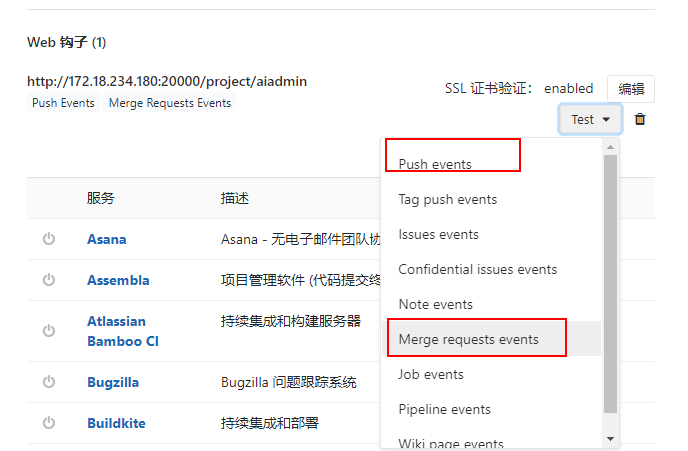

## DevOps产品集成问题

非master分支

利用jenkins进行配置

我们可以通过jenkins>>Builder triggers 配置正则匹配，只有当master分支发生改变时才会触发jenkins。

Builder triggers>>Advanced>>Allowed branches>>Filter branches by regex>>Target Branch Regex>>填写master>>保存配置

step1:gitlab仓库配置的webhook
勾选Merge request events的选项

step2:配置jenkins

Builder triggers>>取消勾选Push Events 选项，然后把有关merge request events 的选项勾上（如果不去掉push events 当分支发生push时，jenkns还是会构建）

step3:测试配置结果

在gitlab 发送一个push的请求，可以看到jenkins已经不会构建了
再测试发送一个 merge request

到此基本上已经可以保障只构建master分支了

