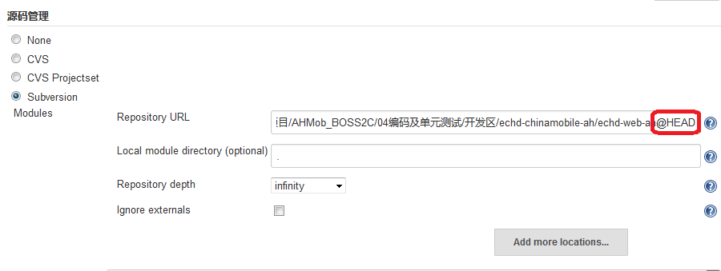

# 三.插件使用

## 3.1 Maven Integration plugin


# 常见问题

## jenkins构建从svn取代码出现延迟原因及解决方法
* 现象：开发人员上传代码后，使用jenkins立即构建，出现无法获取到开发人员刚上传的最新版本代码；
* 原因：Jenkins服务器时间与SVN服务器时间不一致，Jenkins的SVN插件是使用时间标签下载，而不是取HEAD， 因此如果svn服务器的提交代码时间比Jenkins的当前时间晚，该代码就不会被更新；
* 后果：若通过jenkins构建取代码上线，很容易出现由于jenkins服务器与svn时间不一致，而导致上线代码版本取的不是最新版，直接影响上线结果，若上线后未充分测试，很可能是重大故障的隐患；构建代码上传测试环境，也会出现构建时取不到最新版本代码，而影响测试结果和效率；
* 解决方法：在jenkins中svn链接中增加@HEAD，可以不用理会jenkins服务器时间，直接更新到最新的版本；



3-1. 国内加速站点
https://registry.docker-cn.com

http://hub-mirror.c.163.com

https://3laho3y3.mirror.aliyuncs.com

http://f1361db2.m.daocloud.io

https://mirror.ccs.tencentyun.com


```
mkdir -p /etc/docker
sudo tee /etc/docker/daemon.json <<-'EOF'
{
  "registry-mirrors": ["http://hub-mirror.c.163.com"]
}
```


**CA证书生成**
```
openssl req -x509 -nodes -days 36500 -newkey rsa:2048 -keyout nginx.key -out nginx.crt -subj "/C=CN/ST=ShenZhen/L=ShenZhen/O=Example Inc./OU=Web Security/CN=registry.ntpstat.com"
```
https://www.jb51.net/article/91187.htm
https://blog.csdn.net/smartdt/article/details/80027579
https://aotu.io/notes/2016/08/16/nginx-https/index.html
https://juejin.im/post/5c70a8156fb9a049f746d0fc
https://blog.csdn.net/dayi_123/article/details/79753018
https://blog.csdn.net/shida_csdn/article/details/80006645
https://juejin.im/post/5c70a8156fb9a049f746d0fc
**nginx.conf**
```
user  root;
worker_processes  1;

error_log  logs/error.log;
pid        logs/nginx.pid;

events {
    worker_connections  1024;
}

http {
    include       mime.types;
    default_type  application/octet-stream;

    log_format  main  '$remote_addr - $remote_user [$time_local] "$request" '
                      '$status $body_bytes_sent "$http_referer" '
                      '"$http_user_agent" "$http_x_forwarded_for"';

    access_log  logs/access.log  main;

    sendfile        on;
    #tcp_nopush     on;

    #keepalive_timeout  0;
    keepalive_timeout  65;

    gzip  on;

    server {
      listen       9080;
      server_name  172.16.137.104;
		
      location / {
        root   html;
        index  index.html index.htm;
      }
      error_page   500 502 503 504  /50x.html;
      location = /50x.html {
        root   html;
      }
    }

    server {
      listen       443 ssl;
      server_name  172.16.137.104;

	  # 允许大文件上传
	  client_max_body_size 1G;

	  # 对大于 1G 文件的下载进行优化
	  #proxy_max_temp_file_size 2G;

      ssl_certificate /root/tengine/nginx/ssl/nginx.crt;
      ssl_certificate_key /root/tengine/nginx/ssl/nginx.key;
      ssl_session_cache    shared:SSL:1m;
      ssl_session_timeout  5m;
      #禁止在header中出现服务器版本，防止黑客利用版本漏洞攻击
      #server_tokens off;
      #如果是全站 HTTPS 并且不考虑 HTTP 的话，可以加入 HSTS 告诉你的浏览器本网站全站加密，并且强制用 HTTPS 访问
      #fastcgi_param   HTTPS               on;
      #fastcgi_param   HTTP_SCHEME         https;

      location / {
        proxy_pass http://127.0.0.1:8081/;
        proxy_set_header Host $host;
        proxy_set_header X-Real-IP $remote_addr;
        proxy_set_header X-Forwarded-For $proxy_add_x_forwarded_for;
        proxy_set_header X-Forwarded-Proto "https";
	  }
    }
}

```

```
forbidden (13: Permission denied)
解决：
user nobody; -->  user  root;

```

```
从容停止Nginx：
kill -QUIT 主进程号  
例如：kill -QUIT 16391

快速停止Nginx：
kill -TERM 主进程号  

强制停止Nginx：
kill -9 主进程号 
```
**CentOS7 Docker x509: certificate signed by unknown authority 解决方案**
```
本机拉本机仓库，那直接把crt证书拉本地，放

/etc/pki/ca-trust/source/anchors/
然后执行

update-ca-trust
然后重启docker，即可。

外部Client的话（docker配置文件根据系统会有不同，自己定位）：

vim /etc/docker/daemon.json
添加

{ "insecure-registries":["IP:端口"] }
/etc/init.d/docker restart
```

docker run -itd --name=nexus-nginx -p 9090:80 -v /root/nginx:/var/nginx nginx


```
{
	"graph":"/Intelligent/dockerdata",
	"registry-mirrors":["https://registry.docker-cn.com"],
	"bip":"192.168.0.1/24",
	"insecure-registries":["172.21.4.101:5000"]
}
```
