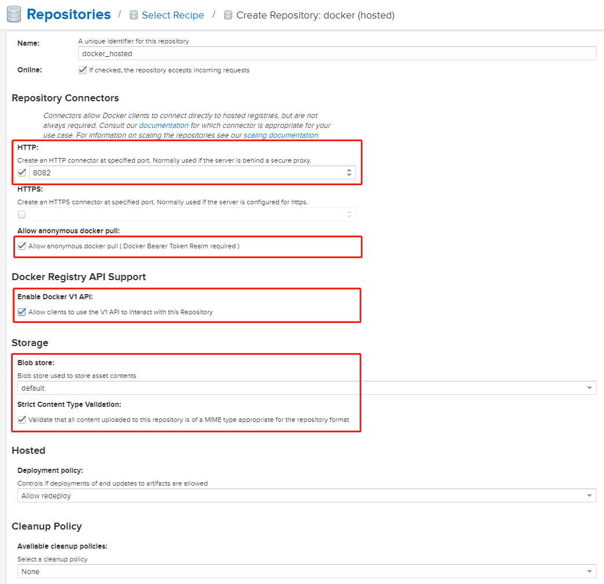
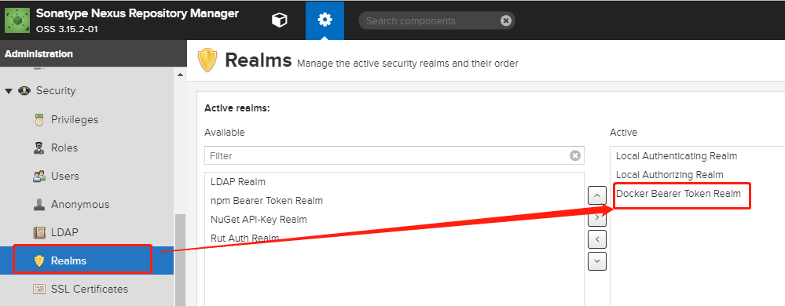
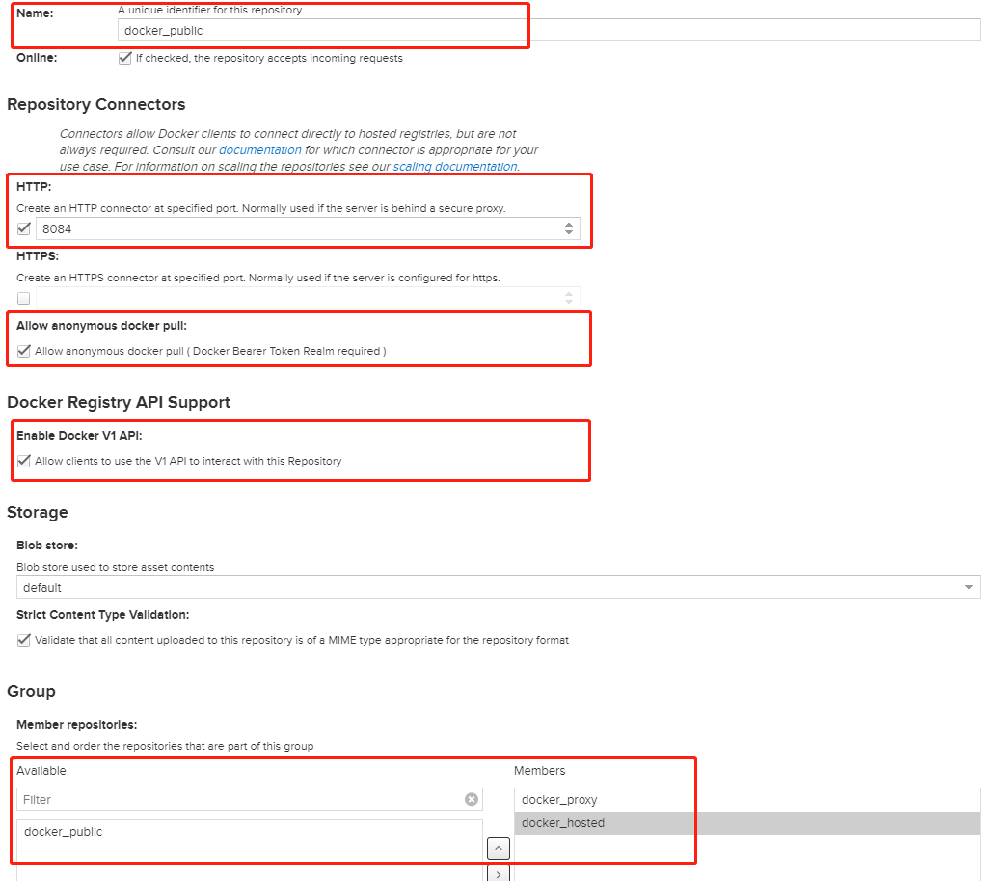

# Nexus3.0使用

## 一.nexus安装

### 1.1 使用jar包安装

### 1.2 使用docker容器安装(推荐)

#### 1.2.1 启动容器

```bash
# 拉取镜像
docker pull sonatype/nexus3

# 创建volume卷
docker volume create --name nexus-data

# 启动容器
docker run -d --name nexus3 \
 --restart=always \
-p 8081:8081 \
-p 8082:8082  \
-p 8083:8083  \
-p 8084:8084  \
-p 8085:8085   \
-v nexus-data:/nexus-data \
sonatype/nexus3
```

**映射端口对应的用途**

* 8081：nexus3网页端
* 8082：docker(hosted)私有仓库，可以pull和push
* 8083：docker(proxy)代理远程仓库，只能pull
* 8084：docker(group)私有仓库和代理的组，只能pull

#### 1.2.2 JVM参数配置

在 /opt/nexus/bin 下面看到一个 nexus.vmoptions 的配置文件，通过这个配置文件可以直接 jvm 参数。

```
$ cat nexus.vmoptions
-Xms1200M
-Xmx1200M
-XX:MaxDirectMemorySize=2G
-XX:+UnlockDiagnosticVMOptions
-XX:+UnsyncloadClass
-XX:+LogVMOutput
-XX:LogFile=../sonatype-work/nexus3/log/jvm.log
-XX:-OmitStackTraceInFastThrow
-Djava.net.preferIPv4Stack=true
-Dkaraf.home=.
-Dkaraf.base=.
-Dkaraf.etc=etc/karaf
-Djava.util.logging.config.file=etc/karaf/java.util.logging.properties
-Dkaraf.data=../sonatype-work/nexus3
-Djava.io.tmpdir=../sonatype-work/nexus3/tmp
-Dkaraf.startLocalConsole=false
```

我们可以看到nexus会自动在 nexus 目录的父目录下生成 sonatype-work 目录，用来放配置文件、数据，还有日志等，你可以通过修改配置文件来改变它的位置。
前面使用 root 用户启动之后生成的这个目录的权限是 root，再使用普通用户启动的话，普通用户会因为没有权限往里面的日志文件中写数据而导致启动失败，所以只是上面要修改这个目录权限的原因。

#### 1.2.3 访问地址

http://127.0.0.1:8081  默认账号密码: admin/admin123

## 二.nexus对Maven私服配置


## 三.nexus对npm私服配置


## 四.nexus对docker私服配置

参考文档：http://www.eryajf.net/1816.html

### 4.1 创建blob存储

登陆之后，先创建一个用于存储镜像的空间。


定义一个name，下边的内容会自动补全


然后保存


这里因为我用的测试服务器演示，因此存储没有那么大，实际生产中使用，建议服务器存储500G或以上。

### 4.2 创建一个hosted类型的docker仓库

Hosted类型仓库用作我们的私有仓库，可以替代harbor的功能。

**使用端口：8082：docker(hosted)私有仓库，可以pull和push**

**Repository >>Repositories>>Create repository 选择 docker(hosted)**



**配置Realms:Security >> Realms，把 Docker Realm 激活 **


#### 连接仓库：
连接仓库前需要进行配置 vim /etc/docker/daemon.json
```
{
  "insecure-registries": ["172.16.77.71:8082" ]
}
    
systemctl daemon-reload
systemctl restart docker
```
**登录仓库：**

注意这里的端口是配置仓库时选择的端口号

`docker login -u admin -p admin123 172.16.77.71:8082 `

**上传镜像：**
```
docker tag nginx:latest 172.16.77.71:8082/nginx:0.1
docker push 172.16.77.71:8082/nginx:0.1
```

**拉取镜像：**
`docker pull 172.16.77.71:8082/nginx:0.1`

**搜索镜像：**
`docker search 172.16.77.71:8082/nginx`

### 4.2 创建一个proxy类型的docker仓库

proxy类型仓库，可以帮助我们访问不能直接到达的网络，如另一个私有仓库，或者国外的公共仓库，如官方的dockerhub镜像库。

```
创建一个proxy类型的仓库
Name: proxy-docker-hub
Repository Connectors: 不设置。

Remote Storage: docker hub的proxy，这里填写: 
官方默认：https://registry-1.docker.io
DaoCloud的容器加速：http://f1361db2.m.daocloud.io[]
Docker Index： Use Docker Hub
Storage：idocker-hub
```

整体配置截图如下：


#### 官方文档说明：

https://help.sonatype.com/repomanager3/formats/docker-registry/proxy-repository-for-docker

### 4.3 创建一个group类型的docker仓库。

group类型的docker仓库，是一个聚合类型的仓库。它可以将前面我们创建的3个仓库聚合成一个URL对外提供服务，可以屏蔽后端的差异性，实现类似透明代理的功能。

```
name：docker-group
Repository Connectors：启用了一个监听在8082端口的http连接器；
Storage：选择专用的blob存储idocker-hub。
group : 将左边可选的3个仓库，添加到右边的members下。
```


整体配置截图如下：




输入http://192.168.101.64:8889
初次运行Jenkins会经过一个安装过程，一般情况使用默认配置，下一步安装即可，其中一步需要输入密码，如下


## 一.容器整理

http://www.eryajf.net/1816.html
https://blog.csdn.net/u010398771/article/details/102665798
https://juejin.im/post/5c70a8156fb9a049f746d0fc

[root@host-172-18-233-123 docker]# vi daemon.json 
{
        "graph":"/Intelligent/docker/dockerdata",
        "insecure-registries":["172.18.234.180:8082"],
        "bip":"192.168.0.1/24"
}
systemctl daemon-reload
systemctl restart docker


```
{
	"graph":"/Intelligent/dockerdata",
	"registry-mirrors":["https://registry.docker-cn.com"],
	"bip":"192.168.0.1/24",
	"insecure-registries":["172.21.4.101:5000"]
}
```
