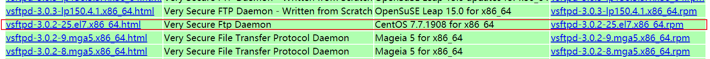
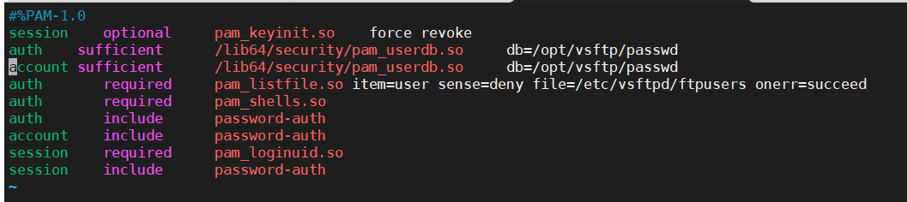
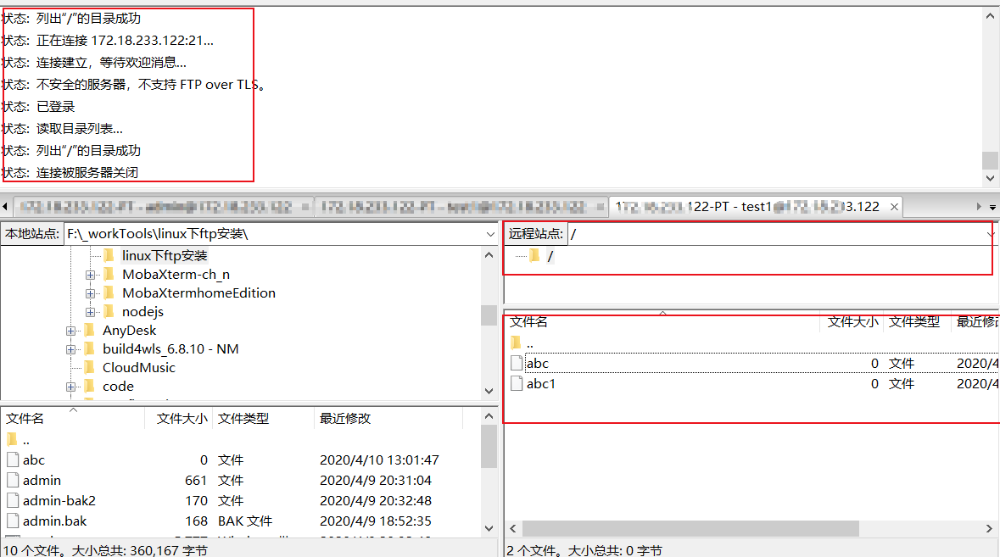
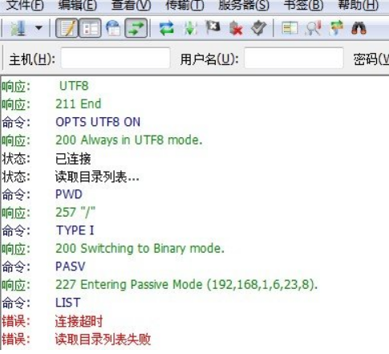

# Linux下FTP服务安装

## 1、简介

FTP 是File Transfer Protocol（文件传输协议）的英文简称，而中文简称为“文传协议”。用于Internet上的控制文件的双向传输。同时，它也是一个应用程序（Application）。基于不同的操作系统有不同的FTP应用程序，而所有这些应用程序都遵守同一种协议以传输文件。互联网上提供文件存储和访问服务的计算机，他们依照的是FTP协议提供服务！支持FTP协议的服务器就是FTP服务器！FTP协议提供存储和传输服务的一套协议。下载”（Download）和”上传”（Upload）。”下载”文件就是从远程主机拷贝文件至自己的计算机上；”上传”文件就是将文件从自己的计算机中拷贝至远程主机上。用Internet语言来说，用户可通过客户机程序向（从）远程主机上传（下载）文件。

## 2、工作原理

FTP采用客户端/服务端的工作模式（C/S结构），通过TCP协议建立客户端和服务器之间的连接，但与其他大多数应用协议不同，FTP协议在客户端和服务端之间建立了两条通信链路，分别是控制链路和数据链路，其中，控制链路负责FTP会话过程中FTP命令的发送和接收，数据链路则负责数据的传输。FTP会话包含了两个通道，控制通道和数据通道，FTP的工作有两种方式，一种是主动模式，一种是被动模式，以FTPServer为参照物，主动模式，服务器主动连接客户端传输，被动模式，等待客户端的的连接 。（无论是主动模式还是被动模式，首先的控制通道都是先建立起来的，只是在数据传输模式上的区别）。

## 3、参考资料

```
https://www.cnblogs.com/UncleWang001/p/9948150.html
https://www.cnblogs.com/Confession/p/6813227.html
```

## 4、FTP的安装与配置

**方式一：FTP在线安装**

```
yum install -y vsftp
```

**方式二：FTP离线安装（我们采取离线安装方式）**

### **1、下载vsftp安装包**
查看本地Linux版本
```
[root@host-172-18-233-122 ~]# cat /etc/redhat-release
CentOS Linux release 7.4.1708 (Core)
```
下载地址：
```
http://rpmfind.net/linux/rpm2html/search.php?query=vsftpd(x86-64)
```

下载符合部署环境版本的安装包，CentOS 7.x（现场环境） 所以选择[vsftpd-3.0.2-25.el7.x86_64.rpm](http://rpmfind.net/linux/centos/7.7.1908/os/x86_64/Packages/vsftpd-3.0.2-25.el7.x86_64.rpm)



### **2、检查是否已经安装了vsftp，后面会介绍怎样卸载**

```
 rpm -qa | grep vsftpd
 如果没有提示则说明没有安装
 如果提示版本号则说明已经安装
```

### **3、安装vsftpd-3.0.2-25.el7.x86_64.rpm**

```
 rpm -ivh vsftpd-3.0.2-25.el7.x86_64.rpm 
```

### **4、检查是否安装成功**

```
[root@host-172-18-233-122 /]# rpm -qa | grep vsftpd
vsftpd-3.0.2-25.el7.x86_64						   //出现版本号，说明安装成功
```

### **5、开启vsftpd的 20、21端口**

centos7.3 开启20和21端口越过此步骤

```
开启
# iptables -I INPUT -i eth0 -p tcp --dport 20 -j ACCEPT
# iptables  -I OUTPUT -o eth0 -p tcp --sport 20 -j ACCEPT
保存
# /etc/rc.d/init.d/iptables save
重启防火墙
# service iptables restart
```

### **6、centos7.3 开启20和21端口，开启4000-5000端口为被动连接提供数据传输**

```
# firewall-cmd --permanent --add-port=20/tcp
# firewall-cmd --permanent --add-port=21/tcp
# firewall-cmd --permanent --add-port=4000-5000/tcp
重启防火墙
# systemctl restart firewalld.service
```
1）如果执行期间发生以下提示信息
```
[root@host-172-18-233-122 ftp]# firewall-cmd --permanent --add-port=20/tcp
FirewallD is not running
```

2）查看firewalld状态:systemctl status firewalld，如果是dead状态，即防火墙未开启，按以下步骤操作，重启防火墙—>查看防火墙状态—>执行开放端口命令。
```
[root@host-172-18-233-122 ftp]# systemctl status firewalld
● firewalld.service - firewalld - dynamic firewall daemon
   Loaded: loaded (/usr/lib/systemd/system/firewalld.service; disabled; vendor preset: enabled)
   Active: inactive (dead)
     Docs: man:firewalld(1)
[root@host-172-18-233-123 ftp]# systemctl start firewalld
[root@host-172-18-233-123 ftp]# systemctl status firewalld
● firewalld.service - firewalld - dynamic firewall daemon
   Loaded: loaded (/usr/lib/systemd/system/firewalld.service; disabled; vendor preset: enabled)
   Active: active (running) since Mon 2020-04-13 09:10:09 CST; 9s ago
     Docs: man:firewalld(1)
 Main PID: 11409 (firewalld)
   Memory: 23.5M
   CGroup: /system.slice/firewalld.service
           └─11409 /usr/bin/python -Es /usr/sbin/firewalld --nofork --nopid

Apr 13 09:10:08 host-172-18-233-123 systemd[1]: Starting firewalld - dynamic firewall daemon...
Apr 13 09:10:09 host-172-18-233-123 systemd[1]: Started firewalld - dynamic firewall daemon.
Apr 13 09:10:10 host-172-18-233-123 firewalld[11409]: WARNING: ICMP type 'beyond-scope' is not supported by the ke...pv6.
Apr 13 09:10:10 host-172-18-233-123 firewalld[11409]: WARNING: beyond-scope: INVALID_ICMPTYPE: No supported ICMP t...ime.
Apr 13 09:10:10 host-172-18-233-123 firewalld[11409]: WARNING: ICMP type 'failed-policy' is not supported by the k...pv6.
Apr 13 09:10:10 host-172-18-233-123 firewalld[11409]: WARNING: failed-policy: INVALID_ICMPTYPE: No supported ICMP ...ime.
Apr 13 09:10:10 host-172-18-233-123 firewalld[11409]: WARNING: ICMP type 'reject-route' is not supported by the ke...pv6.
Apr 13 09:10:10 host-172-18-233-123 firewalld[11409]: WARNING: reject-route: INVALID_ICMPTYPE: No supported ICMP t...ime.
Hint: Some lines were ellipsized, use -l to show in full.
[root@host-172-18-233-122 ftp]# firewall-cmd --permanent --add-port=20/tcp
success
[root@host-172-18-233-122 ftp]# firewall-cmd --permanent --add-port=21/tcp
success
[root@host-172-18-233-122 ftp]# firewall-cmd --permanent --add-port=4000-5000/tcp
success

```
## 5、虚拟用户登录方式设置

**前提：vsftp提供三种登录方式：1.匿名登录  2.本地用户登录  3.虚拟用户登录。为了安全或者对外提供ftp服务时限制用户访问目录等权限设置，我们采取虚拟用户登录方式，以下是虚拟用户登录配置过程。**

### **1 、创建两个系统用户**

**1）因为vsftpd默认的宿主用户是root，不符合安全性要求，所以将新建立的vsftpd服务的宿主用户的shell改为“ /sbin/nologin意思是禁止登录系统 ”**

```
useradd vsftpd -s /sbin/nologin            //系统用户 vsftpd 主要是提供一个默认宿主
```

**2）建立vsftpd虚拟宿主用户**

```
useradd virtusers -s /sbin/nologin        //系统用户 virtusers 本文主要讲虚拟用户登录，这相当于我们的虚拟用户组
```


此次主要介绍虚拟用户，顾名思义虚拟用户在系统中是不存在的，它们集体寄托于方才创建的“virtusers”用户，那么这个用户就相当于一个虚拟用户组了，因为这个用户的权限将影响到后续讲到的虚拟用户。

### **2、 配置vsftpd的主要配置文件vsftpd.conf**

**1）编辑前备份**

```
cp /etc/vsftpd/vsftpd.conf /etc/vsftpd/vsftpd.backup.conf
```

**2）编辑vsftpd.conf文件，主要配置的是ftp相关属性设置，包括登录方式、访问权限等配置**（各参数详见8、vsftpd.cocnf配置文件各参数属性说明）

```
[root@host-172-18-233-122 vsftpd]# vim vsftpd.conf
```
```
# Example config file /etc/vsftpd/vsftpd.conf
#

# The default compiled in settings are fairly paranoid. This sample file
# loosens things up a bit, to make the ftp daemon more usable.
# Please see vsftpd.conf.5 for all compiled in defaults.
#
# READ THIS: This example file is NOT an exhaustive list of vsftpd options.
# Please read the vsftpd.conf.5 manual page to get a full idea of vsftpd's
# capabilities.
#
# Allow anonymous FTP? (Beware - allowed by default if you comment this out).
anonymous_enable=NO
#
# Uncomment this to allow local users to log in.
# When SELinux is enforcing check for SE bool ftp_home_dir
local_enable=YES
#
# Uncomment this to enable any form of FTP write command.
write_enable=YES
#
# Default umask for local users is 077. You may wish to change this to 022,
# if your users expect that (022 is used by most other ftpd's)
local_umask=022
#
# Uncomment this to allow the anonymous FTP user to upload files. This only
# has an effect if the above global write enable is activated. Also, you will
# obviously need to create a directory writable by the FTP user.
# When SELinux is enforcing check for SE bool allow_ftpd_anon_write, allow_ftpd_full_access
#anon_upload_enable=YES
#
# Uncomment this if you want the anonymous FTP user to be able to create
# new directories.
#anon_mkdir_write_enable=YES
anon_upload_enable=NO
anon_mkdir_write_enable=NO
#
# Activate directory messages - messages given to remote users when they
# go into a certain directory.
dirmessage_enable=YES
#
# Activate logging of uploads/downloads.
xferlog_enable=YES
#
# Make sure PORT transfer connections originate from port 20 (ftp-data).
connect_from_port_20=YES
#
# If you want, you can arrange for uploaded anonymous files to be owned by
# a different user. Note! Using "root" for uploaded files is not
# recommended!
chown_uploads=NO
#chown_username=whoever
#
# You may override where the log file goes if you like. The default is shown
# below.
xferlog_file=/var/log/vsftpd.log
#
# If you want, you can have your log file in standard ftpd xferlog format.
# Note that the default log file location is /var/log/xferlog in this case.
xferlog_std_format=YES
#
#
########################################

#idle_session_timeout=600
data_connection_timeout=3600
nopriv_user=vsftpd

##async_abor_enable=YES
ftpd_banner=hello
chroot_local_user=YES
chroot_list_enable=NO
ls_recurse_enable=NO
#########################################
# You may change the default value for timing out an idle session.
#idle_session_timeout=600
#
# You may change the default value for timing out a data connection.
#data_connection_timeout=120
#
# It is recommended that you define on your system a unique user which the
# ftp server can use as a totally isolated and unprivileged user.
#nopriv_user=ftpsecure
#
# Enable this and the server will recognise asynchronous ABOR requests. Not
# recommended for security (the code is non-trivial). Not enabling it,
# however, may confuse older FTP clients.
#async_abor_enable=YES
#
# By default the server will pretend to allow ASCII mode but in fact ignore
# the request. Turn on the below options to have the server actually do ASCII
# mangling on files when in ASCII mode. The vsftpd.conf(5) man page explains
# the behaviour when these options are disabled.
# Beware that on some FTP servers, ASCII support allows a denial of service
# attack (DoS) via the command "SIZE /big/file" in ASCII mode. vsftpd
# predicted this attack and has always been safe, reporting the size of the
# raw file.
# ASCII mangling is a horrible feature of the protocol.
#ascii_upload_enable=YES
#ascii_download_enable=YES
#
# You may fully customise the login banner string:
#ftpd_banner=Welcome to blah FTP service.
#
# You may specify a file of disallowed anonymous e-mail addresses. Apparently
# useful for combatting certain DoS attacks.
#deny_email_enable=YES
# (default follows)
#banned_email_file=/etc/vsftpd/banned_emails
#
# You may specify an explicit list of local users to chroot() to their home
# directory. If chroot_local_user is YES, then this list becomes a list of
# users to NOT chroot().
# (Warning! chroot'ing can be very dangerous. If using chroot, make sure that
# the user does not have write access to the top level directory within the
# chroot)
#chroot_local_user=YES
#chroot_list_enable=YES
# (default follows)
#chroot_list_file=/etc/vsftpd/chroot_list
#
# You may activate the "-R" option to the builtin ls. This is disabled by
# default to avoid remote users being able to cause excessive I/O on large
# sites. However, some broken FTP clients such as "ncftp" and "mirror" assume
# the presence of the "-R" option, so there is a strong case for enabling it.
#ls_recurse_enable=YES
#
# When "listen" directive is enabled, vsftpd runs in standalone mode and
# listens on IPv4 sockets. This directive cannot be used in conjunction
# with the listen_ipv6 directive.
listen=YES
#
# This directive enables listening on IPv6 sockets. By default, listening
# on the IPv6 "any" address (::) will accept connections from both IPv6
# and IPv4 clients. It is not necessary to listen on *both* IPv4 and IPv6
# sockets. If you want that (perhaps because you want to listen on specific
# addresses) then you must run two copies of vsftpd with two configuration
# files.
# Make sure, that one of the listen options is commented !!
#listen_ipv6=NO

pam_service_name=vsftpd
userlist_enable=YES
tcp_wrappers=YES
guest_enable=YES
guest_username=virtusers
virtual_use_local_privs=YES

user_config_dir=/etc/vsftpd/vconf
chroot_local_user=YES
reverse_lookup_enable=NO
allow_writeable_chroot=YES
```

### **3、建立vsftpd的日志文件，并更改属主为vsftpd的服务宿主用户**

```
touch /var/log/vsftpd.log					//vsftpd.conf配置文件中配置的日志目录
chown vsftpd.vsftpd /var/log/vsftpd.log 	 //更改属主为vsftpd的服务宿主用户
```

### **4、虚拟用户信息配置**

**1）建立一个虚拟用户名单**

记录虚拟用户的账号和密码,格式为：单数行用户名，偶数行密码，不要有空格。

```
[root@host-172-18-233-122 vsftp]# vim passwd
```

admin
123456
test1
123456

**2）生成虚拟用户数据文件**

```
db_load -T -t hash -f   /opt/vsftp/passwd  /opt/vsftp/passwd.db
```

需要注意的是，以后对虚拟用户的增删操作完之后需要再次执行上述命令，使其生成新的数据文件。

### **5、设置PAM验证文件，并制定虚拟用户数据库文件进行读取**

**1）操作前备份**

```
cp /etc/pam.d/vsftpd   /etc/pam.d/vsftpd.backup
```

**2）查看我已经配置的文件,可以看到目录就是我们配置的用户名密码配置文件的信息**

```
vim /etc/pam.d/vsftpd
```

32位系统配置添加以下配置信息

```
auth    sufficient      /lib/security/pam_userdb.so     db=/etc/vsftpd/xnpasswd
account sufficient      /lib/security/pam_userdb.so     db=/etc/vsftpd/xnpasswd
```

64位系统配置添加以下配置信息

```
auth    sufficient      /lib64/security/pam_userdb.so     db=/opt/vsftp/passwd
account sufficient      /lib64/security/pam_userdb.so     db=/opt/vsftp/passwd
```

以上两条是手动添加的，内容是对虚拟用户的安全和帐户权限进行验证。

auth是指对用户的用户名口令进行验证。

accout是指对用户的帐户有哪些权限哪些限制进行验证。
**3
建立虚拟用户配置文件的存放路径** (这个路径就是上面配置文件vsftpd.conf末尾配置的路径user_config_dir=/etc/vsftpd/vconf)

```
mkdir /etc/vsftpd/vconf/
```

**4)  为每一个虚拟账户配置专属配置文件**

```
vim /etc/vsftpd/vconf/test   //注意文件名 test与passwd中用户名要保持一致,每个用户都可以拥有一个自己的配置文件
```

```
# Example config file /etc/vsftpd/vsftpd.conf
#
# The default compiled in settings are fairly paranoid. This sample file
# loosens things up a bit, to make the ftp daemon more usable.
# Please see vsftpd.conf.5 for all compiled in defaults.
#
# READ THIS: This example file is NOT an exhaustive list of vsftpd options.
# Please read the vsftpd.conf.5 manual page to get a full idea of vsftpd's
# capabilities.
#
# Allow anonymous FTP? (Beware - allowed by default if you comment this out).
local_root=/opt/vsftpd/file
anonymous_enable=NO
local_enable=YES
write_enable=YES
local_umask=022
anon_upload_enable=NO
async_abor_enable=YES
#allow_writeable_chroot=YES
~

```

**5)  建立虚拟用户的仓库目录并更改相应属主/组且赋予相应权限**

```
mkdir -p /opt/vsftpd/file    //这就是上面local_root=/opt/vsftpd/file 配置的根目录
chown virtusers:virtusers /opt/vsftpd/file 
chmod 755 /opt/vsftpd/file	
```


**6）随便建立个文件方便后续检测是否安装成功**

```
touch  /opt/vsftpd/file/abc
```

## 6、重启

```
[root@host-172-18-233-122 vsftpd]# systemctl restart vsftpd
```

## 7、测试

通过filezilla采用ftp连接方式，并根据虚拟用户登录到我们配置的虚拟用户根目录，完成。



## 8、vsftpd.cocnf配置文件各参数属性说明

```
#默认的根目录为
#local_root=/var/ftp

#设置为NO代表不允许匿名
anonymous_enable=NO
 
#设定本地用户可以访问，主要是虚拟宿主用户，如果设为NO那么所有虚拟用户将无法访问。
local_enable=YES
 
#可以进行写的操作
write_enable=YES
 
#设定上传文件的权限掩码
local_umask=022
 
#禁止匿名用户上传
anon_upload_enable=NO
 
#禁止匿名用户建立目录
anon_mkdir_write_enable=NO
 
# 设定开启目录标语功能
dirmessage_enable=YES
 
# 设定开启日志记录功能
xferlog_enable=YES
 
#设定端口20进行数据连接
connect_from_port_20=YES
 
#设定禁止上传文件更改宿主
chown_uploads=NO
 
#设定vsftpd服务日志保存路劲。注意：改文件默认不纯在，需手动touch，且由于这里更改了vsftpd服务的宿主用户为手动建立的vsftpd，则必
须注意给予该用户对日志的读取权限否则服务启动失败。
xferlog_file=/var/log/vsftpd.log      //这个文件在后面步骤中会提及
 
#设定日志使用标准的记录格式
xferlog_std_format=YES
 
#设定空闲链接超时时间，这里使用默认/秒。
#idle_session_timeout=600
 
#设定最大连接传输时间，这里使用默认，将具体数值留给每个用户具体制定，默认120/秒
data_connection_timeout=3600
 
#设定支撑vsftpd服务的宿主用户为手动建立的vsftpd用户。注意：一旦更改宿主用户，需一起与该服务相关的读写文件的读写赋权问题.
nopriv_user=vsftpd
 
#设定支持异步传输的功能
#async_abor_enable=YES
 
#设置vsftpd的登录标语
ftpd_banner=hello 欢迎登录
 
#是否将所有用户限制在主目录,YES为启用 NO禁用.(该项默认值是NO,即在安装vsftpd后不做配置的话，ftp用户是可以向上切换到要目录之外的)
chroot_local_user=NO //如果设置成YE会导致你用java代码创建文件夹时失败，因为他被限制在了宿主目录


#禁止用户登出自己的ftp主目录
chroot_list_enable=NO
 
#禁止用户登录ftp后使用ls -R 命令。该命令会对服务器性能造成巨大开销，如果该项运行当多个用户使用该命令会对服务器造成威胁。
ls_recurse_enable=NO
 
#设定vsftpd服务工作在standalone模式下。所谓standalone模式就是该服务拥有自己的守护进程，在ps -A可以看出vsftpd的守护进程名。如果
不想工作在standalone模式下，可以选择SuperDaemon模式，注释掉即可，在该模式下vsftpd将没有自己的守护进程，而是由超级守护进程Xinetd全权代理，>与此同时，vsftpd服务的许多功能，将得不到实现。
listen=YES
 
#设定userlist_file中的用户将不能使用ftp
userlist_enable=YES
 
 
#设定pam服务下的vsftpd验证配置文件名。因此，PAM验证将参考/etc/pam.d/下的vsftpd文件配置。
pam_service_name=vsftpd
 
#设定支持TCPwrappers
tcp_wrappers=YES
 
#################################################以下是关于虚拟用户支持的重要配置项目，默认.conf配置文件中是不包含这些项目的，需手动添加。
#启用虚拟用户功能
guest_enable=YES
 
#指定虚拟的宿主用户    
guest_username=virtusers    //virtusers就是我们上面创建的系统用户，作为我们的虚拟用户组使用
#设定虚拟用户的权限符合他们的宿主用户 
virtual_use_local_privs=YES 

#设定虚拟用户个人vsftp的配置文件存放路劲。这个被指定的目录里，将被存放每个虚拟用户个性的配置文件，注意的地方是：配置文件名必须 和虚拟用户名相同。 
user_config_dir=/etc/vsftpd/vconf           //这是个目录，是为每一个虚拟用户配置单独的权限使用，这里我们主要配置每个用户的单独根目录 

#禁止反向域名解析，若是没有添加这个参数可能会出现用户登录较慢，或则客户链接不上ftp的现象
reverse_lookup_enable=NO
#以下是设置连接方式为被动连接
pasv_enable=YES
pasv_min_port=4000
pasv_max_port=5000
```

## 9、常见问题以及解决方法

**1、启动时常见问题**

```
[root@host-172-18-233-122 vsftpd]# systemctl restart vsftpd
Job for vsftpd.service failed because the control process exited with error code. See "systemctl status vsftpd.service" and "journalctl -xe" for details.
[root@host-172-18-233-122 vsftpd]#
```

解决方法：检查配置文件vsftpd.conf 文件中是否有多余空格或者去掉中文备注，尝试后成功。

**2、使用filezilla连接,输入IP地址，虚拟用户账号、密码，连接时报错：530 Permission denied。**

故障排除：

1)  首先检查系统是否开启了vsftp服务，如果没有开启，先开启该服务。

2)  查看配置

vsftpd.conf的配置，配置文件中限定了vsftpd用户连接控制配置。
vsftpd.ftpusers：位于/etc/vsftpd目录下。它指定了哪些用户账户不能访问FTP服务器，例如root等，查看配置的虚拟用户是否存在。
vsftpd.user_list：位于/etc/vsftpd目录下。该文件里的用户账户在默认情况下也不能访问FTP服务器，仅当vsftpd .conf配置文件里启用userlist_enable=NO选项时才允许访问。
vsftpd.conf：位于/etc/vsftpd目录下。来自定义用户登录控制、用户权限控制、超时设置、服务器功能选项、服务器性能选项、服务器响应消息等FTP服务器的配置。

3)  配置修改完成后，执行service vsftpd restart重启vsftpd服务。

**3、出现如图所示异常时**



该错误是由iptables的配置引起的，临时的解决方法是执行如下命令：

[root@localhost soft]# modprobe ip_nat_ftp

再次登录列表正常啦！

但当你重新启动服务器则iptables规则失效，又会出现相同的情况，所以我们需要修改/etc/sysconfig/iptables-config文件

```
[root@host-172-18-233-122 vsftpd]# vi /etc/sysconfig/iptables-config
```

```
Load additional iptables modules (nat helpers)
Default: -none-
Space separated list of nat helpers (e.g. 'ip_nat_ftp ip_nat_irc'), which
are loaded after the firewall rules are applied. Options for the helpers are
stored in /etc/modprobe.conf.
IPTABLES_MODULES=""
Unload modules on restart and stop
Value: yes|no,  default: yes
This option has to be 'yes' to get to a sane state for a firewall
restart or stop. Only set to 'no' if there are problems unloading netfilter
modules.
IPTABLES_MODULES_UNLOAD="yes"
......

```

IPTABLES_MODULES_UNLOAD="yes"的意义：每次iptables停止或者重启都会Unload modules

IPTABLES_MODULES=""的意义：每次防火墙规则应用以后加载的模块

我们需要把IPTABLES_MODULES=""修改为：IPTABLES_MODULES="ip_nat_ftp"。这样重启服务器之后就不必再每次都执行mobprobe啦。

## 10、ftp服务卸载

```
[root@host-172-18-233-122 vsftpd]# yum remove vsftpd
```

如果失败则先停掉vsftpd 服务再执行卸载命令即可

```
[root@host-172-18-233-122 vsftpd]# systemctl stop vsftpd
```

