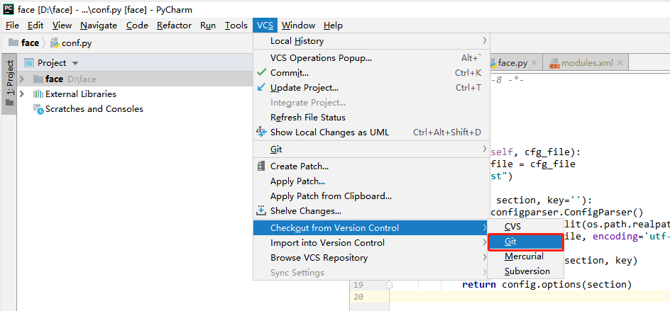

# GitLab使用手册 


## 前言

### 访问地址

### git和svn比较

### git:工作区 暂存区 本地库 远程库


	Workspace:工作区，就是你平时存放项目代码的地方
	Index/Stage:暂存区，用于临时存放你的改动，事实上它只是一个文件，保存即将提交到文件列表信息
	Repository:本地库（或版本库），就是安全存放数据的位置，这里面有你提交到所有版本的数据。其中HEAD指向最新放入仓库的版本
	Remote:远程库，托管代码的服务器，可以简单的认为是你项目组中的一台电脑用于远程数据交换

### readme工程描述
​	工程owner提交readme.md（项目简介）文件，方便其他用户了解工程。

### Tags:
	用来记录重要的版本发布历史，例如里程碑版本。在发布重要版本时可以创建一个tag来保存工程版本。

## 一、GitLab账号注册
	a)注册用户名、昵称：公司ID
	b)注册邮箱：公司邮箱（作用：工程变动、授权通知、找回密码等）

## 二、项目配置

### 2.1 新建群组
**主要为了团队管理**

### 2.2 新建项目

####在用户名下新建项目 主要用于个人项目** 


####在群组下面新建项目 方便团队管理
**第一步:选择群组**

**第二步:在群组下新建项目**


### 2.2 删除项目
```
1 首先，在你的项目列表中选择要删除的项目，点击进入；
2 点击Settings中的General，然后点击Advanced settings 的Expend按钮；
3 滑到最下边，点击“Remove project”
4 在弹出框中输入要删除的项目名称即可；
```

### 2.3 项目类型
```
private(私有库)：只有被赋予权限的用户可见
Internal(内部库)：登录用户可以下载
public(公开库)：所有人可以下载
```
### 2.3 项目成员管理


```
Guest(匿名用户) - 创建项目、写留言薄

Reporter（报告人）- 创建项目、写留言薄、拉项目、下载项目、创建代码片段

Developer（开发者）- 创建项目、写留言薄、拉项目、下载项目、创建代码片段、创建合并请求、创建新分支、推送不受保护的分支、移除不受保护的分支 、创建标签、编写 wiki

Master（管理者）- 创建项目、写留言薄、拉项目、下载项目、创建代码片段、创建合并请求、创建新分支、推送不受保护的分支、移除不受保护的分支 、创建标签、编写 wiki、增加团队成员、推送受保护的分支、移除受保护的分支、编辑项目、添加部署密钥、配置项目钩子

Owner（所有者）- 创建项目、写留言薄、拉项目、下载项目、创建代码片段、创建合并请求、创建新分支、推送不受保护的分支、移除不受保护的分支 、创建标签、编写wiki、增加团队成员、推送受保护的分支、移除受保护的分支、编辑项目、添加部署密钥、配置项目钩子、开关公有模式、将项目转移到另一个名称空间、删除项目
```

**项目成员也可以从其他项目中导入**

### 2.3 群组成员管理


**与项目权限类似**

### 2.2 分支管理（git 客户端  gitlab上均可）

#### 管理员创建dev分支

**第一步**


**第二步**


####开发者创建各自分支
同上

## 二、分支管理规范

### 分支列表


```
1.开发人员本地开发测试，将开发代码提交到各自features_***(noteId)下进行管控维护。
2.本地测试通过，需要将features_***涉及代码合并到dev分支，dev分支为开发测试分支。对应公司开发环境
3.由开发组长定期将dev代码合并到master分支。对应公司测试环境
4.测试无误master打tags标签。将测试环境代码同步到生产环境

#根据实际情况可酌情处理添加test分支 bug分支
```

### 开发流程

```flow
st=>start: 开发人员:
新建分支进行
开发,
测试,
提交分支
op1=>operation: 开发人员:
在gitlab发起合并请求
features_***到dev
指定审核人为自己
op2=>operation: 开发人员:
处理合并请求
将代码pull到本地,
解决冲突、测试、提交
op3=>operation: 开发人员:
在gitlab发起合并请求
dev到master
cond=>condition: Master(组长):
处理合并请求
合并or打回
op4=>operation: Master(组长):
master分支打tag
e=>end: 开发人员:
更新主master版本,
并整理本地分支
或删除本分支创建新的分支
开发新需求

st(right)->op1->op2->op3(right)->cond
cond(yes)->op4(right)-->e
cond(no)->op1
```

## 三、Windows本地安装Git工具

	Git-2.10.0-64-bit.exe  https://git-scm.com/downloads
	TortoiseGit-2.0.0.0-64bit.msi 

## 四、GitLab配置SSH KEY

	gitlab管理代码，我们在clone代码的时候可以选择http协议，亦可以选择ssh协议来拉取代码。本地git客户端生成ssh key，然后配置在gitlab里，而后使用ssh协议进行提交和拉取git远程仓库的代码。

### 2.1 单个GitLab仓库配置
**第一步 配置Git 用户名、邮箱**
``` 
git config --global user.name "wangjn_bj"
git config --global user.email "wangjn_bj@si-tech.com.cn"
```

**第二步 生成ssh公钥和私钥对 (-C 参数是你的邮箱地址)**

```
ssh-keygen -t rsa -C 'wangjn_bj@si-tech.com.cn'
```


**第三步 GitLab服务端授权配置**

然后打开~/.ssh/id_rsa.pub文件,复制其中的内容


**第四步 验证是否OK**
ssh -T git@172.18.234.180

### 2.2 配置多个ssh key
大多数时候，我们的机器上会有很多的git host,比如公司gitlab、github、oschina等，那我们就需要在本地配置多个ssh key，使得不同的host能使用不同的ssh key ,做法如下（以公司gitlab和github为例）：

**第一步 移出原有配置**
```
#查看全局配置
git config --list
# 移除全局配置账户
git config --global --unset user.name
#查看全局用户名
git config --global user.name
# 移除全局配置邮箱
git config --global --unset user.email
# 查看全局邮箱
git config --global user.email
# 移除全局密码
git config --global --unset user.password
# 查看全局密码
git config --global user.password

全局git配置
git config --global user.name 'wangjn1130' && git config --global user.email 'wangjn1130@163.com'

到指定git仓库目录配置
git config --local user.name 'wangjn_bj' && git config --local user.email  'wangjn_bj@si-tech.com.cn'
```

**第二步 为公司生成一对秘钥ssh key**
``` 
ssh-keygen -t rsa -f %USERPROFILE%/.ssh/id_rsa.aigitlab -C 'wangjn_bj@si-tech.com.cn'
```
**第三步 为github生成一对秘钥ssh key**
``` 
ssh-keygen -t rsa -C  'wangjn1130@163.com'
```
**第四步 在~/.ssh目录下新建名称为config的文件。用于配置多个不同的host使用不同的ssh key，内容如下：**
``` 
# gitlab
Host 172.18.234.180
HostName 172.18.234.180
IdentityFile C:/Users/christ/.ssh/id_rsa.aigitlab
PreferredAuthentications publickey
User wangjn_bj
# github
Host github.com
HostName github.com
IdentityFile C:/Users/christ/.ssh/id_rsa
PreferredAuthentications publickey
User wangjn1130

# 配置文件参数
# Host : Host可以看作是一个你要识别的模式，对识别的模式，进行配置对应的的主机名和ssh文件
# HostName : 要登录主机的主机名
# User : 登录名
# IdentityFile : 指明上面User对应的identityFile路径
```
**第五步 按照上面的步骤分别往gitlab和github上添加生成的公钥id_rsa.aigitlab.pub和id-rsa.pub**


**第六步 验证是否OK**
ssh -T git@github.com 
ssh -T git@172.18.234.180
ssh -T git@gitee.com 

### 2.2 总结

我们为什么要使用ssh协议呢？因为ssh更加安全，然后更加方便，比如我们公司的gitlab由http协议换成了https协议，那么如果你是使用http协议管理代码,那么需要修改所有的项目中的git地址变成https,这会把我们给逼疯的！但是如果我们一开始就是用ssh协议，这不需要任何的修改。

## 五、Gitlab使用
	首先在Gitlab里创建一个新的project, 名称为intelligentplatform (或者其他名称都可以)
### 3.1 创建新版本库-从头开发产品

``` 
git clone git@172.18.234.180:aicp/intelligentplatform.git
cd intelligentplatform
touch README.md
git add README.md
git commit -m "add README"
git push -u origin master
```

### 3.2 已存在产品-从其他版本管理工具迁移到gitlab

``` 
cd existing_folder
git init
git remote add origin git@172.18.234.180:aicp/intelligentplatform.git
git add .
git commit -m "Initial commit"
git push -u origin master
```
### 3.3 迁移Git项目到Gitlab-可保留历史记录
``` 
git branch -r | grep -v '\->' | while read remote; do git branch --track "${remote#origin/}" "$remote"; done

git fetch --all

git pull --all

# 确保代码更新到最新
git pull

# 查看当前远程git服务器上的所有分支, 这一步是用于判断哪些分支需要迁移
git branch -r

# 如果需要迁移的branch在本地还不存在, 将其checkout出来
# 如果已经存在了, 就checkout过去, 然后git pull一下确保是最新
git checkout -b branchname origin/branchname

# 将本地git的旧orgin改成别的名称
git remote rename origin origin-old

# 将gitlab的git服务设为新的origin
git remote add origin git@172.18.234.180:aicp/intelligentplatform.git


# 将本地的所有分支push到gitlab
git push -u origin --all
# 将本地的所有标签push到gitlab
git push -u origin --tags

```
### 3.4 Gitlab服务器宕机从本地恢复
```
# 查看当前主机上所有分支
git branch  -a
# 将本地git的旧orgin改成别的名称
git remote rename origin origin-old
# 将gitlab的git服务设为新的origin
git remote add origin git@172.18.234.180:aicp/intelligentplatform.git
# 将本地的所有分支push到gitlab
git push -u origin --all
# 将本地的所有标签push到gitlab
git push -u origin --tags
#删除旧的origin-old
git remote rm origin-old
```

git fetch会把远程服务器上所有的更新都拉取下来
git pull是把远程分支的代码拉取下来并合并到本地分支
git branch -r 查看分支
git branch -a 查看分支

## 六、pycharm+Gitlab管理项目

### 6.3 pycharm配置


### 6.4 克隆项目



**注意通过ssh方式不用再次关系用户名密码**


### 6.4 忽略文件配置.gitignore

```
HELP.md
/target/
/logs/
!.mvn/wrapper/maven-wrapper.jar

### eclipse ###
.apt_generated
.classpath
.factorypath
.project
.settings
.springBeans
.sts4-cache

### IntelliJ IDEA ###
.idea
*.iws
*.iml
*.ipr
```
### 6.5 pycharm分支管理


**查看当前代码所在分支**


**代码比较和分支合并**


### 6.6 代码拉取和推送


**push动作**


**pull动作**


### 代码冲突解决

**第一步:查看确认代码与修改前代码区别（有多种方式）**

**第二步:提交代码**


**选择Merge 也可以选择rebase因为merge是合并而rebase的版本是一条直线 在这里选择merge **

**第三步:解决冲突代码**

**accept left 用左边的 accept 用右边的 中间的是最后的结果**


**点击accept按钮**

**冲突解决之后正常提交**

### 更新远程分支

git branch -a时总是不出现新的分支或者远程已经没有的分支在本地还有，这时就需要更新下本地的git分支保持和远程分支一致，使用下面命令即可：

git remote update origin --prune

### 6.2 合并请求


## 七、在开发者OP报工

### 7.1 生成令牌

**点击生成令牌**


**记下生成的令牌**


### 7.1 报工任务选择git
**报工填写交付物**


**报工填写token**


**报工勾选交付物  注意:不能勾选目录**


**报工交付物填写完成 注意:点击保存**


**正常填写内容**


## 参考资料
	https://www.cnblogs.com/qdhxhz/p/9757390.html
	http://eip.teamshub.com/t/4150178
	http://eip.teamshub.com/t/3149138
``` 
全局git配置
git config --global user.name 'wangjn1130' && git config --global user.email 'wangjn1130@163.com'

到指定git仓库目录配置
git config --local user.name 'wangjn_bj' && git config --local user.email  'wangjn_bj@si-tech.com.cn'
```
```
4.开发分支命名规范
a)主干分支：
Master：随时可以在生产环境部署的代码，建议伴有tag标签
dev：每天需要提交和合并的代码，功能逐渐完成的代码开发分支
b)辅助分支：
		Feature：新功能分支，辅助develop分支，主要用于实验性且效果不好的代码变更。或者用于开发新功能。分支可以直接合并到develop，也可以直接丢弃。
		命名建议：feature-*
		Release：当基本版本完成，可以进行发布前的修改。发布到生产之后，可以提交到master分支，并记录标签（tag）。
		命名建议：release -*
		Hotfix：对于线上版本（master分支）的bug修改的辅助分支，修改完成后合并回master分支和develop分支。
		命名建议：hotfix-*
```
