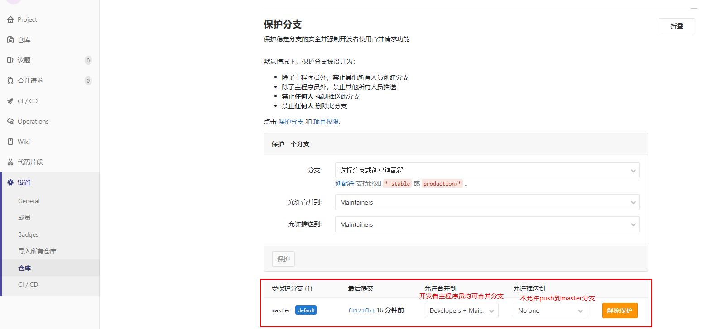

# GitLab相关资料

gitlab权限设置

https://blog.csdn.net/justyman/article/details/90142327


```bash
镜像拉取
docker pull twang2218/gitlab-ce-zh:11.0
镜像导出
docker save -o gitlab-ce-zh.image  twang2218/gitlab-ce-zh:11.0
镜像导入
docker load -i gitlab-ce-zh.image
```

## Docker命令启动GitLab

```
docker network create gitlab-net
docker volume create gitlab-config
docker volume create gitlab-logs
docker volume create gitlab-data

docker run -d \
    --hostname 172.18.234.180 \
    -p 10180:80 \
    -p 10143:443 \
    -p 10122:22 \
    --name gitlab \
    --restart unless-stopped \
    -v gitlab-config:/etc/gitlab \
    -v gitlab-logs:/var/log/gitlab \
    -v gitlab-data:/var/opt/gitlab \
    --network gitlab-net \
	gitlab/gitlab-ce:12.1.6-ce.0
```

## docker-compose配置GitLab（使用中）

### GitLab产品使用

docker-compose.yml

```
version: '2'
services:
    gitlab:
      image: 'twang2218/gitlab-ce-zh:11.0'
      restart: unless-stopped
      hostname: '172.18.234.180'
      environment:
        TZ: 'Asia/Shanghai'
        GITLAB_OMNIBUS_CONFIG: |
          external_url 'http://172.18.234.180'
          gitlab_rails['time_zone'] = 'Asia/Shanghai'
          # 需要配置到 gitlab.rb 中的配置可以在这里配置，每个配置一行，注意缩进。
          # 比如下面的电子邮件的配置：
          gitlab_rails['smtp_enable'] = true
          gitlab_rails['smtp_address'] = "smtp.si-tech.com.cn"
          gitlab_rails['smtp_port'] = 25
          gitlab_rails['smtp_user_name'] = "wangjn_bj@si-tech.com.cn"
          gitlab_rails['smtp_password'] = "123456"
          gitlab_rails['smtp_authentication'] = "login"
          #gitlab_rails['smtp_enable_starttls_auto'] = true
          #gitlab_rails['smtp_tls'] = true
          gitlab_rails['gitlab_email_from'] = 'wangjn_bj@si-tech.com.cn'
          gitlab_rails['smtp_openssl_verify_mode'] = 'none'
      ports:
        - '80:80'
        - '443:443'
        - '22:22'
      volumes:
        - config:/etc/gitlab
        - data:/var/opt/gitlab
        - logs:/var/log/gitlab
volumes:
    config:
    data:
    logs:
```

然后使用命令 `docker-compose up -d` 来启动，停止服务使用 `docker-compose down`

### 注意事项

#### 登录

启动 GitLab 后，第一次访问时，会要求设置 `root` 用户的密码，密码不得小于8位。设置好后，就可以登录使用了。对于早期版本，可以使用默认的 `root` 用户密码 `5iveL!fe` 登录。

#### 配置 SSH 端口

这里运行示例中，无论是使用 `docker-compose.yml` 还是 `docker run` 都使用的是 SSH 默认端口 `22` 去映射容器 SSH 端口。其目的是希望比较自然的使用类似 `git@gitlab.example.com:myuser/awesome-project.git` 的形式来访问服务器版本库。但是，宿主服务器上默认的 SSH 服务也是使用的 22 端口。因此默认会产生端口冲突。

#### 修改宿主的 SSH 端口

修改宿主的 SSH 端口，使用非 `22` 端口。比如修改 SSHD 配置文件，`/etc/ssh/sshd_config`，将其中的 `Port 22` 改为其它端口号，然后 `service sshd restart`。这种方式比较推荐，因为管理用的宿主 SSH 端口改成别的其实更安全。

注意修改：/etc/sysconfig/selinux  SELINUX=disabled

#### 修改容器的 SSH 端口

修改容器的端口映射关系，比如将 `-p 22:22` 改为 `-p 2222:22`，这样 GitLab 的 SSH 服务端口将是 `2222`。这样做会让使用 GitLab 的 SSH 克隆、提交代码有些障碍。这种情况要改变用户使用 Git 的链接方式。

要从之前的：

```
git clone git@gitlab.example.com:myuser/awesome-project.git
```

改为明确使用 `ssh://` 的 URL 方式。

```
git clone ssh://git@gitlab.example.com:2222/myuser/awesome-project.git
```

## GitLab管理员工作

### 1.项目保护分支

```text
1.允许developer角色和主程序员角色合并分支到master
2.禁止push代码到master分支
```



 

## GitLab常见问题

### 发送邮件识别

```
进入容器
gitlab-rails console
Notify.test_email('wangjn_bj@si-tech.com.cn', '邮件标题', '邮件正文').deliver_now
```

