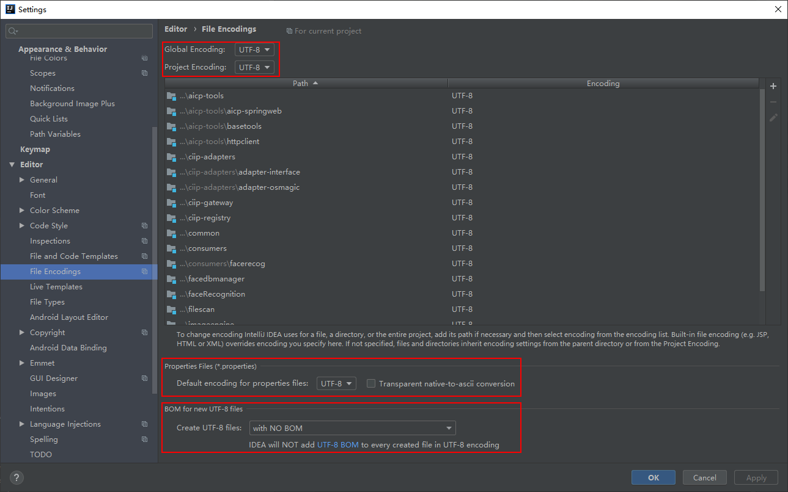
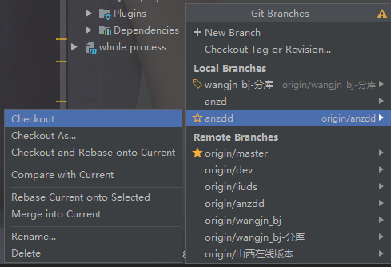
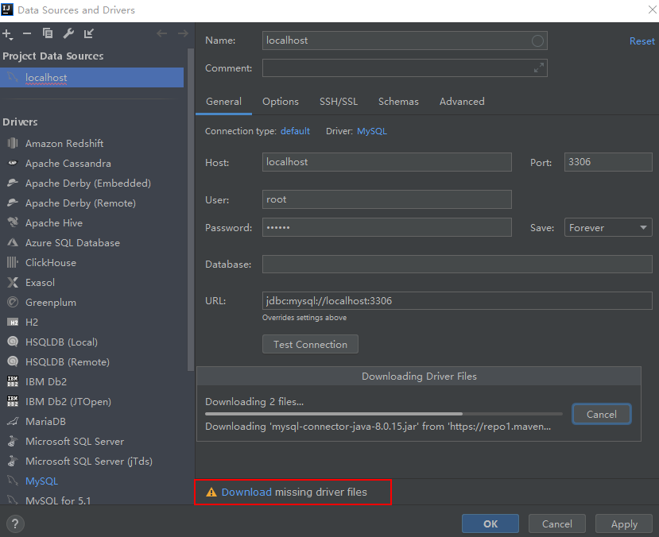
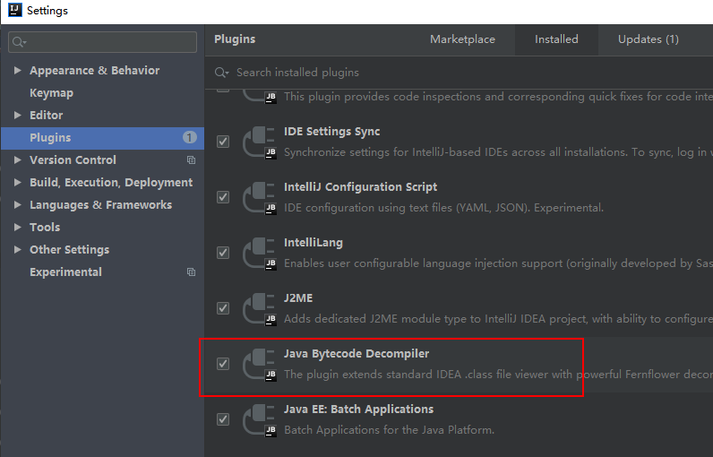

# IDEA使用手册

## 1.IDEA简介

webstorm/pycharm均可以参考此文档使用

### 1.1 IDEA下载

```
#下载地址
https://www.jetbrains.com/idea/download/other.html

#IDEA帮助文档
https://www.jetbrains.com/help/space/getting-started.html
```

### 1.2 IDEA安装&激活

```
参考对应安装激活文档
```

### 1.4 IDEA配置文件

#### 1.4.1 vm配置文件 

idea.exe.vmoptions&idea64.exe.vmoptions  主要配置:IDEA内存、激活破解文件、ide编码

```
-Xms128m
-Xmx750m
-XX:ReservedCodeCacheSize=240m
-XX:+UseConcMarkSweepGC
-XX:SoftRefLRUPolicyMSPerMB=50
-ea
-XX:CICompilerCount=2
-Dsun.io.useCanonCaches=false
-Djava.net.preferIPv4Stack=true
-Djdk.http.auth.tunneling.disabledSchemes=""
-XX:+HeapDumpOnOutOfMemoryError
-XX:-OmitStackTraceInFastThrow
-javaagent:C:\Program Files\JetBrains\IntelliJ IDEA 2019.1.4\bin\jetbrains-agent.jar
-Dfile.encoding=UTF-8
```

#### 1.4.2 属性配置文件

idea.properties 

```
修改配置和索引等文件位置，便于管理
idea.config.path=${idea.home}/.IntelliJIdea90/config
idea.system.path=${idea.home}/.IntelliJIdea90/system
idea.plugins.path=${idea.home}/.IntelliJIdea90/config/plugins
```

##### 1.4.3 个人习惯的配置文件

```
C:\Users\${USER}\.IntelliJIdea2019.1

config:个性化配置目录
system:系统文件目录,idea和项目关系相关目录
```

### 1.5 首次运行IDEA


### 1.6 IDEA 的项目目录

```
我们创建的项目，在 d:\ideawork目录的demo下
.idea 目录和 demo.iml 和我们开发无关，是IDEA工具自己使用的
out 目录是存储编译后的.class文件
src 目录是存储我们编写的.java源文
```

### 1.7 IDEA常见图标

#### 1.7.1 基本图标


#### 1.7.2 文件夹类图标


#### 1.7.3 可见度的图标


#### 1.7.4 数据源相关的图标


#### 1.7.5 分别是数据库的图标


## 2.IDEA设置


### 2.1 Settings设置

#### 2.1.1 主题选择

File | Settings | Appearance & Behavior | Appearance


#### 2.1.2 打开新项目窗口方式

File | Settings | Appearance & Behavior | System Settings


#### 2.1.3 关闭软件自动更新

File | Settings | Appearance & Behavior | System Settings | Updates


#### 2.1.3 自动 import 类型

File | Settings | Editor | General | Auto Import


#### 2.1.4 代码提示不区分大小写

File | Settings | Editor | General | Code Completion    去掉Match case勾选


#### 2.1.5 取消方法代码自动折叠    

File | Settings | Editor | General | Code Folding    去掉勾选 One-line methods


#### 2.1.6 编辑区字体

File | Settings | Editor | Font      推荐：Consolas 14号


#### 2.1.7 去掉单词拼写检查

File | Settings | Editor | Inspections，取消 Spelling


#### 2.1.8 文件编码设置

File | Settings | Editor | File Encodings



#### 2.1.9 忽略文件设置

File | Settings | Editor | File Types


#### 2.1.10 自动编译设置

File | Settings | Build, Execution, Deployment | Compiler

#### 2.1.11 Debugger端口设置

File | Settings | Build, Execution, Deployment | Debugger


#### 2.1.11 ES6语法识别设置

File | Settings | Languages & Frameworks | JavaScript


#### 2.1.12 Node&NPM设置

File | Settings | Languages & Frameworks | Node.js and NPM


### 2.2 Project Structure 项目结构

#### 2.2.1 工程设置


#### 2.2.2 模块设置


#### 2.2.3 依赖jar设置

可以是外部java的依赖，也可以是maven的依赖


#### 2.2.4 Artifacts设置

配置项目中输出布局设计


#### 2.2.5 全局SDK设置和全局lib


### 2.3 通用设置

#### 2.3.1 边框模式


#### 2.3.2 代码语法检查级别

可以节约计算机资源


#### 2.3.3 省电模式

会关闭代码自动提示和检查， 检查


### 2.4 系统模式设置

Settings for New Projects & Structure for  New Projects

## 3.IDEA插件

### 3.1 插件安装方法

用快捷键ctrl+alt+s打开  点到Plugins ，也可以点击 File –> Setting –>Plugins  搜索插件


### 3.2  常用插件

#### 3.2.1 背景插件 

 在IDE中设置半透明背景图片

第一步：安装  Background Image Plus +插件

第二步：重启IDE,点击view->set Background Image


第三步：选择图片，调整透明度


#### 3.2.2 Maven helper插件

> 可以快速的解决maven 冲突问题


#### 3.2.3 GsonFormat

> 1.可以格式化json
>
> 2.可以根据json自动生成javabean

快捷键 Alt+S

#### 3.2.3 markdown

#### 3.2.3 findbugs

> https://blog.csdn.net/m0_37482190/article/details/89913383

#### Alibaba Java Coding Guidelines

#### 3.2.3 Translation翻译插件

#### 3.2.2 Lombok

```
https://mp.weixin.qq.com/s/5GZYtvWMjQsbLb2lIURumg
```

#### 3.2.3 BashSupport

```
#编写shelll脚本工具
https://blog.csdn.net/u012443641/article/details/81295999
```


## 4.IDEA常规使用

### 4.1 IDEA的编译方式

IntelliJ IDEA 支持实时编译和手动编译两种，实时编译比较耗费资源，一般都选择手动编译。手动编译有三种类型


```
Recompile(Ctrl+Shift+F9)：对选定的目标(Java 类文件)进行强制性编译,不管目标是否是被修改过。

Rebuild：对选定的目标(Project)，进行强制性编译，不管目标是否是被修改过，由于 Rebuild 的目标只有 Project，所以 Rebuild 每次花的时间会比较长。

Make(Ctrl+F9 build)：使用最多的编译操作。对选定的目标（Project 或 Module）进行编译，但只编译有修改过的文件，没有修改过的文件不会编译，这样平时开发大型项目才不会浪费时间在编译过程中。IDEA在运行或调试之前默认会先进行Make操作。
```

#### 4.1.1 Recompile：

在文件中右键或者选中文件右键


#### 4.1.2 Rebuild：

对选定目标强制编译，不管是否修改过


#### 4.1.3 Make：

对修改过的文件进行编译

#### 4.1.4 运行之前做编译的配置 edit configition


### 4.2 编译设置

File | Settings | Build, Execution, Deployment | Compiler


#### 4.2.1 不进行编译的文件

File | Settings | Build, Execution, Deployment | Compiler | Excludes

#### 4.2.2 编译环境设置

File | Settings | Build, Execution, Deployment | Compiler | Java Compiler


#### 4.2.3 SpringBoot项目设置热部署以及静态资源livereload

```
https://blog.csdn.net/haiyoung/article/details/78608449
https://blog.csdn.net/asynct/article/details/49466569
```

### 4.3 IDEA的索引

索引的作用:加快文件查询，加快代码提示操作速度。

清理缓存和索引文件入口


C:\Users\christ\.IntelliJIdea2019.1\system\LocalHistory

重置idea可以删除 C:\Users\christ\.IntelliJIdea2019.1\system

### 4.4 创建项目

File | New | Project

#### 4.4.1 新建J2EE项目


#### 4.4.2 新建maven的web项目


### 4.5 同时管理多项目

idea是以project为单位显示窗口的

IDEA 一个窗口只能管理一个项目，对用惯了 Eclipse 的同学来说可能会不大方便。思维
转换下，把 IDEA 项目看成工作空间，IDEA 模块看成项目，就可以实现一个窗口中管理多个
项目。下面介绍下如何实现多项目管理。

```
1、创建空项目（空项目当做工作空间）。选择 File->New Project，选择 Empty Project，修改
Project Name 为项目名称，Project location 为项目路径。
2、点击“Finish”完成空项目的创建，同时会打开空项目配置
3、选择 Project，设置 Java SDK。
4、选择 Modules，可以通过“New Module”或者“Import Module”创建或导入项目
```

### 4.6 Tomcat工程配置


部署设置：


调整配置


### 4.8 窗口复原


### 4.9 查看代码历史

选中代码历史记录和选中文件查看历史记录，没有版本工具的时候能使用


### 4.10 pycharm中远程编辑服务器文件

远程编程比较适合.py这种脚本语言，java不太适合

 Tools | Develpment | Configuration


配置SFTP


映射本地工程到远程工程目录：


修改文件时候同步提交


## 5.**IDEA快捷操作**

### 5.1 常用快捷键

#### 5.1.1  基本快捷键

| 快捷键                | 功能                                   |
| --------------------- | -------------------------------------- |
| Alt+Enter             | 导入包，自动修正代码                   |
| Alt+Insert            | 自动生成代码，toString，get，set等方法 |
| Ctrl + F12 或者 Alt+7 | 显示方法列表                           |

#### 5.1.2  编辑快捷键

| 快捷键              | 功能                                                         |
| ------------------- | ------------------------------------------------------------ |
| Ctrl+Y              | 删除行                                                       |
| Ctrl+D              | 复制行                                                       |
| Ctrl+/              | 单行注释                                                     |
| Ctrl+Shift+/        | 选中代码注释，多行注释，再按取消注释                         |
| Ctrl+W              | 按照语法自动选中代码，逐级上升                               |
| Ctrl+Shift+W        | 反向选中                                                     |
| Ctrl+左右方向箭头   | 前后单词移动光标                                             |
| Ctrl+Shift+左右箭头 | 快速选中字符串或变量名，前提:光标放在字符串或变量名的开始或结束部位。 |
| Alt+Shift+ 上下箭头 | 移动当前代码行                                               |
| Ctrl+Shift+Alt      | 块状选区                                                     |
| Shift+Alt           | 多个选区                                                     |
| Ctrl+Alt+B          | Eclipse中Ctrl + T 跳转到具体实现方法                         |
| Ctrl+Alt+V          | 自动设置返回值   .var提示信息                                |
| Ctrl+I              | 实现接口方法                                                 |
| Ctrl+Shift+U        | 大小写切换                                                   |
| Ctrl+Alt+T          | idea中的surround with                                        |

#### 5.1.3  查找快捷键

| 快捷键        | 功能                          |
| ------------- | ----------------------------- |
| Ctrl+N        | 查找类或者资源，提供模糊匹配  |
| 连续两次Shift | 同 Ctrl+N                     |
| Ctrl+Shift+N  | 搜索文件,查找定位   名称:行数 |
| Ctrl+F        | 文件内容搜索                  |
| Ctrl+Shift+F  | 全局内容搜索                  |
| CTRL+Q        | 查看注释                      |

#### 5.1.4  格式化代码

| 快捷键       | 功能                        |
| ------------ | --------------------------- |
| Ctrl+Alt+O   | 格式化import                |
| Ctrl+Alt+L   | 格式化代码 Command+option+L |
| Ctrl+Tab     | 切换窗口                    |
| Ctrl+E       | 最近打开的文件              |
| Ctrl+Shift+E | 最近编辑过的文件            |

### 5.2 IDEA 修改快捷键

```
1.IDEA默认快捷键的配置文件所在地（目录前缀自己改）：
	C:\Program Files (x86)\JetBrains\IntelliJ IDEA 13.1.4\lib\resources.jar\idea\KeyMap_***.xml

2.IDEA用户自定义快捷键的配置文件所在地（目录前缀自己改）：
	C:\Users\Administrator\.IntelliJIdea13\config\keymaps\*.xml
```

#### 5.2.1 代码提示

在IDEA工具中， Ctrl+ 空格 的快捷键，可以帮助我们补全代码，但是这个快捷键和Windows中的输入法切换快捷
键冲突，需要修改IDEA中的快捷键

File ->Settings->keymap->Main menu->code->Completion->Basic


双击 Basic ->remove->Ctrl+空格


再次双击 Basic ->Add Keyboard->键入 Alt+/->点击OK


#### 5.2.2 自定义修改的快捷键

```
Main menu | Edit | Duplicate Line or Selection
Main menu | Navigate | Previous Occurrence
Main menu | Code | Generate...      Alt+Shift+S
Main menu | Code | Move Line Down
Main menu | Code | Move Line Up
```

### 5.3 实时模板 Ctrl+J

#### 5.3.1 常见实时模板

| 简写 | 模板内容         |
| ---- | ---------------- |
| sout | System.out.print |
| psvm |                  |
| fori |                  |
| ifn  |                  |

#### 5.3.2 实时模块快捷配置


## 6. Git插件使用

### 6.1 git设置


快捷管理：idea右下角



快捷管理：idea右上角


#### git使用十大场景：

> https://blog.csdn.net/qq_39331713/article/details/82350852

## 7.Maven的使用

### 7.1 maven设置

File | Settings | Build, Execution, Deployment | Build Tools | Maven

File | Settings for New Projects | Build, Execution, Deployment | Build Tools | Maven


Maven import设置


### 4.3 创建 Maven 项目

选择 File->New Module，选择 Maven，输入 Module Name

### 4.4 导入 Maven

选择 File->Import Module，选择 Maven 模块路径

### 4.5 MAVEN工程使用


```
1.ReImport All Maven Project #重新加载项目
2.Generate Sources and Update Folders For All Projects # 源代码重新编译，更薪文件夹
3.Download Sources and/or Documentation #下载源代码,文件
4.Add Maven Projects #导入maven项目 
5.Run Maven Build    #运行选中Lifcycle中生命周期中Maven命令
6.Execute Maven Goal #运行maven全局命令
7.Toggle Offine Mode #切换maven离线模式
8.Toggle 'Skip Tests' Mode #跳过测试得模式
9.Show Dependencies(Ctrl+Alt+Shift+U) #查看项目的传递依赖
10.Collapse All #折叠所有maven
11.Maven Settings #
```

第六点：运行maven项目


第九点：查看项目的传递依赖 **推荐时使用Maven Helper插件**


## 8.IDEA调试运行调试

### 8.1 基本调试

F7 进入方法

F8 下一步动作

F9 跳转到下一个断点


Alt+F8表达式的计算  

查看表达式的值：

可以选中表达式，之后拖入variables区域


右键断点可以设置进入断点的条件


### 8.2 多线程调试

### 8.3 远程调试

## 9.DATABASE管理工具



## 10.IDEA常见问题 

### 10.1 找不到符号

### 10.2 未结束的字符串文字

### 10.3 idea 的 add as maven project在哪里

```
http://www.codes51.com/itwd/4381551.html
```

### 10.4 显示RunDashBoard窗口

打开workspace.xml文件之后，找到component为RunDashboard的节点处，然后在component标签里添加

```
<option name="configurationTypes">
    <set>
      <option value="SpringBootApplicationConfigurationType" />
    </set>
</option>
```

### 10.5 IDEA无法编译源码

#### 问题：

idea使用自带的反编译插件只有函数名，而函数体出现/* compiled code*/。这通常是多个反编译插件混淆导致。


#### 解决办法：

勾选：Java Bytecode Decompiler 去掉 Bytecode Viewer



