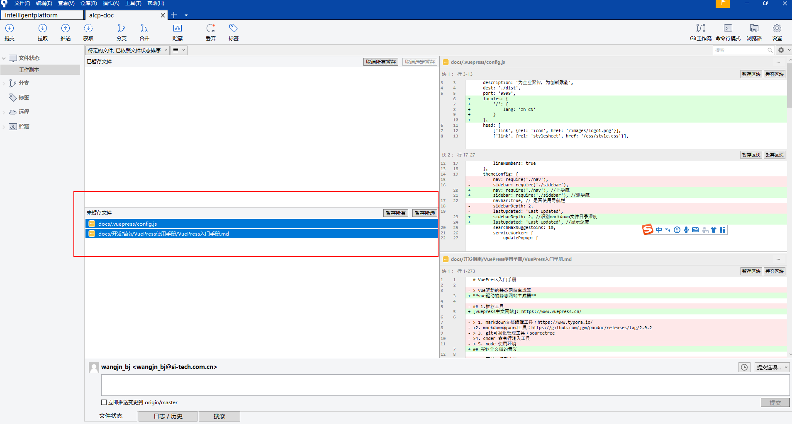
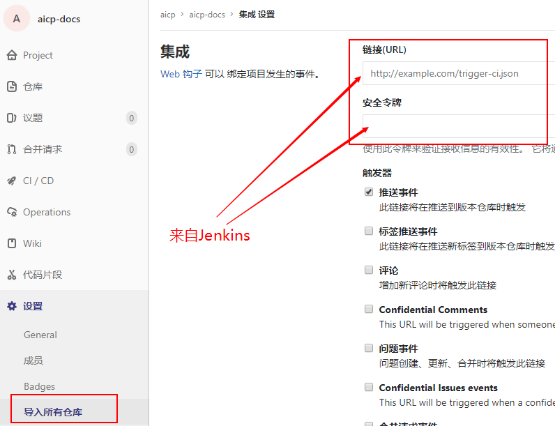
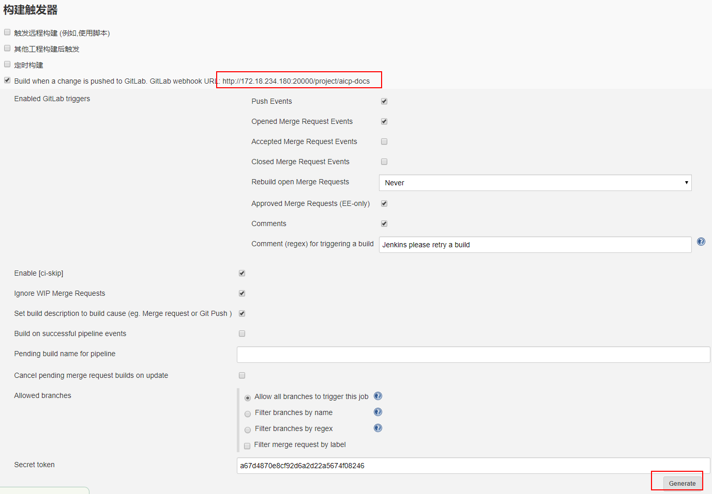

# VuePress使用入门

**vue驱动的静态网站生成器**

[vuepress中文网站]: https://www.vuepress.cn/

## 写这个文档的意义

1.在公司内宣传产品API门户

2.产品线聚智，为后续写文档提供材料基础（解决写文档无材料的窘境）

3.大家个人表单呈现整理思路。

想清楚-->说清楚-->写清楚。

逆向推导如果文档写的乱，说明也说不清楚，还是没有想清楚，或者没想透

## 1.基础环境配置

### 1.1 推荐工具

1. node 使用环境(**必装**)：http://nodejs.cn/download/
2. markdown文档编辑工具：https://www.typora.io/ 
3. git可视化管理工具：sourcetree
4. cmder 命令行输入工具
5. markdown转word工具：https://github.com/jgm/pandoc/releases/tag/2.9.2

#### 1.2 工具安装配置

nodejs安装： https://www.runoob.com/nodejs/nodejs-install-setup.html

### 1.2 vuepress环境安装

```bash
#vuepress工具安装
npm install -g vuepress
#克隆工程
git clone git@172.18.234.180:aicp/aicp-docs.git
#安装依赖
npm install 
#本地环境构建
npm run docs:dev
#静态页面构建(生产环境使用)
npm run docs:build
```

## 2.配置文件讲解

### 2.1目录结构

```shell
.
├── docs
│   ├── .vuepress(vuepress配置目录)
│   │   ├── public (存放静态资源)
│   │   │   ├── css
│   │   │   │ 	└── style.css
│   │   │   ├── js
│   │   │   │ 	└── main.js
│   │   │   ├── images
│   │   │   │ 	└── logo.png
│   │   ├── styles (重点:修改默认主题样式)
│   │   │   ├── palette.styl(重点:主题设置)
│   │   ├── config.js (主配置文件)
│   │   └── nav.js (上导航配置文件)
│   │   └── sidebar.js (侧导航配置文件)
│   ├── 文档目录
│   │   └── README.md
│   │   └── sidebar.js(上导航配置文件)
│   │   └── 文档文件夹
│   │   │   └── 具体文档
└── package.json(nodejs工程主配置文件)
└── .gitignore(git忽略文件)
└── .git(版本控制文件)
└── dist(静态发布生产文件目录)
```

### 2.2 package.json项目配置文件

```
{
  "name": "aicp-docs",
  "version": "1.0.0",
  "description": "",
  "main": "index.js",
  "scripts": {
    "docs:dev": "vuepress dev docs",
    "docs:build": "vuepress build docs"
  },
  "devDependencies": {
    "vuepress": "^1.3.1",
    "@vuepress/plugin-back-to-top": "^1.0.0-rc.1",
    "vuepress-plugin-comment": "^0.7.2"
  },
  "keywords": [],
  "author": "",
  "license": "ISC"
}
```

### 2.3 主配置文件config.js

```
module.exports = {
    title: 'AI产品线',
    description: '为企业聚智，为创新赋能',
    dest: './dist',
    port: '9999',
	locales: {
		'/': {
			lang: 'zh-CN'
		}
    },
    head: [
        ['link', {rel: 'icon', href: '/images/logo1.png'}],
        ['link', {rel: 'stylesheet', href: '/css/style.css'}],
        ['script', {charset: 'utf-8', src: '/js/main.js'}]
    ],
    markdown: {
        lineNumbers: true
    },
    themeConfig: {
        nav: require('./nav'), //上导航
        sidebar: require('./sidebar'), //测导航
        navbar:true, // 是否使用导航栏
        sidebarDepth: 2, //识别markdown文件目录深度
        lastUpdated: 'Last Updated', //显示深度
        searchMaxSuggestoins: 10,
        serviceWorker: {
            updatePopup: {
                message: "有新的内容.",
                buttonText: '更新'
            }
        },
        editLinks: true,
        editLinkText: '在 GitLab 上编辑此页 ！'
    }
}
```

### 2.4 上导航nav.js

用于给config.js 引用使用，link指向文档目录中README.md文件

```
module.exports = [
    {
        text: '开发指南', link: '/开发指南/'
    },
    {
        text: '智能交互平台', link: '/智能交互平台/',
        items: [
            {text: '产品介绍', link: '/智能交互平台/产品介绍/'},
            {text: '使用手册', link: '/智能交互平台/使用手册/'},
        ]
    },
    {
        text: '特征识别中心', link: '/特征识别中心/',
        items: [
            {text: '产品介绍', link: '/特征识别中心/产品介绍/'},
            {text: '产品手册', link: '/特征识别中心/产品手册/'},
        ]
    },
    {
        text: '工具箱',
        items: [
			{
                text: '在线编辑',
				items: [
					{text: '图片压缩', link: 'https://tinypng.com/'},
                    {text: '图片转base64', link: 'http://tool.chinaz.com/tools/imgtobase'}
                    
				]
            },
			{
                text: 'spring ',
				items: [
					{text: 'spring官网', link: 'https://spring.io/'},
					{text: 'spring-cloud', link: 'https://spring.io/projects/spring-cloud/'},
                    {text: 'spring-cloud中文网', link: 'https://www.springcloud.cc/'},
				]
            },
			{
                text: '博客指南',
				items: [
					{text: '掘金', link: 'https://juejin.im/'},
					{text: 'CSDN', link: 'https://blog.csdn.net/'},
				]
            }
        ]
    }
]
```

### 2.5 侧导航sidebar.js

和nav.js 一样用于给config.js 引用使用，link指向文档目录中README.md文件

```
module.exports = {
	'/开发指南': require('../开发指南/sidebar'),
	'/智能交互平台': require('../智能交互平台/sidebar'),
	'/特征识别中心': require('../特征识别中心/sidebar'),
}
```

### 2.6 文档侧导航sidebar.js

指向具体的Markdown文档内容

```
module.exports = [
	{
		title:'VuePress使用手册',
		collapsable: true,
		children:[
			'/开发指南/VuePress使用手册/VuePress入门手册',
			'/开发指南/VuePress使用手册/VuePress高阶手册',
		]
	},
	{
		title:'IDEA使用手册',
		collapsable: true,
		children:[
			'/开发指南/IDEA使用手册/IDEA使用手册',
		]
	},
	{
		title:'GitLab使用手册',
		collapsable: true,
		children:[
			'/开发指南/GitLab使用手册/GitLab使用手册',
		]
	},
	{
		title:'docker安装手册',
		collapsable: true,
		children:[
			'/开发指南/Docker安装手册/docker安装手册',
		]
	},
]
```

## 3.实战场景

### 3.1 迭代原有文档 

在原有稳定修改即可，之后使用git提交

### 3.2 开发新的文档

#### 3.2.1 编辑上导航nav.js

如果需要编辑上导航，则编辑，如果不需要可不编辑

上导航分三种：

1.指向指定文件

2.指向导航目录

3.指向外部链接

同时上导航可以分多个层级展示

#### 3.2.2 编辑侧导航sidebar.js

主目录侧导航，不做显示使用，用来确定上导航和侧导航之间的关联关系

文档目录侧导航，主要进行文档窗口

#### 3.3.3 编写文档内容

```
markdown语法
```

#### 3.3.4.提交文档

使用可视化git管理工具soucetree管理工具更方便



## 4.规则约定：

### 4.1 一个Markdown文件有且只有一个一级标题

```
markdown文件中只能有一个一级标题，不然侧边栏无法正常显示
```

### 4.2 Markdown中图片路径问题

```
图片路径使用相对路径
图片路径中不能有中文
使用'/' 而不要使用 '\'
图片名称后缀不能是大写 .jpg  .png均可 使用SIM会报错
```

### 4.3 vuepress不识别markdown复杂语法

```
使用markdown编写的流程图，vuepress不识别，建议使用图片
```

## 5.持续集成环境

### 5.1持续集成gitlab配置



### 5.2 Jenkins相关配置说明

#### 5.2.1 Jenkins上读取gitlab相关配置信息



#### 5.2.2 构建后执行脚本

```bash
source /aimanager/.bash_profile
npm install --registry=https://registry.npm.taobao.org
rm -rf ./dist/*
npm run docs:build
cp -r dist /aimanager/devops/nginx-vuepress/
```