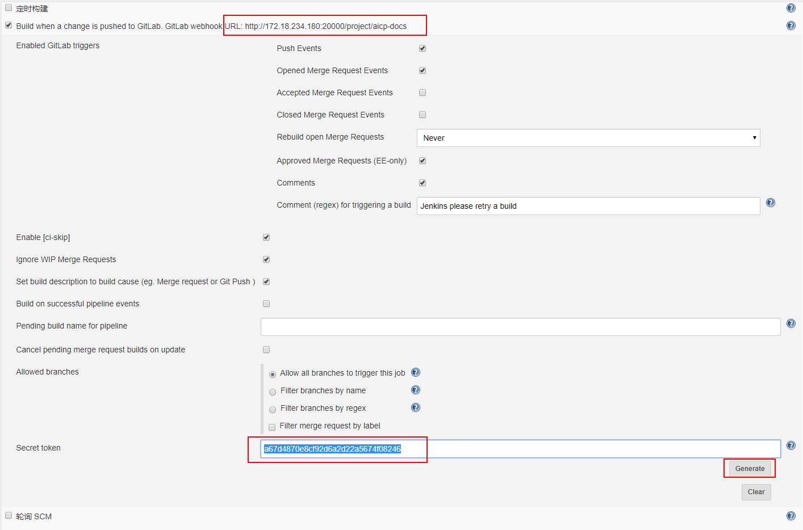

# VuePress使用手册

## 1.环境安装

```
# 安装vuepress
npm install -g vuepress

# 创建工程文件夹
mkdir aicp-docs

# 初始化工程
cd aicp-docs
npm init -y
# 主要存放博客书籍内容
mkdir docs

#运行文档

vuepress dev docs
```


配置package.json，添加下述两行

```
{
  "scripts": {
    "docs:dev": "vuepress dev docs",
    "docs:build": "vuepress build docs"
  }
}
```

### nginx部署

```
docker run -itd \
        --name=nginx-vuepress \
        -p 9443:443\
        -p 9999:80 \
        -v /aidata/aicp/devops/nginx-vuepress/dist:/usr/share/nginx/html \
        -v /aidata/aicp/devops/nginx-vuepress/config/nginx.conf:/etc/nginx/nginx.conf \
        -v /aidata/aicp/devops/nginx-vuepress/config/conf.d/default.conf:/etc/nginx/conf.d/default.conf \
        -v /aidata/aicp/devops/nginx-vuepress/logs:/var/log/nginx/ \
        -v /aidata/aicp/devops/nginx-vuepress/ssl:/ssl/ \
        --restart=always \
        nginx:1.16.0
使用
docker run -di --name=nginx-vuepress \
-v /aidata/aicp/devops/nginx-vuepress/dist:/usr/share/nginx/html \
-v /aidata/aicp/devops/nginx-vuepress/logs:/var/log/nginx/ \
-p 9999:80 nginx:1.16.0

docker run -di --name=nginx-vuepress \
-v /aimanager/devops/nginx-vuepress/dist:/usr/share/nginx/html \
-v /aimanager/devops/nginx-vuepress/logs:/var/log/nginx/ \
-p 9999:80 nginx:1.16.0


docker run -d --name nexus3     --restart=always     -p 8081:8081     -p 8082:8082     -p 8083:8083     -p 8084:8084     -v nexus-data:/nexus-data     sonatype/nexus3:3.19.0

```

## 持续集成部署

### gitlab自动化部署



## 常见问题：

### vuepress中白页问题

```
1.检测markdown文件中,图片关联文件路径是否正确   
	使用'/' 而不要使用 '\'
	图片名称中不能有中文

```

